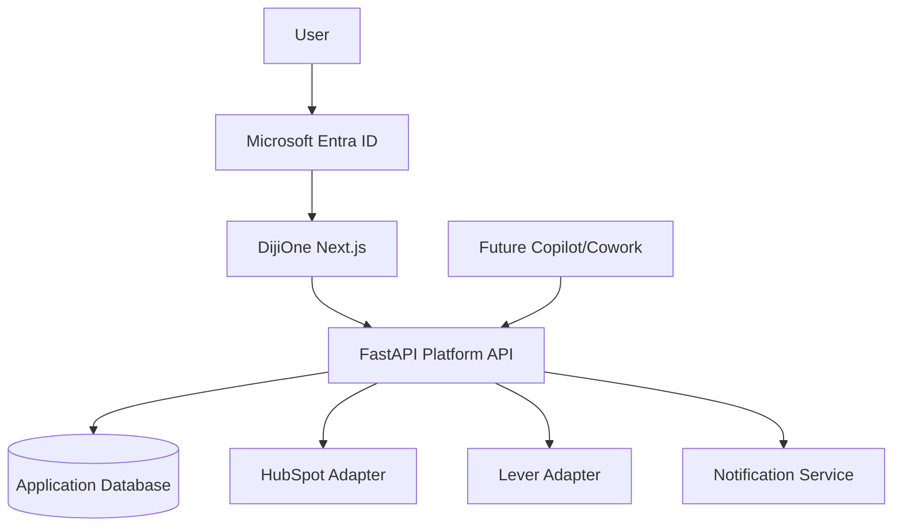
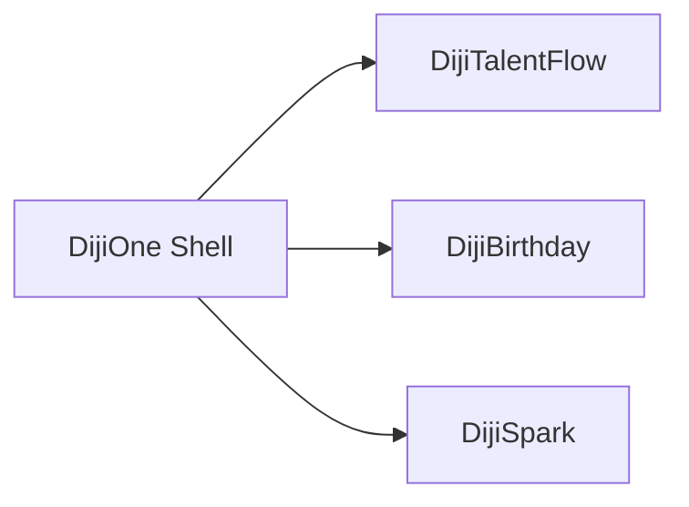
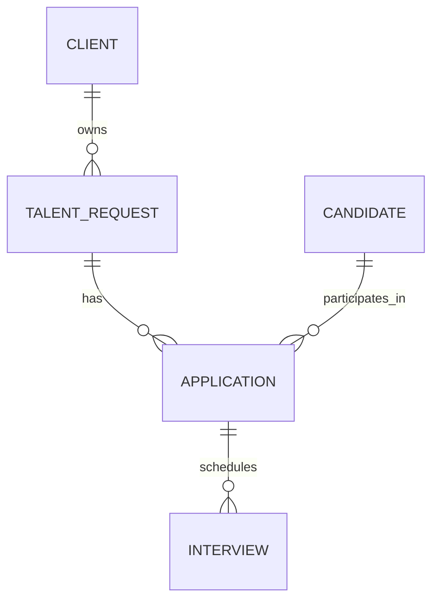
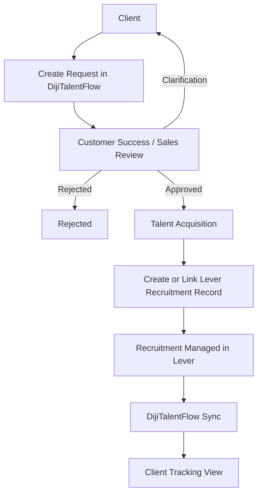

# DijiOne Platform
# Complete Master Engineering, Product, UI, Integration and Autonomous Agent Contract

> **Authoritative project contract for autonomous coding agents**
>
> Working platform name: **DijiOne**
>
> First major module: **DijiTalentFlow**
>
> Brand relationship: **by Dijital Team**

---

> **Phase 2.5 addendum (Application-Level Service Separation).** This
> contract was written for, and largely still describes, the Phase 1/2
> modular monolith (one Next.js app, one FastAPI app). Phase 2.5 split that
> monolith into eight independently runnable application-level services
> without changing the business behavior, UI, or authorization semantics
> this contract defines — every requirement below still holds, just spread
> across services instead of one process. Before making changes, read
> **`docs/platform/service-architecture.md`** (what the eight services are
> and what each owns), **`docs/platform/service-contracts.md`** (each
> service's API surface and the gateway routing table), and
> **`docs/platform/failure-isolation.md`** (what happens when one service
> is down) — they are the current source of truth for *where* code for a
> given responsibility now lives; this document remains the source of
> truth for *what* DijiOne and DijiTalentFlow must do.

---


# CRITICAL AUTONOMOUS EXECUTION AND SAFETY RULES

These rules are mandatory and override convenience, shortcuts, speculative
redesigns, and autonomous changes in direction.

## 1. PROJECT ROOT IS THE HARD WORKING BOUNDARY

The authorized project root is:

C:\Projects\Diji Projects\DijiOne\dijione-platform

All project development work MUST remain inside this directory.

You may:

- Read files inside the project root.
- Create files inside the project root.
- Modify files inside the project root.
- Create folders inside the project root.
- Rename or move project files inside the project root.
- Delete generated, temporary, obsolete, or explicitly replaceable project
  files inside the project root when reasonably required for development.
- Run the application from the project root.
- Install project dependencies.
- Run tests, builds, linting, migrations and development servers.
- Create local Git commits for development checkpoints.

You MUST NOT intentionally modify, move, rename, overwrite or delete user
files or directories outside the authorized project root.

You MUST NOT use parent directories as working areas.

You MUST NOT perform cleanup operations against:

C:\Projects
C:\Projects\Diji Projects
C:\Projects\Diji Projects\DijiOne

or any other directory outside:

C:\Projects\Diji Projects\DijiOne\dijione-platform

The parent directories exist only to contain the project.

Do not reorganize them.

Do not clean them.

Do not delete them.

Do not move the repository to another location.

Do not create application source code elsewhere.

Do not use another repository as a substitute workspace.

If an operation would require destructive modification of data outside the
project root, DO NOT perform the operation.

Treat this as a genuine blocker rather than bypassing this restriction.


## 2. DELETION POLICY

Deletion outside the project root is STRICTLY PROHIBITED.

Inside the project root, deletion is permitted only when reasonably required
for implementation, refactoring, dependency cleanup, replacement of generated
artifacts, or correction of work produced during this project.

Before performing a large or destructive deletion inside the project root,
verify that the target path resolves inside:

C:\Projects\Diji Projects\DijiOne\dijione-platform

Never construct deletion commands that could resolve to a parent directory,
drive root, user profile, system directory, or unrelated repository.

Never use broad recursive deletion against an absolute drive path.

Never delete unrelated user data.

Never delete files merely to avoid understanding or fixing an implementation.


## 3. DO NOT ESCAPE THE REQUIREMENTS

CLAUDE.md is the authoritative product and engineering contract.

Stay aligned with the requirements, architecture, scope, UI direction,
business processes, roles, terminology, integrations and MVP objectives
defined in this document.

Do NOT abandon a requirement because implementation becomes difficult.

Do NOT silently replace a requested feature with an easier unrelated feature.

Do NOT remove functionality simply to make tests pass.

Do NOT redesign the product into a different application.

Do NOT change the agreed technology stack without a genuine technical blocker.

Do NOT simplify away core architectural requirements.

Do NOT reinterpret unresolved implementation difficulty as permission to
change the business requirement.

When implementation becomes difficult:

1. Investigate the problem.
2. Inspect the existing code.
3. Determine the root cause.
4. Research installed package/API documentation when necessary.
5. Implement the most appropriate solution consistent with CLAUDE.md.
6. Test the solution.
7. Fix failures.
8. Continue with the planned work.

Only declare a blocker when progress genuinely requires information,
credentials, permissions, infrastructure or a business decision that cannot
reasonably be mocked, abstracted or inferred from this contract.


## 4. PRESERVE WORK AND FIX PROBLEMS

Do not restart, rewrite or delete working components simply because another
implementation would be easier.

Prefer:

inspect -> understand -> modify -> test -> fix -> continue

over:

delete -> rebuild -> hope

Preserve valid existing work.

Refactor when there is a technical reason.

When tests fail, investigate and fix the underlying issue.

When builds fail, diagnose and fix them.

When dependencies conflict, resolve the dependency issue.

When frontend and backend contracts disagree, reconcile them according to the
architecture defined in this document.

Do not hide errors.

Do not disable meaningful tests merely to obtain a successful test result.

Do not replace real implementation requirements with hardcoded UI solely to
claim completion.


## 5. AUTONOMOUS EXECUTION EXPECTATION

This repository is intended to be developed with a high degree of agent
autonomy.

Do not request user confirmation between normal engineering steps.

Continue autonomously through:

planning
-> scaffolding
-> implementation
-> integration
-> testing
-> debugging
-> documentation
-> validation

Use subagents when they materially improve development speed or quality.

Maintain PLAN.md and update progress as work proceeds.

Run relevant tests, linting and builds continuously.

Fix errors before proceeding when practical.

Continue until the current delivery milestone is operational or a genuine
blocker is reached.


## 6. CREDENTIALS AND EXTERNAL SYSTEMS

Production credentials are intentionally unavailable during the initial
development phases.

The absence of credentials for:

- Microsoft Entra ID
- HubSpot
- Lever
- Microsoft Copilot / Cowork
- production databases
- production infrastructure

is NOT by itself a reason to stop development.

Build provider abstractions and realistic mock implementations.

The architecture must allow mock providers to be replaced later by real
providers without redesigning the application.

Never fabricate production credentials.

Never search the user's computer for credentials.

Never read unrelated environment files outside this repository looking for
secrets.

Never commit credentials or secrets to Git.

Use .env.example for configuration contracts.


## 7. SECURITY

Do not weaken security controls merely to make development easier.

Do not expose secrets in frontend code.

Do not commit secrets.

Do not disable authorization simply because authentication is currently
mocked.

Role-based authorization, tenant isolation and provider boundaries should
exist architecturally even during mock-first development.

Client users must not gain access to another client's data.

TA users must receive only the capabilities defined by the product contract.


## 8. SCOPE DISCIPLINE

The objective is an MVP, not an uncontrolled enterprise-platform build.

Implement the architecture so DijiOne can expand, but prioritize the
functionality required for the defined MVP.

Do not spend excessive time building speculative infrastructure that is not
needed to demonstrate the current product.

Do not introduce additional frameworks, databases, queues, cloud services or
architectural layers merely because they might be useful someday.

Favor clean extension points over premature complexity.


## 9. COMPLETION STANDARD

A feature is not complete merely because source files exist.

Where applicable, completion requires:

- implementation exists;
- UI is usable;
- API contract works;
- database interaction works;
- tenant/role behavior works;
- mock integration behavior works;
- errors are handled;
- relevant tests pass;
- lint/build passes;
- documentation reflects the implementation.

The objective is a demonstrable working MVP, not a collection of generated
source files.


## 10. GENUINE BLOCKER RULE

If a genuine blocker occurs:

- clearly identify the blocker;
- explain what was attempted;
- preserve all completed work;
- document the blocker in PLAN.md;
- identify exactly what input is required from the user;
- do not destroy or roll back unrelated working functionality.

Otherwise, continue autonomously.

## 1. PURPOSE OF THIS FILE

This file is the authoritative engineering and product contract for the DijiOne platform.

The project may begin from a blank or near-blank repository.

The principal coding agent is expected to use this file to:

- understand the product vision;
- establish the correct repository and application architecture;
- implement the shared DijiOne platform;
- implement DijiTalentFlow as the first major module;
- create realistic local demo data;
- build all major UI flows required for the MVP;
- prepare, but not activate, real integrations;
- create a secure authentication architecture;
- test the system continuously;
- maintain technical documentation;
- work autonomously without repeated human confirmation.

This is not a request to produce disconnected mock screens.

This is a request to create a maintainable, modular application foundation that can grow into a larger Dijital Team digital operating platform.

---

# 2. AUTONOMOUS AGENT ROLE

You are the principal engineering agent responsible for:

- architecture;
- frontend;
- backend;
- data model;
- API design;
- authentication architecture;
- authorization;
- multi-tenancy;
- integration abstraction;
- test strategy;
- documentation;
- developer experience;
- build quality;
- code maintenance.

You must work autonomously.

Do not ask the user to confirm ordinary implementation steps.

Plan the work, implement it, test it, fix your own errors, update documentation and continue.

Only stop when:

1. external credentials are genuinely required to continue a specific live integration;
2. a destructive or irreversible operation is required;
3. production systems would be modified;
4. an important business rule cannot safely be inferred;
5. continuing would create a material security risk.

Missing API keys are explicitly **NOT** a blocker during the initial development phases.

Use provider interfaces, realistic mocks and test fixtures and continue.

---

# 3. TOP-LEVEL PRODUCT VISION

The final product is not DijiTalentFlow alone.

The parent platform is:

# DijiOne

DijiOne is the centralized digital operating workspace for Dijital Team.

The long-term goal is to avoid building dozens of unrelated applications, each with separate URLs, separate login flows, separate design systems and duplicated infrastructure.

Instead, users should have:

- one main destination;
- one sign-in experience;
- one navigation shell;
- one user identity;
- one role model;
- one notification model;
- one design system;
- one platform API;
- multiple independently maintainable business modules.

Conceptually:

```text
                             DijiOne
                   Unified Digital Workspace
                              │
              ┌───────────────┼────────────────┐
              │               │                │
      DijiTalentFlow     DijiBirthday      DijiSpark
              │               │                │
              └────────── Future Modules ──────┘
```

DijiTalentFlow is therefore a **module / micro-application within DijiOne**.

It must remain independently maintainable while still operating inside the same DijiOne platform experience.

---

# 4. WORKING BRAND AND NAMING

Use the following naming unless explicitly changed later:

Platform display name:

**DijiOne**

Platform repository:

```text
dijione-platform
```

First module display name:

**DijiTalentFlow**

Module key:

```text
talent-flow
```

Future module examples:

```text
birthday
spark
onboarding
requests
insights
```

The codebase must not hard-code the platform so tightly to the name DijiOne that renaming later becomes expensive.

Names and product labels should be centralized in platform configuration where practical.

---

# 5. DijiOne PLATFORM PRINCIPLES

DijiOne must provide shared capabilities that business modules consume.

Shared platform capabilities include:

- single entry URL;
- global application shell;
- centralized navigation;
- Microsoft Entra ID Single Sign-On;
- centralized user identity;
- centralized authorization;
- platform roles;
- module-specific roles;
- client/tenant access;
- module registry;
- notifications;
- audit logging;
- shared UI design system;
- integration framework;
- common API conventions;
- user profile/context;
- shared configuration;
- observability;
- future Copilot / Cowork access;
- platform administration.

Individual modules must not independently recreate these capabilities unless there is a justified technical reason.

---

# 6. ARCHITECTURAL APPROACH

During the MVP, use a **modular monolith**, not distributed microservices.

Use:

- one Next.js web application;
- one FastAPI backend;
- clear module boundaries;
- shared platform packages;
- isolated domain services;
- reusable integration adapters.

This is intentionally chosen to provide:

- simpler local development;
- one deployment;
- one authentication experience;
- one design system;
- strong module separation;
- lower infrastructure complexity;
- easy future refactoring.

The architecture should allow a module to be extracted into an independently deployed service later if scale, ownership or operational requirements justify it.

Do not introduce distributed microservices during the MVP merely because the system contains multiple modules.

---

# 7. REPOSITORY STRUCTURE

Create a maintainable monorepo.

Recommended structure:

```text
dijione-platform/
│
├── CLAUDE.md
├── AGENTS.md
├── PLAN.md
├── README.md
├── BLOCKERS.md                 # only when needed
├── .env.example
├── .gitignore
├── docker-compose.yml
│
├── apps/
│   ├── web/                    # Next.js DijiOne shell and all current modules
│   └── api/                    # FastAPI platform API
│
├── modules/
│   ├── talent-flow/
│   ├── birthday/
│   ├── spark/
│   └── README.md
│
├── packages/
│   ├── ui/
│   ├── auth/
│   ├── config/
│   ├── types/
│   └── api-client/
│
├── integrations/
│   ├── lever/
│   ├── hubspot/
│   ├── bamboohr/
│   ├── microsoft365/
│   └── README.md
│
├── agents/
│   ├── copilot/
│   └── workflows/
│
├── docs/
│   ├── platform/
│   ├── architecture/
│   ├── talent-flow/
│   ├── integrations/
│   ├── decisions/
│   ├── api.md
│   ├── setup.md
│   └── mvp-status.md
│
└── scripts/
```

The implementation may adapt exact folder placement to framework constraints, but the architectural boundaries must remain clear.

---

# 8. TECHNOLOGY STACK

## Frontend

Use:

- Next.js 15 or later;
- App Router;
- React;
- TypeScript;
- Tailwind CSS;
- shadcn/ui where useful;
- Lucide icons;
- TanStack Query for server state;
- responsive layouts;
- reusable shared UI components.

## Backend

Use:

- Python 3.12 preferred;
- FastAPI;
- Pydantic v2;
- SQLAlchemy 2;
- Alembic;
- httpx;
- pytest;
- ruff.

## MVP Database

Use:

```text
SQLite
```

for the local MVP.

## Production Database Target

Design for:

```text
PostgreSQL
```

The domain model and migrations should make later migration practical.

## Identity

Target:

- Microsoft Entra ID;
- OpenID Connect;
- Authorization Code Flow with PKCE;
- MFA-compatible sign-in;
- application roles and/or group claims.

## Hosting Target

Design for Microsoft Azure.

Possible production services:

- Azure App Service;
- Azure Container Apps;
- Azure Database for PostgreSQL;
- Azure Key Vault;
- Application Insights.

Do not over-engineer production infrastructure during early MVP development.

---

# 9. DijiOne PLATFORM HOME EXPERIENCE

After authentication, users should arrive at DijiOne Home.

The home page should feel like a premium internal digital operating system, not a generic admin dashboard.

Suggested structure:

## Header

- DijiOne branding;
- global search;
- notifications;
- future Copilot entry point;
- user profile/menu.

## Greeting / Context Area

Example:

```text
Good morning, Madushanka.
Here is what needs your attention today.
```

## My Apps

Display only modules the user is authorized to access.

Example cards:

```text
DijiTalentFlow
Talent Operations and Client Tracking

DijiBirthday
Birthday Workflow Automation

DijiSpark
HR / Spark Hire Workflows
```

## Tasks / Attention

Possible future items:

- pending approvals;
- new talent requests;
- integration failures;
- overdue actions;
- birthday ordering tasks;
- onboarding tasks.

## Recent Activity

Show platform-level recent events.

## Ask DijiOne / Copilot

Reserve UI space for future AI orchestration.

Full Copilot implementation is not required during the first MVP.

---

# 10. MODULE REGISTRY

DijiOne must have a module registry.

Conceptual entity:

```text
ApplicationModule
```

Suggested fields:

- id;
- key;
- name;
- description;
- icon;
- route;
- status;
- enabled;
- display_order;
- required_roles or permission references;
- created_at;
- updated_at.

Example module keys:

```text
talent-flow
birthday
spark
```

Module availability must be controlled through platform configuration and permissions.

Do not hard-code the entire product around DijiTalentFlow.

---

# 11. PLATFORM AND MODULE ROLE MODEL

Authorization must support both platform-level and module-level permissions.

## Platform Roles

Initial:

```text
PLATFORM_USER
PLATFORM_ADMIN
```

## DijiTalentFlow Roles

Initial:

```text
TALENT_CLIENT
TA_MEMBER
CUSTOMER_SUCCESS
TA_MANAGER
```

Only the roles required by the MVP need full UI implementation initially, but the model must support the above.

## Future DijiBirthday Roles

Example:

```text
HR_USER
HR_ADMIN
```

A user may have:

```text
DijiTalentFlow → TA_MEMBER
DijiBirthday → no access
DijiSpark → read-only
```

Role/permission resolution must therefore be module-aware.

---

# 12. SINGLE SIGN-ON ARCHITECTURE

All DijiOne modules must share one Microsoft Entra ID sign-in.

Users should authenticate once into DijiOne.

They should not be prompted to log in again when switching between:

- DijiTalentFlow;
- DijiBirthday;
- DijiSpark;
- future modules.

Target production authentication:

```text
Microsoft Entra ID
→ OpenID Connect
→ Authorization Code Flow + PKCE
→ Next.js
→ bearer access token
→ FastAPI
```

FastAPI must validate:

- signature;
- issuer;
- audience;
- expiry;
- role claims;
- user mapping;
- module permissions;
- client/tenant scope.

Frontend hiding is not authorization.

Backend authorization is mandatory.

---

# 13. LOCAL DEVELOPMENT IDENTITY MODE

Real Microsoft Entra credentials will not be supplied during the first development stage.

Implement a clearly marked:

```text
DEV IDENTITY MODE
```

Provide sample personas such as:

- Madushanka — TA Member;
- ABC Company Client User;
- XYZ Company Client User;
- Nova Solutions Client User;
- Customer Success User;
- Platform Admin.

The development persona switch is for local/demo purposes only.

Do not design production security around the selector.

The production implementation must be able to replace the dev identity provider without rewriting business logic.

---

# 14. MULTI-TENANCY

DijiOne and DijiTalentFlow must enforce multi-tenant access.

Example:

```text
ABC Company user
→ ABC records only

XYZ Company user
→ XYZ records only

Nova Solutions user
→ Nova records only

TA_MEMBER
→ all clients within their authorization scope
```

Tenant isolation must be enforced server-side.

Every client-scoped repository/service query must validate tenant ownership.

Create automated tests proving that Client A cannot access Client B records by:

- list endpoint;
- detail endpoint;
- manipulated route ID;
- search/filter endpoint.

This is a mandatory MVP security requirement.

---

# 15. MICROSOFT COPILOT / COWORK AI LAYER

DijiOne must be AI-ready.

Microsoft 365 Copilot / Copilot Cowork should be considered an orchestration and interaction layer above DijiOne.

The deterministic business application must not depend on an LLM to perform critical transactions.

Future examples:

```text
User:
Show me all talent requests that have been in sourcing for more than 10 days.

Copilot:
Queries approved DijiOne tools/APIs and returns the result.
```

```text
User:
Order next week's birthday cakes.

Copilot:
Invokes an approved DijiBirthday workflow.
```

```text
User:
What are our most urgent recruitment requests?

Copilot:
Queries DijiTalentFlow.
```

DijiOne should eventually expose controlled application tools or APIs that Copilot/Cowork can invoke.

Create:

```text
docs/platform/copilot.md
```

Document:

- future Copilot architecture;
- safe read tools;
- approval-required write tools;
- role propagation;
- auditing;
- agent boundaries.

Do not implement full Copilot integration during the first MVP phase.

---

# 16. FIRST MAJOR BUSINESS MODULE

The first major DijiOne module is:

# DijiTalentFlow

Display:

```text
DijiTalentFlow
by Dijital Team
```

DijiTalentFlow is a multi-tenant Talent Operations module.

It has two principal experiences:

1. Client Workspace
2. Talent Acquisition Workspace

A future Customer Success review experience must also be supported in the domain model and workflow.

---

# 17. DIJITAL TEAM TALENT BUSINESS MODEL

The talent operating model has three core parties:

1. Client
2. Dijital Team
3. Candidate / Contractor

Example:

```text
ABC Company
needs
Senior Power Platform Developer
```

ABC Company is a Dijital Team client.

Dijital Team manages sourcing, screening, interviews and recruitment.

Ron Axel is a candidate.

If hired, Ron may deliver services to ABC Company through the Dijital Team engagement model.

---

# 18. MAIN BUSINESS PROBLEM

Clients currently have limited end-to-end visibility into what is happening after they request a resource.

The recruiting team may be:

- sourcing;
- screening;
- reviewing CVs;
- conducting internal interviews;
- arranging client interviews;
- managing feedback;
- progressing offers.

The client may only receive occasional updates.

This can create uncertainty and repeated manual status enquiries.

DijiTalentFlow should provide an “Uber-like” visibility experience:

```text
I made a talent request.
Where is it now?
What stage is it in?
What is happening next?
```

This comparison refers to visibility and status tracking, not to creating a public talent marketplace.

---

# 19. CANDIDATE OWNERSHIP RULE

A candidate must not permanently belong to one client.

This is critical.

Example:

```text
Candidate:
Ron Axel
```

Application 1:

```text
Client: ABC Company
Request: Senior Power Platform Developer
Status: Rejected
```

Application 2:

```text
Client: XYZ Company
Request: Senior Python Developer
Status: Client Review
```

There must only be one Ron Axel master candidate record.

Never duplicate or physically “move” the candidate profile merely because the candidate is considered for a second client.

Use an Application entity.

---

# 20. CORE TALENT DOMAIN MODEL

Required conceptual relationships:

```text
Client
  1 → many TalentRequests

Candidate
  1 → many Applications

TalentRequest
  1 → many Applications

Application
  belongs to one Candidate
  belongs to one TalentRequest

Application
  1 → many Interviews
```

Additional entities:

- User;
- UserModuleRole;
- ApplicationModule;
- Client;
- TalentRequest;
- Candidate;
- Application;
- Interview;
- Message;
- Document;
- Notification;
- AuditLog;
- ExternalMapping;
- IntegrationEvent.

---

# 21. TALENT REQUEST ENTITY

Suggested fields:

- id;
- request_code;
- client_id;
- designation;
- description;
- required_skills;
- seniority;
- location;
- engagement_type;
- target_start_date;
- current_stage;
- lifecycle_status;
- customer_success_status;
- ta_status;
- client_safe_status_text;
- priority;
- created_by;
- created_at;
- updated_at;
- external mappings.

---

# 22. CANDIDATE ENTITY

Suggested fields:

- id;
- full_name;
- email;
- phone;
- professional_title;
- summary;
- location;
- availability_status;
- skills;
- cv_reference;
- source;
- created_at;
- updated_at;
- Lever external identifier.

Candidate information shown to clients must be filtered through a client-safe DTO.

---

# 23. APPLICATION ENTITY

Application represents the relationship between:

```text
Candidate
and
TalentRequest
```

Suggested fields:

- id;
- candidate_id;
- talent_request_id;
- current_stage;
- status;
- score;
- recruiter_notes;
- client_visible_notes;
- rejection_reason;
- is_client_visible;
- created_at;
- updated_at;
- external Lever application/opportunity mapping.

This relationship is the key to cross-client candidate reuse.

---

# 24. EXTERNAL BUSINESS SYSTEMS

DijiTalentFlow interacts primarily with:

- HubSpot;
- Lever.

These systems have different responsibilities.

Do not confuse their ownership.

---

# 25. HUBSPOT RESPONSIBILITY

HubSpot is the CRM/commercial/customer system.

It contains or is expected to contain information such as:

- companies;
- customers;
- contacts;
- deals;
- opportunities;
- sales activities;
- marketing activity;
- customer communications;
- emails;
- meetings;
- customer-related transcripts;
- CRM activity.

HubSpot must not be assumed to contain the full detailed recruitment pipeline.

---

# 26. LEVER RESPONSIBILITY

Lever is Dijital Team's Applicant Tracking System and recruitment source of truth.

Lever contains or is expected to contain:

- candidates;
- opportunities;
- applications;
- requisitions;
- postings;
- recruitment stages;
- interviews;
- interview feedback;
- hiring decisions;
- offers;
- archive reasons;
- recruitment pipeline;
- Lever users.

Detailed candidate and recruitment pipeline information should be considered Lever-owned unless live discovery proves otherwise.

---

# 27. DijiTalentFlow RESPONSIBILITY

DijiTalentFlow is the experience and orchestration layer.

It combines selected information from:

- HubSpot;
- Lever;
- DijiOne-owned data.

It provides:

- client visibility;
- talent operations views;
- portal-originated talent requests;
- candidate/application relationships;
- client-specific authorization;
- cross-system mappings;
- notifications;
- messages;
- documents;
- audit history;
- workflow state not owned by Lever/HubSpot.

Do not expose raw external-provider payloads directly to the frontend.

Convert external data into internal domain DTOs.

---

# 28. EXISTING LEVER / HUBSPOT INTEGRATION

There is already an authorized HubSpot application visible in Lever.

Treat this as existing production integration infrastructure.

Do not:

- revoke it;
- replace it;
- alter it;
- modify its configuration;
- rotate credentials;
- create conflicting synchronization behavior

unless explicitly authorized.

Initial integration work must be read-only and non-invasive.

---

# 29. CLIENT TALENT REQUEST WORKFLOW

A request submitted by a client must not automatically create a production record in HubSpot or Lever.

Required flow:

```text
CLIENT
  ↓
Create Talent Request in DijiTalentFlow
  ↓
PENDING CUSTOMER SUCCESS / SALES REVIEW
  ↓
Customer Success / Sales Review
  ├── Clarification Required
  ├── Rejected
  └── Approved
          ↓
Talent Acquisition receives approved requirement
          ↓
TA validates operational requirement
          ↓
TA creates or links the relevant ATS / CRM operational record
          ↓
Recruitment runs in Lever
          ↓
Lever pipeline changes
          ↓
DijiTalentFlow synchronization
          ↓
Client sees client-safe progress
```

This controlled review process must be represented in:

- backend state;
- UI;
- audit logs;
- notifications.

---

# 30. TALENT REQUEST LIFECYCLE

Client-facing stages may initially be:

1. Request Submitted
2. Requirement Confirmed
3. Sourcing
4. Screening
5. Client Review
6. Interviews
7. Offer
8. Onboarding
9. Deployed

These are **client-friendly canonical stages**.

The integration layer must be able to map Lever's actual stages into these canonical stages once live Lever discovery is performed.

Do not force external provider stage names directly into the client UI.

---

# 31. CLIENT WORKSPACE NAVIGATION

DijiTalentFlow Client Workspace must include:

- Dashboard;
- My Requests;
- Candidates;
- Interviews;
- Messages;
- Documents.

Also provide:

- New Talent Request action;
- access to DijiOne Home;
- user profile;
- notifications where useful.

---

# 32. CLIENT DASHBOARD

Show:

- Active Requests;
- Candidates in Process;
- Interviews This Week;
- Offers in Progress;
- Talent Request cards;
- current recruitment stage;
- progress timeline;
- progress percentage;
- client-safe status explanation.

Example card:

```text
Marketing Manager
TA-0042

Request Submitted ✓
Requirement Confirmed ✓
Sourcing ✓
Screening ✓
Client Review ✓
Interviews ●
Offer ○
Onboarding ○
Deployed ○

Client interviews in progress
62%
```

---

# 33. MY REQUESTS

Capabilities:

- search designation;
- search request code;
- filter by status;
- filter by stage;
- view request;
- view progress;
- view client-safe counts;
- create new request;
- inspect request detail.

Client users must only see their organization's requests.

---

# 34. NEW TALENT REQUEST

Required fields:

- designation;
- description;
- skills;
- seniority;
- location;
- engagement type;
- target/expected start date;
- notes.

Submitting a request must:

1. validate tenant;
2. create DijiTalentFlow record;
3. set Customer Success status to Pending Review;
4. write AuditLog;
5. create Notification for Customer Success / Sales;
6. show submitted state to client.

Do not automatically create a Lever or HubSpot production record in the initial flow.

---

# 35. CLIENT CANDIDATES

Clients must only see candidates approved for client visibility.

Possible client-safe fields:

- name;
- title;
- selected skills;
- relevant experience summary;
- current client-facing stage;
- upcoming interview status.

Do not expose by default:

- internal recruiter comments;
- confidential scores;
- salary discussion;
- internal rejection reasoning;
- applications with other clients;
- private TA notes;
- unrestricted CV content.

Client-safe information must be controlled through backend DTOs and flags.

---

# 36. CLIENT INTERVIEWS

Show:

- candidate;
- designation;
- date;
- time;
- interview type;
- interview status;
- upcoming/completed grouping;
- meeting link only when client-authorized.

---

# 37. CLIENT MESSAGES

Provide a lightweight MVP messaging experience.

Future communication may include:

- Client;
- Customer Success;
- Talent Acquisition.

MVP can use application-stored messages.

Real-time chat is not required for the first release.

---

# 38. CLIENT DOCUMENTS

Provide lightweight document management.

MVP can initially support:

- metadata;
- file name;
- category;
- request relation;
- uploaded_by;
- timestamps;
- demo/local URL or safe file abstraction.

Architecture should later support:

- Azure Blob Storage;
- SharePoint;
- approved enterprise storage.

---

# 39. TALENT ACQUISITION WORKSPACE

TA navigation must include:

- Operations Dashboard;
- Client Portfolios;
- All Requests;
- Candidate Pool;
- Applications;
- Interview Manager.

Future additions may include:

- Analytics;
- Bench;
- Matching;
- Notifications;
- Integration Health.

---

# 40. TA OPERATIONS DASHBOARD

Show cross-client summary:

- Clients;
- Active Requests;
- Active Applications;
- Available Candidates;
- Interviews;
- Offers;
- Client portfolio summary;
- pending review/attention counts.

---

# 41. CLIENT PORTFOLIOS

Display cards or table with:

- client name;
- industry;
- account manager;
- total requests;
- active requests;
- status;
- link to portfolio detail.

TA users can see authorized clients.

Client users cannot access this consolidated screen.

---

# 42. ALL TALENT REQUESTS

Provide:

- cross-client queue;
- search;
- client filter;
- stage filter;
- status filter;
- request code;
- designation;
- progress;
- client;
- status;
- attention indicators.

---

# 43. CANDIDATE POOL

Maintain one master profile per candidate.

Candidate cards should show:

- name;
- title;
- skills;
- availability;
- status;
- application count;
- relevant active applications.

Example:

```text
Ron Axel
Senior Power Platform Developer
Available

Power Apps
Dataverse
Power Automate
Azure

Applications (2)
ABC Company — Senior Power Platform Developer — Client Review
XYZ Company — Senior Python Developer — Shortlisted
```

---

# 44. CANDIDATE APPLICATIONS

TA users must be able to:

- select candidate;
- select client request;
- create application;
- update stage;
- update status;
- update score;
- record approved TA notes.

Creating a new application must not overwrite an existing application.

Do not move the candidate master record.

Use the Application entity.

---

# 45. INTERVIEW MANAGER

Provide cross-client interview view.

Show:

- date/time;
- candidate;
- client;
- designation;
- interview type;
- status.

MVP should support listing and basic status changes where application-owned.

---

# 46. DijiOne SHARED DESIGN SYSTEM

DijiOne and all modules must visually align with Dijital Team.

Do not create a generic blue SaaS identity.

The visual identity must be derived from:

- official Dijital Team public sites;
- publicly available Dijital Team brand/logo assets;
- approved DijiTalentFlow UI direction from this project.

Public reference URLs:

```text
https://www.dijitalteam.com/
https://www.dijitalteam.com/contact
https://www.dijitalteam.lk/
```

If public web access is available to the coding agent, inspect these sources before finalizing the design system.

---

# 47. BRAND COLOUR DIRECTION

The dominant application colour family is warm.

Use:

- deep red;
- dark burnt orange;
- burnt orange;
- vivid orange;
- amber;
- soft warm yellow;
- cream;
- warm off-white;
- white;
- dark warm neutral text.

Do not use blue as a primary brand colour.

Avoid:

- navy/blue sidebars;
- Microsoft-blue CTA defaults;
- blue gradients;
- generic blue SaaS component styling.

Blue may only appear where semantically necessary or required by third-party branding.

---

# 48. INITIAL DijiOne UI DERIVED PALETTE

Until official Dijital Team brand guidelines are provided, use a centrally managed **derived UI palette** inspired by the approved screens and public Dijital Team visual direction.

These are not to be described as official corporate HEX codes.

Recommended starting tokens:

```css
:root {
  --dt-red-deep: #8f2417;
  --dt-red: #aa2f1d;
  --dt-burnt-orange: #c9431d;
  --dt-orange-deep: #db4d18;
  --dt-orange: #f26a1b;
  --dt-amber: #f59e0b;
  --dt-yellow-soft: #fbc34a;

  --dt-background: #f8f5f2;
  --dt-surface: #ffffff;
  --dt-surface-warm: #fff8ef;
  --dt-cream: #ffefd5;

  --dt-text-primary: #24140f;
  --dt-text-secondary: #76584c;
  --dt-border: #eadbd3;

  --dt-success: #138a4b;
  --dt-warning: #c78300;
  --dt-danger: #c62d26;
  --dt-info: #5b6472;
}
```

The frontend agent may refine these values after inspecting the official public branding.

All palette changes must remain centralized.

---

# 49. GRADIENT DIRECTION

Use tasteful brand gradients such as:

```text
deep red → burnt orange
burnt orange → vivid orange
dark orange → light orange
orange → amber
```

Use gradients selectively for:

- application sidebar;
- DijiOne hero/header areas;
- primary CTA buttons;
- selected navigation emphasis;
- module title areas.

Do not place gradients on every card.

Cards should generally use:

- white;
- warm cream;
- warm off-white.

---

# 50. APPROVED DijiTalentFlow VISUAL LANGUAGE

The approved DijiTalentFlow direction is:

- red/orange gradient sidebar;
- white sidebar text;
- cream active-navigation state;
- white cards;
- warm off-white page background;
- orange recruitment stage lines;
- deep orange current stage;
- light cream/orange status panels;
- green only for positive semantic states such as “On Track”;
- modern large headings;
- rounded cards;
- restrained warm shadows;
- clean enterprise spacing.

Do not revert to the earlier blue/navy mock-up.

The warm orange/red version is the reference direction.

---

# 51. DIJITAL TEAM LOGO

Where technically and legally appropriate for this internal Dijital Team platform, use official/public Dijital Team logo assets.

Do not AI-generate or redraw the company logo when an official usable asset exists.

Store shared brand assets centrally, for example:

```text
apps/web/public/brand/
```

or:

```text
packages/ui/assets/
```

Preserve:

- aspect ratio;
- clear space;
- proportions;
- legibility.

Do not:

- stretch;
- distort;
- recolour unnecessarily;
- materially redesign the logo.

---

# 52. DijiOne BRAND RELATIONSHIP

DijiOne should visually communicate:

```text
DijiOne
by Dijital Team
```

Modules should follow the same family:

```text
DijiTalentFlow
by Dijital Team

DijiBirthday
by Dijital Team

DijiSpark
by Dijital Team
```

Do not invent unrelated visual identities for each module.

Modules inherit DijiOne design-system primitives and may have only limited accent variation.

---

# 53. TYPOGRAPHY

Use a modern professional sans-serif font.

If the public Dijital Team web font can be identified and is appropriately licensed for the application, it may be used.

Otherwise use a high-quality open/web-safe alternative.

Maintain a consistent type scale for:

- page title;
- section heading;
- card heading;
- body;
- metadata;
- caption;
- table header.

Avoid excessive uppercase labels and excessive weight variation.

---

# 54. SHARED UI COMPONENTS

Create reusable UI primitives/components.

Examples:

- AppShell;
- DijiOneSidebar;
- ModuleSidebar;
- TopNav;
- PageHeader;
- ModuleCard;
- MetricCard;
- RequestCard;
- CandidateCard;
- InterviewCard;
- StatusBadge;
- SearchFilterBar;
- Timeline;
- DataTable;
- FormField;
- EmptyState;
- LoadingState;
- ErrorState;
- NotificationPanel;
- ConfirmDialog;
- UserMenu;
- DevPersonaSwitcher.

Keep reusable components in the shared UI package where practical.

Do not recreate visually equivalent components inside every module.

---

# 55. UI QUALITY REQUIREMENTS

Every MVP page must:

- be responsive;
- work on desktop;
- work on tablet;
- work on mobile;
- avoid horizontal overflow;
- avoid overlapping text;
- avoid clipped controls;
- use consistent spacing;
- use keyboard-accessible controls;
- have clear focus states;
- maintain accessible contrast;
- provide loading states;
- provide empty states;
- provide error states;
- provide sensible skeletons/spinners;
- look stakeholder-demo ready.

Do not ship placeholder-looking pages.

---

# 56. SEMANTIC COLOUR RULES

Brand orange must not be used for every state.

Use semantic states:

```text
Green
→ success / completed / on track

Amber
→ attention / waiting / warning

Red
→ error / rejected / overdue / destructive

Neutral
→ inactive / draft

Brand orange
→ navigation / primary interaction / current-stage emphasis
```

Semantic states must remain distinguishable.

---

# 57. DESIGN DOCUMENTATION

Create:

```text
docs/platform/design-system.md
```

Document:

- derived colour palette;
- tokens;
- gradients;
- typography;
- spacing;
- radii;
- shadows;
- status colours;
- buttons;
- navigation;
- form patterns;
- cards;
- tables;
- accessibility rules;
- logo handling;
- DijiTalentFlow examples.

If an official brand guideline is later supplied, the centralized token system must allow easy replacement.

---

# 58. API CREDENTIAL POLICY

Important:

During the initial development phase, **no real production API credentials or security secrets will be provided**.

Do not repeatedly ask for:

- Lever API key;
- HubSpot token;
- Entra secret;
- BambooHR key;
- Graph secret;
- other production credentials.

This is intentional.

Do not skip integration architecture because credentials are unavailable.

Instead build:

- interfaces;
- adapters;
- mocks;
- fixtures;
- schemas;
- error handling;
- retries;
- test coverage;
- environment-variable definitions.

---

# 59. INTEGRATION DEVELOPMENT PHASES

Follow this sequence:

## Phase A — Foundation

Build:

- DijiOne shell;
- DijiTalentFlow;
- database;
- dev authentication;
- roles;
- core domain;
- UI.

Use local/mock data.

## Phase B — Functional MVP

Complete major business features.

Use realistic mock providers.

## Phase C — Provider Architecture

Implement:

- HubSpotClient;
- LeverClient;
- mock implementations;
- mapping layer;
- integration tests.

## Phase D — Live Discovery

At approximately 55–65% application maturity, request read-only API credentials.

## Phase E — Mapping

Inspect actual Lever/HubSpot data and update field mappings.

## Phase F — Controlled Live Sync

Enable read-only or explicitly approved synchronization.

## Phase G — Production Hardening

Add:

- webhooks;
- reconciliation;
- monitoring;
- secret management;
- production database;
- SSO.

Never require live credentials to construct the initial UI.

---

# 60. LEVER PROVIDER

Create:

```text
LeverClient
MockLeverClient
```

Support architectural access for:

- opportunities;
- applications;
- postings;
- requisitions;
- pipeline stages;
- interviews;
- feedback;
- offers;
- users;
- archive reasons;
- files/resumes where appropriate.

Initial live integration must be read-only.

Never write to Lever production data without explicit authorization.

## LIVE LEVER SAFETY CONTRACT

A real Lever production API credential may now be configured locally for
DijiTalentFlow live-data discovery.

Lever MUST currently be treated as a READ-ONLY external production system.

The coding agent MAY:

- authenticate to the Lever API;
- perform GET/read operations;
- inspect Lever object structures and schemas;
- retrieve candidates;
- retrieve opportunities/applications;
- retrieve postings;
- retrieve requisitions;
- retrieve pipeline stages;
- retrieve interviews;
- retrieve users;
- retrieve archive reasons;
- retrieve other recruitment metadata required for discovery;
- map Lever records into DijiTalentFlow internal DTOs;
- store synchronized/read copies in the DijiOne local database;
- build and test read-only synchronization;
- document discovered Lever mappings.

The coding agent MUST NOT:

- create Lever records;
- update Lever records;
- delete Lever records;
- archive or unarchive candidates/opportunities;
- move candidates between Lever stages;
- change application stages;
- modify postings or requisitions;
- create or modify interviews;
- create or modify offers;
- modify candidate information;
- upload files or resumes to Lever;
- modify Lever users;
- modify Lever configuration;
- create, modify, enable or disable Lever webhooks;
- rotate or generate Lever API credentials;
- revoke existing Lever integrations or authorized applications;
- modify the existing HubSpot, Spark Hire, TestGorilla, Xref, Workato,
  LinkedIn, or other Lever integrations;
- perform POST, PUT, PATCH or DELETE requests against Lever production APIs.

For the current development phase:

    LEVER ACCESS MODE = READ ONLY

Only GET/read requests are authorized.

If implementation requires a Lever write operation, STOP that specific
operation and report it as requiring explicit user authorization.

Do not bypass this restriction.

The existence of a valid Lever API key does NOT constitute permission to
write to Lever.

The Lever API key:

- MUST remain in apps/talent-api/.env;
- MUST NOT be written into CLAUDE.md;
- MUST NOT be added to .env.example;
- MUST NOT be committed to Git;
- MUST NOT be printed in logs;
- MUST NOT be exposed to frontend code;
- MUST NOT be included in screenshots, documentation, test fixtures or
  agent summaries.

Live discovery must prefer the minimum number of API requests reasonably
necessary to understand the production Lever data model.

---

# 61. HUBSPOT PROVIDER

Create:

```text
HubSpotClient
MockHubSpotClient
```

Support:

- companies;
- contacts;
- deals;
- opportunities;
- CRM activity needed for client context.

Do not infer detailed candidate recruitment pipeline from HubSpot.

---

# 62. OTHER FUTURE PROVIDERS

DijiOne integration architecture must support additional systems.

Examples:

- BambooHR;
- Spark Hire;
- Microsoft Graph;
- Microsoft Teams;
- Outlook;
- SharePoint;
- WhatsApp provider;
- SMS provider.

Create generic integration conventions to make future adapters predictable.

---

# 63. SYNCHRONIZATION ARCHITECTURE

Prefer event-driven updates where external platforms support them.

Use:

- Lever webhooks;
- HubSpot webhooks where appropriate.

Also support scheduled reconciliation as a fallback.

Integration processing must be:

- authenticated;
- idempotent;
- retry-safe;
- observable;
- auditable.

---

# 64. EXTERNAL MAPPING

Create an ExternalMapping model or equivalent.

Suggested fields:

- id;
- provider;
- external_object_type;
- external_id;
- internal_object_type;
- internal_id;
- last_synced_at;
- sync_status;
- sync_error;
- created_at;
- updated_at.

Repeated webhook deliveries must not duplicate domain records.

---

# 65. INTEGRATION EVENT LOG

Create an IntegrationEvent or equivalent.

Suggested fields:

- provider;
- external_event_id;
- event_type;
- received_at;
- processed_at;
- processing_status;
- retry_count;
- error;
- payload_reference or sanitized payload where appropriate.

Do not persist secrets.

---

# 66. API DESIGN

Create a clean REST API.

Suggested structure:

## Platform

```text
GET /api/health
GET /api/auth/me

/api/platform/*
/api/modules/*
/api/notifications/*
```

## Talent Module

```text
/api/talent/clients
/api/talent/requests
/api/talent/candidates
/api/talent/applications
/api/talent/interviews
/api/talent/messages
/api/talent/documents
/api/talent/ta/dashboard
```

## Integrations

```text
/api/integrations/lever/*
/api/integrations/hubspot/*
```

## Webhooks

```text
POST /api/webhooks/lever
POST /api/webhooks/hubspot
```

Do not expose provider payloads directly.

Use internal request/response schemas.

---

# 67. BACKEND STRUCTURE

Keep backend responsibilities separated.

Suggested internal FastAPI structure:

```text
apps/api/app/
│
├── api/
├── auth/
├── core/
├── db/
├── models/
├── schemas/
├── repositories/
├── services/
├── integrations/
│   ├── lever/
│   └── hubspot/
└── main.py
```

Do not place all logic inside:

```text
main.py
```

Use services and repositories.

---

# 68. PROVIDER ABSTRACTION

Use abstractions such as:

```text
HubSpotClient
LeverClient

TalentRequestService
CandidateService
ApplicationService
InterviewService
NotificationService
SyncService
```

Route handlers should not contain scattered direct HTTP calls to external providers.

---

# 69. DATABASE AND MIGRATIONS

Use SQLAlchemy 2 and Alembic.

Local:

```text
SQLite
```

Target:

```text
PostgreSQL
```

Do not rely on ad hoc table creation only.

Create migrations.

Include:

- seed command;
- reset/reseed command for local development;
- documented DB setup.

---

# 70. REALISTIC DEMO DATA

Seed realistic demo data.

Clients:

- ABC Company;
- XYZ Company;
- Nova Solutions.

Talent Requests:

- Marketing Manager;
- Senior Power Platform Developer;
- Senior Python Developer;
- Cloud Solutions Architect;
- Service Delivery Manager.

Candidates:

- Ron Axel;
- Ayesha Wijeratne;
- Dinuka Peris;
- Kavindu Silva;
- Sarah Perera.

Requirements:

- Ron Axel must have applications for at least two different client requests;
- at least one request should be at Interview stage;
- one should be at Sourcing/Screening;
- one should be at Offer;
- clients must have distinct data for tenant testing.

---

# 71. NOTIFICATIONS

MVP notification model should support application notifications.

Examples:

- new talent request requires Customer Success review;
- request approved for TA;
- client feedback required;
- upcoming interview;
- integration sync failed.

Future adapters may send:

- email;
- Microsoft Teams;
- push.

Do not require external notification credentials initially.

---

# 72. AUDIT LOGGING

Create audit logging for important business events.

Examples:

- request created;
- request approved/rejected;
- application created;
- stage changed;
- interview status changed;
- external record linked;
- integration sync succeeded/failed;
- privileged administrative action.

Suggested fields:

- actor;
- action;
- entity_type;
- entity_id;
- timestamp;
- previous_state summary;
- new_state summary;
- metadata.

---

# 73. SECURITY RULES

Mandatory rules:

- secrets only via environment variables;
- do not commit credentials;
- backend role enforcement;
- tenant isolation;
- sanitized integration errors;
- no raw secrets in logs;
- validate webhook authenticity where supported;
- use idempotency;
- enforce request validation;
- avoid unrestricted client-provided foreign IDs;
- never expose internal-only candidate notes to clients.

---

# 74. ENVIRONMENT VARIABLES

Create:

```text
.env.example
```

Possible future variables:

```text
APP_ENV
DATABASE_URL

ENTRA_TENANT_ID
ENTRA_CLIENT_ID
ENTRA_CLIENT_SECRET

LEVER_API_KEY
LEVER_BASE_URL

HUBSPOT_ACCESS_TOKEN

AZURE_STORAGE_CONNECTION_STRING
```

Real credentials are not currently available.

This is not a blocker.

---

# 75. DOCUMENTATION REQUIREMENTS

Documentation is part of the product.

Maintain:

```text
docs/platform/requirements.md
docs/platform/architecture.md
docs/platform/authentication.md
docs/platform/module-framework.md
docs/platform/design-system.md
docs/platform/copilot.md

docs/talent-flow/requirements.md
docs/talent-flow/workflows.md
docs/talent-flow/data-model.md

docs/integrations/lever.md
docs/integrations/hubspot.md

docs/api.md
docs/setup.md
docs/mvp-status.md
```

---

# 76. REQUIRED DIAGRAMS

Use Mermaid where useful.

Document:

## DijiOne Architecture



## Module Architecture



## Candidate / Application Model



## Client Request Flow



Also document:

- SSO flow;
- role evaluation flow;
- Lever synchronization;
- HubSpot context flow;
- future Copilot orchestration.

---

# 77. AGENT WORKING MODEL

At startup:

1. inspect the repository;
2. identify whether it is blank;
3. create PLAN.md;
4. document intended architecture;
5. bootstrap the monorepo;
6. implement in phases;
7. run tests after every meaningful phase;
8. fix failures before continuing;
9. update docs/mvp-status.md;
10. continue autonomously.

Do not repeatedly ask:

```text
Should I continue?
```

Continue automatically.

---

# 78. SUBAGENT MODEL

If subagents are available, use them.

Suggested responsibilities:

## Platform Architect

Own:

- DijiOne architecture;
- module boundaries;
- shared platform conventions.

## Frontend Agent

Own:

- Next.js shell;
- shared UI;
- responsive implementation;
- module pages.

## Backend Agent

Own:

- FastAPI;
- services;
- repositories;
- API.

## Database Agent

Own:

- SQLAlchemy;
- Alembic;
- seeds;
- data integrity.

## Auth Agent

Own:

- dev identities;
- future Entra integration;
- RBAC;
- tenant isolation.

## TalentFlow Agent

Own:

- DijiTalentFlow business functionality.

## Lever Agent

Own:

- Lever provider abstraction;
- mock provider;
- tests;
- later live mapping.

## HubSpot Agent

Own:

- HubSpot provider abstraction;
- mock provider;
- tests;
- later live mapping.

## UI/Brand Agent

Own:

- Dijital Team visual research;
- design tokens;
- DijiOne design system;
- consistent module styling.

## AI/Copilot Agent

Own:

- future Copilot/Cowork architecture;
- approved tool boundaries;
- AI documentation.

## QA Agent

Own:

- test coverage;
- regression;
- build verification.

## Documentation Agent

Own:

- architecture;
- requirements;
- status;
- setup.

The principal agent remains responsible for consistency and final integration.

---

# 79. QUALITY GATES

## Frontend

Must pass:

```text
npm run lint
npm run build
```

No unresolved TypeScript errors.

No obvious browser console errors on primary flows.

## Backend

Must pass:

```text
pytest
ruff check
```

FastAPI must start.

Health endpoint must succeed.

Alembic migration upgrade must work.

## Security

Tests must cover:

- client tenant isolation;
- role enforcement;
- TA vs Client authorization.

## Integration

Tests must cover:

- mock provider behavior;
- mapping logic;
- duplicate webhook/idempotency behavior.

Never mark a phase complete with failing tests.

---

# 80. GIT RULES

If Git is available:

- initialize repository if needed;
- use logical commits;
- never commit secrets;
- keep commits small enough to understand.

Example commits:

```text
chore: bootstrap dijione monorepo
feat: add platform module registry
feat: add talentflow domain model
feat: implement client workspace
feat: implement ta operations workspace
feat: add lever provider abstraction
test: add tenant isolation coverage
docs: add dijione architecture
```

---

# 81. BLOCKER HANDLING

If a genuine blocker occurs, create:

```text
BLOCKERS.md
```

Record:

- blocker;
- component;
- exact information required;
- what is already complete;
- what can continue independently;
- whether it is credential-related;
- whether it affects the MVP.

Do not stop unrelated work because one integration is blocked.

---

# 82. IMPLEMENTATION PHASES

Use this approximate roadmap.

## Phase 0 — Planning

- repository inspection;
- architecture;
- plan;
- documentation skeleton.

## Phase 1 — DijiOne Platform Foundation

- Next.js shell;
- FastAPI;
- SQLite;
- Alembic;
- design system;
- module registry;
- dev identity;
- shared layout.

## Phase 2 — DijiTalentFlow Core

- Client Workspace;
- TA Workspace;
- talent requests;
- clients;
- candidates;
- applications;
- interviews;
- messages;
- documents;
- realistic demo data.

## Phase 3 — Workflow and Security

- Customer Success review state;
- notifications;
- audit log;
- tenant isolation;
- module authorization.

## Phase 4 — Mock Integration Architecture

- LeverClient;
- HubSpotClient;
- mock providers;
- ExternalMapping;
- IntegrationEvent;
- webhook endpoints;
- tests.

## Phase 5 — 55–65% Review Point

At this stage, the system should be demo-ready.

Only then request:

- read-only Lever access;
- read-only HubSpot access;
- Entra configuration where ready.

## Phase 6 — Live Data Discovery

- inspect real objects;
- confirm mappings;
- document differences;
- update adapters.

## Phase 7 — Controlled Sync

- real provider reads;
- webhooks;
- reconciliation;
- monitoring.

## Phase 8 — Production Hardening

- PostgreSQL;
- Entra SSO;
- Azure secrets;
- monitoring;
- deployment;
- UAT.

---

# 83. FIRST DELIVERY TARGET

The first major delivery is:

```text
DijiOne platform shell
+
functional DijiTalentFlow MVP
+
realistic local database
+
mock Lever integration
+
mock HubSpot integration
+
integration-ready architecture
```

Expected maturity:

approximately 55–60%.

The first delivery does not require production credentials.

---

# 84. DEFINITION OF MVP DONE

The MVP is considered complete when:

1. repository starts from documented local commands;
2. DijiOne Home works;
3. module registry works;
4. DijiTalentFlow opens inside DijiOne;
5. Client Workspace is functional;
6. TA Workspace is functional;
7. client tenant isolation works;
8. new talent request workflow works;
9. Customer Success review state exists;
10. candidate pool works;
11. candidate can participate in multiple applications;
12. application stages can be managed;
13. interviews work;
14. messaging MVP works;
15. documents MVP works;
16. realistic demo data exists;
17. audit events are recorded;
18. notifications exist;
19. Lever adapter architecture exists;
20. HubSpot adapter architecture exists;
21. mock provider tests pass;
22. webhook endpoints exist;
23. Entra SSO architecture is documented and code seam exists;
24. frontend production build passes;
25. backend tests pass;
26. migrations work;
27. design system matches Dijital Team direction;
28. documentation reflects implementation;
29. no secrets are committed.

---

# 85. FIRST AUTONOMOUS RUN

Begin immediately after reading this file.

Do not ask for normal implementation confirmation.

Perform:

1. inspect repository;
2. initialize monorepo;
3. create PLAN.md;
4. create documentation structure;
5. create DijiOne architecture documentation;
6. research public Dijital Team visual identity if internet access is available;
7. create DijiOne design-system tokens;
8. bootstrap Next.js;
9. bootstrap FastAPI;
10. configure SQLite;
11. configure Alembic;
12. implement platform module registry;
13. implement development personas;
14. implement module-level authorization;
15. implement DijiOne Home;
16. implement shared navigation;
17. implement DijiTalentFlow module;
18. implement Client Workspace;
19. implement TA Workspace;
20. implement tenant isolation;
21. implement talent request workflow;
22. implement Customer Success review state;
23. implement candidate/application model;
24. implement interviews;
25. implement messages;
26. implement documents;
27. implement notifications;
28. implement audit log;
29. seed realistic demo data;
30. implement integration abstractions;
31. implement MockLeverClient;
32. implement MockHubSpotClient;
33. implement ExternalMapping;
34. add webhook architecture;
35. create Copilot/Cowork architecture documentation;
36. add tests;
37. run frontend lint;
38. run frontend production build;
39. run backend tests;
40. run ruff;
41. run database migrations;
42. fix failures;
43. update README;
44. update docs/mvp-status.md.

Continue until the first delivery target is operational or a genuine blocker occurs.

---

# 86. REQUIRED FINAL AGENT SUMMARY

When the autonomous run completes, print:

```text
DijiOne Build Summary

COMPLETED

CURRENT MODULES

DIJIONE HOME STATUS

DIJITALENTFLOW CLIENT WORKSPACE STATUS

DIJITALENTFLOW TA WORKSPACE STATUS

FRONTEND STATUS

BACKEND STATUS

DATABASE STATUS

DESIGN SYSTEM STATUS

AUTH / TENANT STATUS

TEST STATUS

INTEGRATION READINESS

LEVER READINESS

HUBSPOT READINESS

COPILOT READINESS

CREDENTIALS REQUIRED LATER

BLOCKERS

CURRENT MVP COMPLETION ESTIMATE

NEXT AUTONOMOUS PHASE
```

---

# 87. STARTUP PROMPT EXPECTATION

When this file is provided to an autonomous coding agent, the user may only provide a short instruction such as:

```text
Read CLAUDE.md completely.

Treat it as the authoritative product and engineering contract.

Start the FIRST AUTONOMOUS RUN.

No production API credentials will be supplied during this phase.
Use realistic mocks and provider abstractions.

Use subagents where useful.

Run tests, linting and builds continuously.
Fix your own errors before progressing.

Do not ask me for confirmation between normal engineering phases.

Continue until the first delivery target is operational or a genuine blocker is reached.
```

The agent must then proceed.

---

# 88. FINAL ENGINEERING PRINCIPLE

DijiOne should be built as a coherent platform, not as a collection of unrelated applications.

DijiTalentFlow is the first major proof of that architecture.

The implementation must optimize for:

- maintainability;
- clarity;
- secure multi-tenancy;
- consistent UX;
- modular growth;
- future integrations;
- future Microsoft Copilot/Cowork orchestration;
- minimal duplicated infrastructure;
- safe introduction of production credentials later.

Do not over-engineer the MVP.

Do not under-design the architecture.

Build a strong shared platform foundation, implement DijiTalentFlow thoroughly enough for an end-to-end stakeholder demo, and leave clear seams for the next modules and live integrations.
