# DijiOne / DijiTalentFlow — Current System Workflow (As-Built Baseline)

**Document type:** Read-only inspection report. No application code was modified to produce this document.
**Source of truth:** the repository at the time of inspection (commits `f481a6b`, `ea2a814`).
**Authoritative contract:** [`CLAUDE.md`](../CLAUDE.md) (read in full before this inspection).

This document describes what the code **actually does today**, not what CLAUDE.md originally requested. Where the two differ, that is called out explicitly. Individual diagrams are also available as standalone Mermaid source files in [`docs/diagrams/source/`](./diagrams/source/), with pre-rendered PNG exports in [`docs/diagrams/rendered/`](./diagrams/rendered/) (regenerate with `npm run diagrams` from the repository root — see [`docs/diagrams/README.md`](./diagrams/README.md)).

**Phase 2 note:** this snapshot predates the DijiOne Phase 2 identity/authorization/Admin Center change request. Its architecture and authentication sections (1-2, 12-13) are superseded by [`docs/platform/authorization.md`](./platform/authorization.md) and [`docs/platform/admin-center.md`](./platform/admin-center.md) — this file is kept as a historical point-in-time inspection record rather than rewritten, per its own "read-only inspection report" scope; see [`docs/mvp-status.md`](./mvp-status.md) for the current, actively maintained status.

---

## How to read the status labels used throughout

| Label | Meaning |
|---|---|
| **IMPLEMENTED** | Real code path exists, is wired end-to-end, and was exercised (tests and/or manual browser verification). |
| **PARTIALLY IMPLEMENTED** | Some of the path exists; a meaningful piece is missing. |
| **MOCKED / SIMULATED** | A working code path exists but talks to an in-memory fixture, not a real external system. |
| **ARCHITECTURE-READY ONLY** | An interface, seam, or documented plan exists; no functional code executes it. |
| **NOT IMPLEMENTED** | Nothing exists beyond, at most, a mention in documentation. |

---

## 1. Current Platform Architecture

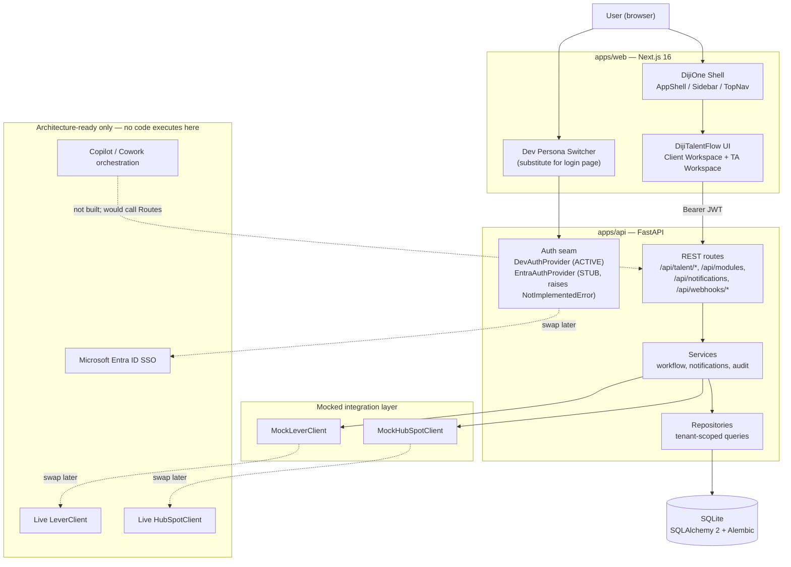

### Component status

| Component | Status | Evidence |
|---|---|---|
| DijiOne platform shell (sidebar, top nav, home, module registry) | **IMPLEMENTED** | `apps/web/src/app/page.tsx`, `components/shell/*`, `GET /api/modules` |
| DijiTalentFlow module (Client + TA workspaces) | **IMPLEMENTED** | `apps/web/src/app/talent-flow/**` |
| Next.js frontend | **IMPLEMENTED** | Next.js 16.3.0, App Router, builds clean |
| FastAPI backend | **IMPLEMENTED** | `apps/api/app/main.py`, all routers registered |
| SQLite database | **IMPLEMENTED** | `apps/api/app/db/session.py`, one Alembic migration applied |
| REST API layer | **IMPLEMENTED** | 30+ endpoints under `/api/talent/*`, `/api/auth/*`, `/api/modules`, `/api/notifications`, `/api/webhooks/*`, `/api/integrations/*` |
| Tenant/client isolation | **IMPLEMENTED** (backend-enforced) | `app/api/deps.py: TalentScope`, repository-layer filtering, `tests/test_tenant_isolation.py` |
| Role handling (RBAC) | **IMPLEMENTED** | `UserModuleRole`, `require_staff_scope`, `require_customer_success_scope` |
| Authentication | **IMPLEMENTED for Dev Identity Mode only** | `app/core/security.py: DevAuthProvider` |
| Authorization | **IMPLEMENTED, backend-enforced** | Every route depends on `TalentScope` or `require_*_scope` |
| HubSpot integration layer | **MOCKED / SIMULATED** | `app/integrations/hubspot/*`, no live HTTP calls anywhere in the codebase |
| Lever integration layer | **MOCKED / SIMULATED** | `app/integrations/lever/*`, no live HTTP calls anywhere in the codebase |
| Microsoft Entra ID SSO | **ARCHITECTURE-READY ONLY** | `EntraAuthProvider` class exists; both its methods raise `NotImplementedError` |
| Copilot / Cowork layer | **NOT IMPLEMENTED** | Only `docs/platform/copilot.md` (prose, no code) |
| Notification mechanism | **IMPLEMENTED** | `Notification` model, `NotificationService`, in-app bell/panel in `TopNav` |
| Audit/event mechanism | **IMPLEMENTED** | `AuditLog` model, `AuditService`, called from every state-mutating service method |
| Mock/stub/adapter layers | **IMPLEMENTED as mocks** | `MockLeverClient`, `MockHubSpotClient`, selected via `app/integrations/factory.py` |

---

## 2. Authentication / SSO Workflow

### Direct answers

- **Is there a real login page?** No. There is a **persona switcher screen** (`apps/web/src/components/shell/DevPersonaSwitcher.tsx`) that lists the 7 seeded users and lets the browser "become" any of them with a single click — no password, no credential of any kind is requested or checked.
- **Is Microsoft Entra ID / Azure AD SSO actually implemented?** No. `EntraAuthProvider` (`apps/api/app/core/security.py`) exists as a class satisfying the `AuthProvider` interface, but both `issue_token()` and `decode_token()` immediately `raise NotImplementedError(...)`. It is never instantiated unless `DEV_IDENTITY_MODE=false`, and if it were, every authenticated request would fail.
- **Is authentication currently mocked?** Yes — entirely. `DevAuthProvider` self-issues HS256 JWTs signed with a hardcoded local secret (`JWT_DEV_SECRET=dev-only-insecure-secret-change-me` in `.env.example`) after nothing more than a persona selection.
- **How is the current user determined?** The JWT's `sub` claim is the numeric `User.id`. `get_current_user()` (`app/api/deps.py`) decodes the bearer token and loads that `User` row. There is no session, cookie, or server-side session store — the token is the entire credential and it lives in the browser's `localStorage` (`apps/web/src/lib/api.ts: getToken/setToken`).
- **How is the user's role determined?** By reading `UserModuleRole` rows for that `user_id` where `module_key='talent-flow'` (`get_talent_scope()`). A user's role is whatever was seeded into the database — there is no self-service role assignment UI.
- **How does the system decide between Client Workspace and TA Operations?** `TalentScope.is_staff` — true if `role` is one of `TA_MEMBER` / `CUSTOMER_SUCCESS` / `TA_MANAGER`. The exact same React components (`apps/web/src/app/talent-flow/**`) render different content/nav based on this flag (see `lib/auth-context.tsx: useTalentScope`).
- **How is client/tenant membership determined?** `UserModuleRole.client_id`, set only for `TALENT_CLIENT` role rows. It is a column in the database, populated only by `scripts/seed.py`; there is no UI to create or edit it.
- **Where are permissions enforced?** Exclusively in the FastAPI layer (`app/api/deps.py` + repository query filters). See Section 12 for detail.
- **Is enforcement frontend-only, backend-only, or both?** **Backend only**, functionally. The frontend does hide nav items and pages it thinks are inappropriate for the current role (`AuthGate`, `talent-flow/layout.tsx`), but this is a UX convenience, not a security boundary — there is no Next.js `middleware.ts`/`proxy.ts` file in the repository, so nothing blocks a browser from requesting any page's HTML/JS. Every actual data fetch still goes through the backend's role/tenant checks, which is what actually prevents unauthorized access.
- **Can a client potentially access another client's information?** Not through the implemented API paths — this is specifically covered by automated tests (`tests/test_tenant_isolation.py`) exercising all four vectors called out in CLAUDE.md §14. See Section 12 for the mechanism and its current limits.
- **What would need to change for production-grade Microsoft SSO?** Implement `EntraAuthProvider.decode_token()` to validate real Entra-issued JWTs against Entra's JWKS (signature, issuer, audience, expiry, role claims), implement the OIDC Authorization Code + PKCE redirect flow in the Next.js app (there is currently no `/api/auth/callback` route despite `.env.example` referencing `ENTRA_REDIRECT_URI=http://localhost:3000/api/auth/callback` — that route does not exist in `apps/web/src/app`), map Entra user identities to local `User` rows (by email or object id — no such mapping logic exists yet), and set `DEV_IDENTITY_MODE=false`. No other application code needs to change, by design (`get_auth_provider()` is the single seam).

### Diagram — AS-IS authentication flow

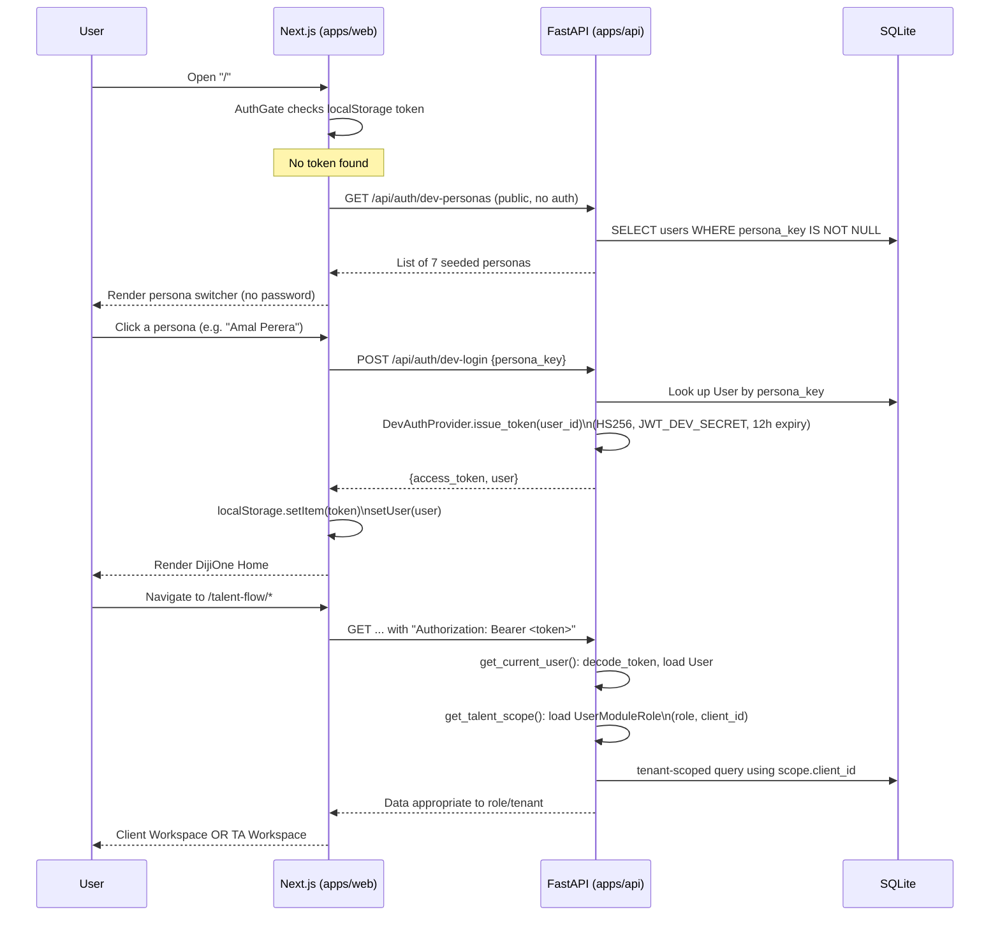

### Diagram — TARGET Microsoft SSO flow (not built)

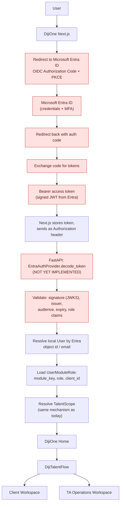

Everything downstream of "Resolve TalentScope" in the target diagram is **already implemented** and would not need to change — only the boxes shaded red are new work.

---

## 3. DijiOne Platform Entry Workflow

The module registry (`ApplicationModule` table, `GET /api/modules`) is real and does filter by the caller's authorization, but only **one** module has actual functionality behind it:

| Registry key | `status` column | Frontend routes | Verdict |
|---|---|---|---|
| `talent-flow` | `ACTIVE` | `/talent-flow/**` (14 pages) | **IMPLEMENTED** |
| `birthday` | `COMING_SOON` | none | **ARCHITECTURE-READY ONLY** (registry row exists; card renders as disabled on Home; no route exists) |
| `spark` | `COMING_SOON` | none | **ARCHITECTURE-READY ONLY** (same as above) |

`docs/platform/module-framework.md` documents how a real second module would be added; that process has not been exercised.

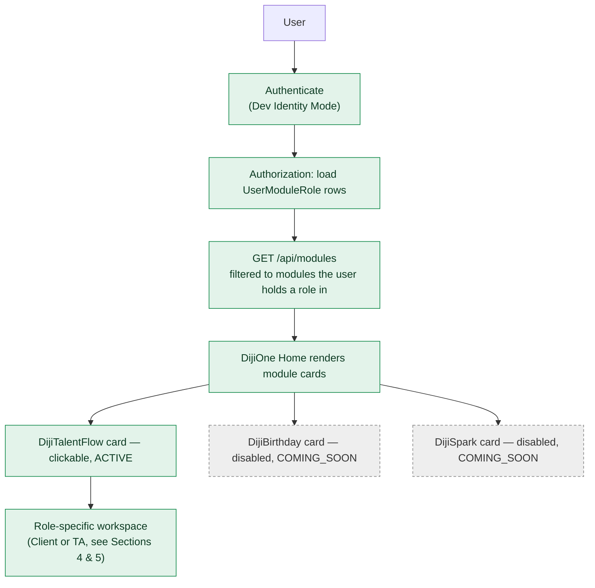

---

## 4. Client Workspace — As-Built Workflow

Confirmed by reading `apps/web/src/app/talent-flow/layout.tsx`, `dashboard/`, `requests/`, `candidates/`, `interviews/`, `messages/`, `documents/` and the corresponding backend routes.

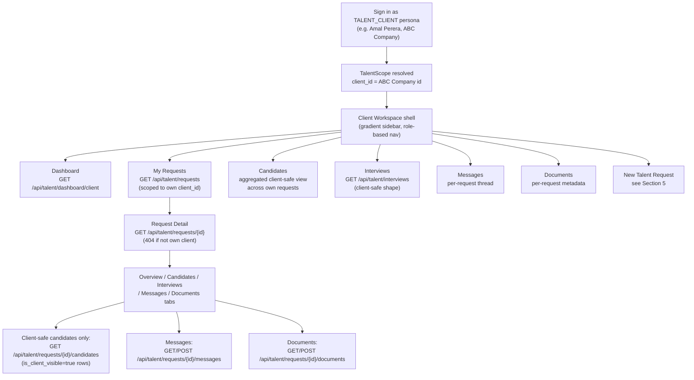

Notes verified from code:

- **Candidates and Interviews pages are aggregations, not first-class list endpoints.** There is no `GET /api/talent/candidates` accessible to a client (that endpoint is `require_staff_scope`-gated, confirmed 403 in `test_client_cannot_reach_staff_only_endpoints`). The client-facing "Candidates" page (`apps/web/src/components/talent/ClientCandidatesOverview.tsx`) works by first calling `GET /api/talent/requests` (already scoped to the client), then calling `GET /api/talent/requests/{id}/candidates` once per request and merging results client-side. Same pattern for "Interviews" (fetches the full scoped interview list once and groups it) and "Messages"/"Documents" overview pages.
- **What a client can never see, structurally:** `Application.score`, `Application.recruiter_notes`, any `Application` belonging to a different `talent_request_id`, and any `Application` where `is_client_visible=false`. This is enforced by the response DTO shape (`ClientSafeCandidateOut` simply has no such fields), not by a filter that could be forgotten — see `apps/api/app/schemas/candidate.py`.

---

## 5. New Talent Request — As-Built Workflow

This is the most important workflow boundary in the system, and the implementation stops earlier than the full CLAUDE.md business narrative.

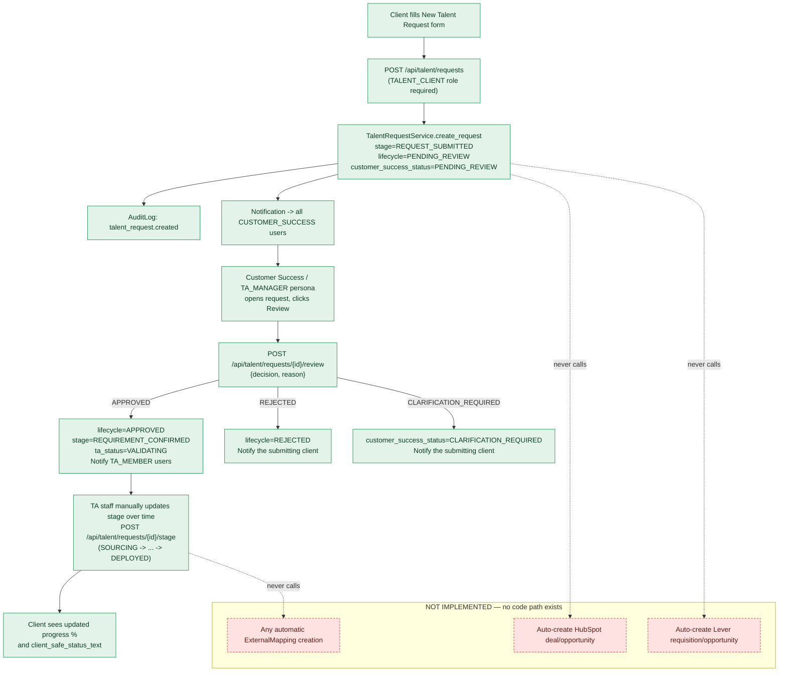

**Explicit boundary** (verified by reading `app/services/talent_request_service.py` in full, and grepping the entire `app/` tree for any call site that constructs an `ExternalMapping`):

- Everything above the "NOT IMPLEMENTED" box is real, tested (`tests/test_talent_request_workflow.py`), and was manually verified in a browser.
- `TalentRequestService.create_request()` never touches HubSpot or Lever — it is a pure local database write plus an in-app notification.
- The CLAUDE.md narrative step "TA creates or links the relevant ATS/CRM operational record" has **no corresponding UI action or API endpoint anywhere in the repository**. The only `ExternalMapping` rows that exist in the database are five hardcoded rows inserted directly by `scripts/seed.py` (two Lever opportunity links for Ron Axel's two applications, three HubSpot company links for the three demo clients) — there is no button, form, or endpoint a user can invoke to create one.
- "TA validates operational requirement" is represented only as a status enum (`ta_status`), settable via `POST /api/talent/requests/{id}/ta-status`, with no validation logic behind it beyond accepting the new value.

---

## 6. TA Operations Workspace — As-Built Workflow

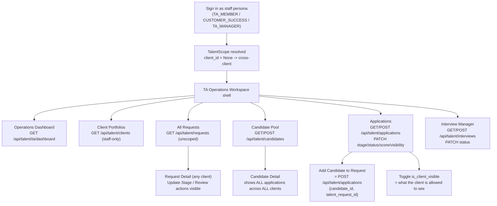

### Multi-tenancy: TA vs. Client

| Aspect | `TALENT_CLIENT` | Staff (`TA_MEMBER`/`CUSTOMER_SUCCESS`/`TA_MANAGER`) |
|---|---|---|
| `TalentScope.client_id` | A specific integer (their own client) | `None` |
| `GET /api/talent/requests` | Only rows with matching `client_id` | All rows, all clients |
| `client_id` query param | Ignored (scope always wins) | Honored, used as an optional additional filter |
| `GET /api/talent/clients` (portfolios) | 403 Forbidden | 200 OK |
| `GET /api/talent/candidates` (full pool) | 403 Forbidden | 200 OK |
| Review/approve requests | Not permitted (403) | `CUSTOMER_SUCCESS`/`TA_MANAGER` only |
| Update stage / TA status | Not permitted (403) | Any staff role |
| Score / recruiter notes visibility | Never returned | Always returned |

All staff roles (`TA_MEMBER`, `CUSTOMER_SUCCESS`, `TA_MANAGER`) currently share **identical** data visibility (`is_staff` is a single boolean) — the only staff-vs-staff distinction implemented is that request **review** additionally requires `CUSTOMER_SUCCESS` or `TA_MANAGER` specifically (`require_customer_success_scope`), so a plain `TA_MEMBER` cannot approve/reject a request but can do everything else a staff user can. There is no dedicated Customer Success UI — that role uses the same TA Workspace shell.

---

## 7. Candidate Cross-Client Assignment Workflow

**Answer to the direct question in the brief: the implementation uses model (C)** — multiple independent `Application` relationship rows against one unchanged `Candidate` master profile. It does **not** move the candidate (A) and does **not** duplicate the candidate (B).

Evidence:
- `apps/api/app/models/candidate.py` docstring: *"Master candidate profile. One row per human being — never duplicated across clients."*
- `apps/api/app/models/application.py`: `UniqueConstraint("candidate_id", "talent_request_id")` — a candidate can have at most one `Application` per request, but an unlimited number of `Application` rows across different requests/clients.
- `ApplicationService.create_application()` raises `DuplicateApplicationError` if the pair already exists; it never touches `Candidate.id` or copies a `Candidate` row.
- Proven by an automated test: `tests/test_candidate_ownership.py::test_candidate_can_apply_to_two_clients_as_one_master_record`.
- Demonstrated in seed data: candidate "Ron Axel" (single `candidates` row) has two `applications` rows — one against ABC Company's "Senior Power Platform Developer" request, one against XYZ Company's "Senior Python Developer" request — and this was visually confirmed in the browser (Candidate Pool card literally reads "2 applications").

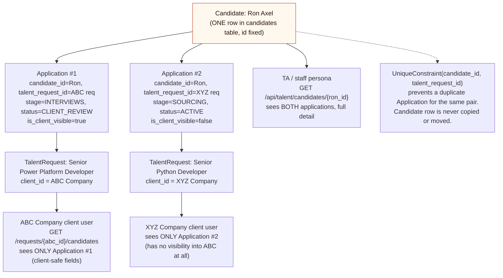

One gap versus the scenario as narrated in the brief: **nothing in the code automatically re-proposes a rejected/inactive candidate to a new client opportunity.** A TA user must manually open the Candidate Pool, find the candidate, and manually create the second `Application` via "Add Candidate to Request." There is no matching/recommendation logic.

---

## 8. HubSpot Workflow

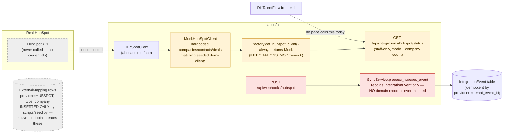

| Direction | Status | Detail |
|---|---|---|
| HubSpot → DijiOne (read) | **MOCKED** | `MockHubSpotClient.list_companies/get_company/list_contacts/list_deals` return hardcoded Python objects. `GET /api/integrations/lever/status`-equivalent `GET /api/integrations/hubspot/status` exposes only `{mode, provider, companies_available, read_only}` — no company/contact/deal data actually reaches the frontend anywhere. |
| DijiOne → HubSpot (write) | **NOT IMPLEMENTED** | No function anywhere constructs an outbound HTTP request to HubSpot. Creating a Talent Request never writes to HubSpot (confirmed in Section 5). |
| Webhook ingestion | **STUBBED** | `POST /api/webhooks/hubspot` accepts any JSON, records one idempotent `IntegrationEvent` row (immediately marked `PROCESSED`), and returns. No signature/authenticity validation. No domain mutation logic exists for HubSpot events (contrast with Lever, Section 9). |
| Adapter/client classes | Present | `HubSpotClient` (ABC), `MockHubSpotClient` |
| Config/credential placeholders | Present, empty | `HUBSPOT_ACCESS_TOKEN=`, `HUBSPOT_BASE_URL=https://api.hubapi.com` in `.env.example` |
| External IDs stored in DB | Present, seed-only | 3 `ExternalMapping` rows (`provider=HUBSPOT, external_object_type=company`) linking each demo `Client` to a fake `hs-abc`/`hs-xyz`/`hs-nova` id |
| Frontend consumption | **NOT IMPLEMENTED** | `apps/web/src/lib/api.ts` defines `getHubspotStatus()`/`listIntegrationEvents()` but no page or component calls them — there is no integration-health screen in the UI. |

---

## 9. Lever Workflow

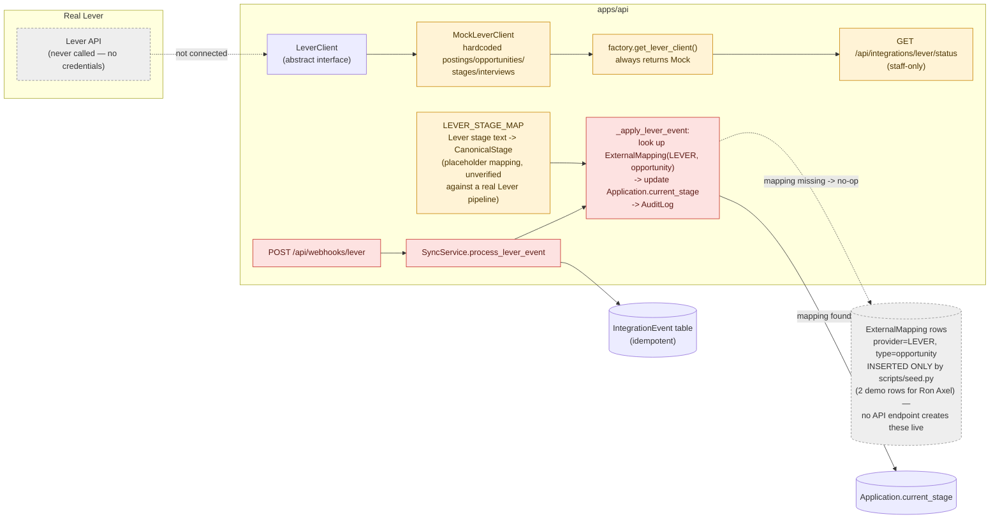

| Direction | Status | Detail |
|---|---|---|
| Lever → DijiOne (read) | **MOCKED** | `MockLeverClient` returns hardcoded postings/opportunities/stages/interviews. Only surfaced via `GET /api/integrations/lever/status` (postings count only) — not otherwise consumed by any UI page. |
| DijiOne → Lever (write) | **NOT IMPLEMENTED** | No outbound HTTP call to Lever exists anywhere. |
| Webhook ingestion | **STUBBED, with real (if shallow) domain logic** | `POST /api/webhooks/lever` is idempotent (`IntegrationEvent` dedupe) and, uniquely among the two providers, actually **does** mutate a domain record: if the payload's `opportunityId` resolves via an existing `ExternalMapping` to a local `Application`, `Application.current_stage` is updated and an `AuditLog` row is written. This was verified with a real test (`tests/test_webhook_idempotency.py::test_lever_stage_sync_updates_linked_application`) that manually inserts the `ExternalMapping` first. |
| Stage mapping | **MOCKED / placeholder** | `LEVER_STAGE_MAP` in `app/integrations/lever/mapper.py` is a guessed mapping of common Lever stage names (e.g. `"Client Submission"`, `"Onsite Interview"`) to `CanonicalStage` — explicitly documented in its own docstring as needing revision against a real Lever pipeline. Unknown stage text silently falls back to `SOURCING`. |
| Adapter/client classes | Present | `LeverClient` (ABC), `MockLeverClient` |
| Config/credential placeholders | Present, empty | `LEVER_API_KEY=`, `LEVER_BASE_URL=https://api.lever.co/v1` |
| External IDs stored in DB | `Candidate.lever_external_id`, `Application.lever_opportunity_id` columns exist but are **unused** — seed data does not populate them (the seed script uses `ExternalMapping` rows instead, not these columns) | Confirmed by reading `scripts/seed.py`: candidate/application creation never sets these fields. |
| Frontend consumption | **NOT IMPLEMENTED** | Same as HubSpot — client functions exist in `lib/api.ts`, no UI surface. |

**How the local model is intended to map to Lever** (per code comments, not yet verified against a real Lever tenant): a Lever "Opportunity" ≈ a DijiOne `Application`; a Lever "Posting"/"Requisition" has no local model equivalent yet; Lever pipeline "stages" collapse many-to-one into the 9 `CanonicalStage` values via `LEVER_STAGE_MAP`; Lever "Candidates" ≈ DijiOne `Candidate` (linkage column `lever_external_id` exists but is not populated by any live process).

---

## 10. Source-of-Truth Matrix

| Data Domain | Current Local Storage | Intended Source of Truth | Integration Status | Notes |
|---|---|---|---|---|
| Client/company | `clients` table (full owner) | HubSpot (per CLAUDE.md §25) | **NOT SYNCED** | Local `Client` is the only place this data actually lives today; `ExternalMapping` links exist but nothing reads from HubSpot to populate/update `Client` rows. |
| Client contacts | Not modeled locally (no `Contact` entity) | HubSpot | **NOT IMPLEMENTED** | `HubSpotContact` mock schema exists in the integration layer only; no local table. |
| Talent requests/requisitions | `talent_requests` table (full owner) | DijiTalentFlow itself, per CLAUDE.md §21 (requests originate here, not in Lever) | **N/A — local is correct source of truth by design** | Confirmed intentional in CLAUDE.md; not a gap. |
| Candidate master profile | `candidates` table (full owner) | Lever (per CLAUDE.md §26), with DijiOne caching a read-model | **NOT SYNCED** | `lever_external_id` column exists, unpopulated by any live process. |
| Candidate applications | `applications` table (full owner) | Lever "Opportunity" per business intent | **PARTIALLY SYNCED (webhook only, inbound stage field)** | Only `current_stage` is ever updated by a (simulated) Lever webhook; nothing else on `Application` is Lever-sourced. |
| Pipeline stage | `applications.current_stage` | Lever, mapped through `CanonicalStage` | **MOCKED sync path exists** | See Section 9. |
| Interview | `interviews` table (full owner) | Lever (per CLAUDE.md §26) | **NOT SYNCED** | No code path creates/updates an `Interview` from Lever data; all seeded/created via local UI only. |
| Interview feedback | Not modeled (no field/table) | Lever | **NOT IMPLEMENTED** | No `feedback` concept anywhere in the schema. |
| Hiring decision | Approximated by `Application.status = HIRED` | Lever | **NOT SYNCED** | Status is only ever set manually via the Applications grid. |
| Documents | `documents` table, metadata only, `storage_reference` is a fake local URI | UNCONFIRMED (CLAUDE.md suggests Azure Blob/SharePoint eventually) | **NOT IMPLEMENTED (no real storage)** | No file bytes are ever stored; `storage_reference` defaults to `local://demo-files/{filename}`. |
| Messages | `messages` table (full owner) | UNCONFIRMED (no external system named for this in CLAUDE.md) | **N/A** | Purely internal by design. |
| User identity | `users` table (full owner) | Microsoft Entra ID (target) | **NOT SYNCED** | No Entra object id column exists on `User` yet. |
| User roles | `user_module_roles` table (full owner) | UNCONFIRMED whether Entra app roles/groups will drive this in production | Marked **UNCONFIRMED** — CLAUDE.md §12 says role claims come from Entra, but no field-level mapping is specified or coded. |
| Tenant membership | `user_module_roles.client_id` | UNCONFIRMED how this will be derived from Entra (group claim? custom attribute?) | **UNCONFIRMED** — not specified in CLAUDE.md beyond "tenant/client scope" being part of token validation. |
| Audit history | `audit_logs` table (full owner) | N/A — local by design | **N/A** | Complete for actions taken through the app; nothing to sync. |

---

## 11. Database / Entity Relationship Diagram

Built directly from the SQLAlchemy models in `apps/api/app/models/*.py` (all 13 model classes read in full for this report).

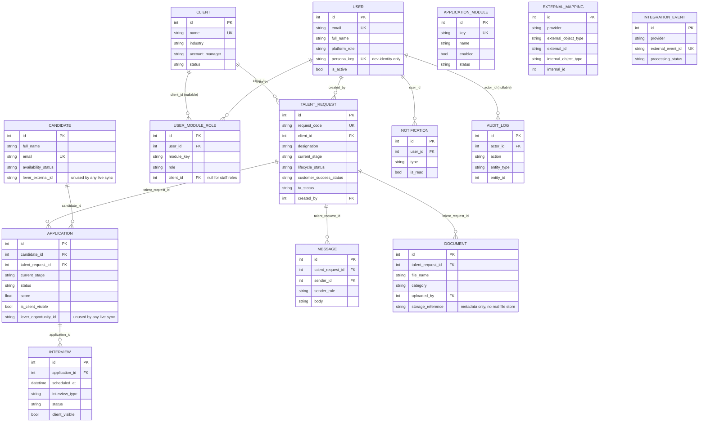

Notes:
- `EXTERNAL_MAPPING.internal_id` and `AUDIT_LOG.entity_id` are **polymorphic** integer references (paired with a `..._type` string column) rather than real foreign keys — SQLAlchemy has no FK constraint for them, so they are drawn unconnected above. This is a deliberate pattern to let one table reference rows in several different tables, at the cost of no database-level referential integrity on those columns.
- `applications` has a `UniqueConstraint(candidate_id, talent_request_id)` — the mechanism underpinning Section 7.
- All tables also carry `created_at`/`updated_at` (from a shared `TimestampMixin`), omitted above for readability.

---

## 12. Complete End-to-End DijiTalentFlow Workflow

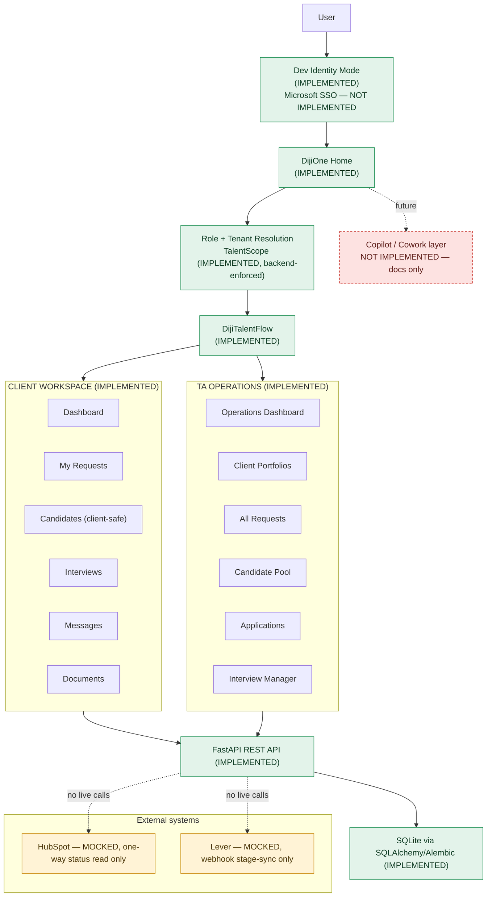

---

## 13. Security / Tenant Isolation Review

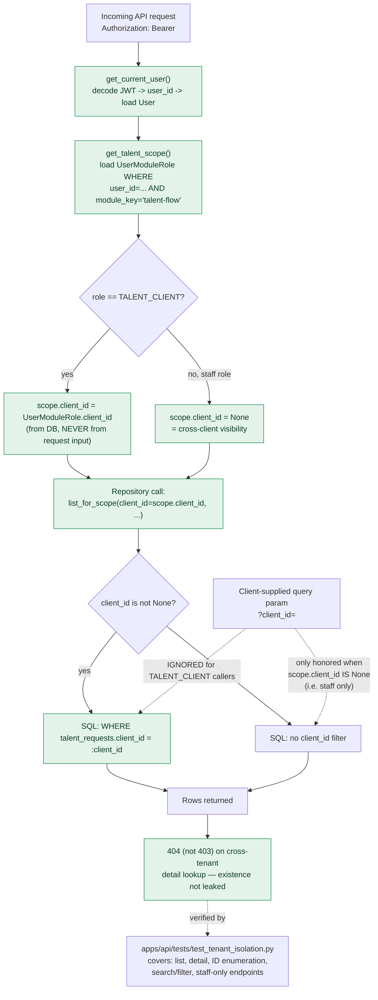

### How tenant ID is determined
Server-side only, from the database: `UserModuleRole.client_id` for the authenticated user, resolved fresh on every request inside `get_talent_scope()`. It is never taken from a header, cookie, query parameter, or request body supplied by the caller.

### Can tenant IDs be supplied/manipulated by the frontend?
A `client_id` query parameter **is** accepted by `GET /api/talent/requests` and `GET /api/talent/clients/{id}`-adjacent endpoints, but its meaning depends entirely on the caller's own resolved scope:
- If the caller is `TALENT_CLIENT`, `list_for_scope()` is called with `client_id=scope.client_id` (their own), and the query-string `client_id` is only ever applied as `filter_client_id` **when `client_id is None`** (i.e. staff) — see `talent_request_repo.py: list_for_scope`. A client-role caller's supplied `client_id` is silently ignored, not honored, not erred on.
- This was specifically tested: `test_search_filter_endpoint_is_tenant_scoped` asserts that passing `?client_id=<other tenant>` as a client persona does not widen the result set.

### Backend authorization checks
Every DijiTalentFlow route depends on one of `get_talent_scope`, `require_staff_scope`, or `require_customer_success_scope` (FastAPI `Depends`). There is no route in `app/api/routes/talent_*.py` or `app/api/routes/webhooks.py`-adjacent talent routes that skips this. (`/api/webhooks/*` themselves have **no** authentication at all — see "current weaknesses" below.)

### TA cross-tenant permissions
By design: any `is_staff` role gets `client_id=None`, meaning literally no `WHERE client_id = ...` clause is ever added — full cross-client visibility, which is the intended behavior per CLAUDE.md §14 ("TA_MEMBER → all clients within their authorization scope").

### Role checks
`require_staff_scope` (any of `TA_MEMBER`/`CUSTOMER_SUCCESS`/`TA_MANAGER`) and `require_customer_success_scope` (`CUSTOMER_SUCCESS`/`TA_MANAGER` only) are the two granularity levels implemented. There is no per-client-per-staff-user restriction (e.g. "this TA_MEMBER may only see clients X and Y") — every staff user sees every client, unconditionally.

### Current weaknesses before production (observed, not exploited)

1. **Dev-mode JWT secret is a hardcoded, checked-in placeholder** (`JWT_DEV_SECRET=dev-only-insecure-secret-change-me` in `.env.example`; the running process falls back to this exact literal string if no `.env` overrides it). Fine for local dev; would be a critical finding if ever deployed as-is.
2. **Webhook endpoints (`/api/webhooks/lever`, `/api/webhooks/hubspot`) have no authentication or signature verification at all** — literally any unauthenticated caller can POST an arbitrary payload. For Lever, a crafted payload with a matching `opportunityId` can move a real `Application`'s stage (mitigated only by the requirement that a matching `ExternalMapping` already exist, which today only seed data creates). This is explicitly flagged in code comments as a "Phase G production-hardening item," not fixed.
3. **No rate limiting, no login attempt limiting** anywhere (moot today since Dev Identity Mode requires no credential, but relevant once real auth exists).
4. **No Next.js route/middleware protection** — any unauthenticated browser can load the HTML/JS for any page; the only real gate is that data fetches will 401. Not a data leak (verified: pages render empty/loading states without a token) but worth closing with a `proxy.ts` before production for defense-in-depth and to avoid exposing route structure/behavior to unauthenticated crawlers.
5. **Tokens are stored in `localStorage`**, which is vulnerable to XSS-based token theft in a way an `httpOnly` cookie would not be. Reasonable for a Dev Identity Mode MVP; should be reconsidered for the real Entra ID integration (Entra ID's own SDKs typically manage this more safely).
6. **`AZURE_STORAGE_CONNECTION_STRING` and other production secrets are empty placeholders in `.env.example`** — correctly, nothing is committed, but there is currently no secret-management story (e.g. Key Vault) wired into the code; it would all be `os.environ` reads via `pydantic-settings` as it is today.

No penetration testing, fuzzing, or exploitation was performed to produce this list — all six points are static-code-reading observations.

---

## 14. Current MVP Completion Map

| Feature | Status | Evidence / Code Location | Production Gap |
|---|---|---|---|
| DijiOne shell | COMPLETE | `apps/web/src/app/page.tsx`, `components/shell/*` | Real SSO (see below) |
| DijiTalentFlow | COMPLETE (as a module) | `apps/web/src/app/talent-flow/**` | — |
| Client Dashboard | COMPLETE | `components/talent/ClientDashboardView.tsx`, `GET /api/talent/dashboard/client` | — |
| My Requests | COMPLETE | `app/talent-flow/requests/page.tsx` | — |
| New Talent Request | COMPLETE (local workflow only) | `app/talent-flow/requests/new/page.tsx`, `POST /api/talent/requests` | No HubSpot/Lever write-through (by design at this phase) |
| Candidates (client view) | COMPLETE (aggregated) | `components/talent/ClientCandidatesOverview.tsx` | N+1 client-side fetch pattern; fine at demo scale |
| Interviews | COMPLETE | `components/talent/InterviewList.tsx` | — |
| Messages | COMPLETE | `components/talent/tabs/MessagesTab.tsx` + overview page | No real-time delivery (poll/refresh only) |
| Documents | PARTIAL | `components/talent/tabs/DocumentsTab.tsx` | Metadata only — **no real file upload/storage exists** |
| TA Dashboard | COMPLETE | `components/talent/TaDashboardView.tsx`, `GET /api/talent/ta/dashboard` | — |
| Client Portfolios | COMPLETE | `app/talent-flow/clients/page.tsx` | No HubSpot enrichment surfaced |
| All Requests | COMPLETE | `app/talent-flow/requests/page.tsx` (staff branch) | — |
| Candidate Pool | COMPLETE | `components/talent/CandidatePoolView.tsx` | — |
| Applications | COMPLETE | `components/talent/ApplicationsView.tsx` | — |
| Candidate reassignment (multi-application) | COMPLETE | See Section 7 | No matching/recommendation automation |
| Interview Manager | COMPLETE | `app/talent-flow/interviews/page.tsx` (staff branch) | — |
| Database | COMPLETE (SQLite) | `apps/api/app/db/`, one Alembic migration | PostgreSQL not actually provisioned/tested, only "compatible" |
| Seed/demo data | COMPLETE | `apps/api/scripts/seed.py` | — |
| RBAC | COMPLETE (2-tier: staff vs client, + CS/manager gate on review) | `app/api/deps.py` | No per-client staff restriction; no fine-grained permission table |
| Multi-tenancy | COMPLETE (enforced, tested) | Section 13 | Webhook endpoints unauthenticated |
| Microsoft SSO | NOT STARTED | `EntraAuthProvider` stub only | Full OIDC flow, JWKS validation, user provisioning |
| HubSpot integration | MOCKED | Section 8 | No live client, no outbound writes, no UI surface |
| Lever integration | MOCKED | Section 9 | No live client, stage map unverified, no UI surface |
| Audit logging | COMPLETE | `AuditLog`, `AuditService`, called from every mutating service method | No admin UI to browse audit history |
| Notifications | COMPLETE (in-app only) | `Notification`, `NotificationService`, `TopNav` bell panel | No email/Teams/push delivery |
| Production database | NOT STARTED | SQLite only | PostgreSQL provisioning, connection pooling, migration rehearsal |
| Production deployment | NOT STARTED | No Dockerfile, no CI/CD config, no IaC found in repo | Everything — Azure App Service/Container Apps target is documented in CLAUDE.md only |

---

## Appendix: Files inspected for this report

Representative, not exhaustive — every file below was opened and read in full:

`CLAUDE.md`; `apps/api/app/core/{security,config,constants}.py`; `apps/api/app/api/deps.py`; `apps/api/app/api/routes/{talent_requests,talent_candidates,talent_applications,talent_interviews,webhooks,integrations,modules,auth,notifications}.py`; `apps/api/app/models/*.py` (all 13 files); `apps/api/app/schemas/candidate.py`; `apps/api/app/services/{talent_request_service,sync_service,candidate_service}.py`; `apps/api/app/integrations/**` (lever + hubspot clients, mocks, mapper, factory); `apps/api/scripts/seed.py`; `apps/api/tests/test_tenant_isolation.py`; `.env.example`; `apps/web/src/lib/{auth-context,api,types}.tsx?`; `apps/web/src/app/**/page.tsx` and `layout.tsx` (route inventory); `apps/web/src/components/shell/DevPersonaSwitcher.tsx`; existing `docs/*.md` written during the prior build phase.
