# DijiAtWork V1 User Manual

## Document control

| | |
|---|---|
| Document title | DijiAtWork V1 User Manual |
| Document purpose | Explains how employees record their working sessions and request corrections, and how managers review attendance, decide requests and produce reports. |
| Document version | 2.0 |
| Publication date | 20 November 2026 |
| Document status | Final. No formal review or approval process applies to these manuals. |
| Application version | DijiAtWork 0.5.0 (`atwork-web`) |
| Platform name | DijiOne by Dijital Team |
| Release reference | `main`, commit `d877a31` (DijiAtWork V1 final release, deployed to Production on 19 November 2026, UTC) |
| Production address | https://dijione.dijitalteam.com/atwork |
| Solutions Architect & Development Engineer | Madushanka Weeriyasinghe |
| Business owner | Dijital Team |
| Document owner | Dijital Team |
| Intended audience | All employees; managers (DijiAtWork Manager, sections G to K); authorised DijiOne administrators |
| Classification | **Internal.** No approved classification exists yet. Dijital Team staff only. |
| Related documents | The other DijiOne user manuals; the screenshot provenance and known limitations in `docs/end-user/README.md`. |

## Revision history

Every revision was drafted with the Claude Code AI assistant.

| Version | Date | Summary of changes | Prepared by | Review or approval status |
|---|---|---|---|---|
| 1.0 - 1.5 | 15 November 2026 | First manual and editorial passes (documentation commits `9974b01` to `e7320cc`), based on release-line commit `b5ce3d4`. | Madushanka Weeriyasinghe | No formal review |
| 2.0 | 20 November 2026 | **DijiAtWork V1 manual.** Restructured into sections A to N. All 36 screenshots recaptured from the V1 release (`d877a31`) with fictional demonstration data. New: automatic application access for every active DijiOne user and the separate attendance eligibility, the "Attendance is not set up for your account" screen, the collapsible sidebar, notifications, sample CSV and Excel exports, and expanded troubleshooting and FAQs. | Madushanka Weeriyasinghe | No formal review |

## Contents

- [A. Introduction](#a-introduction)
- [B. Accessing DijiAtWork](#b-accessing-dijiatwork)
- [C. Employee: Today](#c-employee-today)
- [D. Employee: Attendance history](#d-employee-attendance-history)
- [E. Employee: Attendance corrections](#e-employee-attendance-corrections)
- [F. Notifications](#f-notifications)
- [G. Management: Overview](#g-management-overview)
- [H. Management: Employees and sessions](#h-management-employees-and-sessions)
- [I. Management: Corrections](#i-management-corrections)
- [J. Management: Reports and exports](#j-management-reports-and-exports)
- [K. Management: Settings and audit](#k-management-settings-and-audit)
- [L. Common problems and troubleshooting](#l-common-problems-and-troubleshooting)
- [M. Frequently asked questions](#m-frequently-asked-questions)
- [N. Support and document control](#n-support-and-document-control)

> **About the screenshots.** Every figure is a genuine capture of the DijiAtWork V1 application, run locally from the released code with fictional people (for example *Nimali Fernando* and *Ayesha Silva*) and fictional attendance. No real employee data appears. The demonstration day is Friday 20 November 2026 in the Asia/Colombo time zone. The footer in the screenshots reads "Build dev"; in Production it shows the release build.

---

## A. Introduction

### What DijiAtWork is

**DijiAtWork** is Dijital Team's work check-in and attendance application inside **DijiOne**, the company's digital workspace. You use it to record **when you work**: you check in when you start, record your breaks, and check out when you finish. DijiAtWork keeps your personal attendance history and lets you ask Management to correct mistakes.

DijiAtWork records **operational working hours. It is not a payroll system.** It is also separate from Diji On-site (the fingerprint terminals); the two do not share data.

### Who should use it

| Who | What they use |
|---|---|
| Every active DijiOne user | Can open DijiAtWork from DijiOne Home |
| Employees linked to an employee record | **Today**, **My Attendance** and **My Requests**: record and review their own attendance |
| Managers (DijiAtWork Manager) | Everything above, plus the **Management** area for all employees |

### Employee and Management functions

- **Employee functions** cover your own attendance only: check in and out, breaks, history, correction requests.
- **Management functions** cover everyone's attendance: who is working, correction decisions, reports, exports, audit history and settings. They are available only to people a DijiOne administrator has given the **DijiAtWork Manager** role.

### Terminology

| Term | Meaning |
|---|---|
| **Session** | One period of work from check-in to check-out. You can have several sessions in a day. |
| **Work mode** | Where you work for a session: **Office**, **Remote** or **Client Site**. |
| **Break** | A pause inside a session, recorded with **Start Break** and **End Break**. |
| **Gross time** | The total time from check-in to check-out. |
| **Net working time** | Gross time minus break time. |
| **Missed check-out threshold** | The number of hours (12 by default) after which an open session is treated as a possible missed check-out. |
| **Unverified time** | Time from a session that ran longer than the threshold. It is shown separately and **not counted** until Management confirms the real times. |
| **Correction request** | Your request to change a recorded session. |
| **Missing session request** | Your request to add a session that was never recorded. |
| **Business time zone** | The single time zone DijiAtWork uses for all times (Asia/Colombo). |

### Attendance recording principles

- You can have **one open session at a time**. Checking in again after a check-out starts a **new session**, and sessions on the same day add up.
- **Time between sessions is not counted** unless Management approves a request for it.
- **Check Out asks for confirmation and cannot be undone.** A completed session changes only through an approved correction.
- **Nobody is checked out automatically.** A session left open longer than the threshold becomes **unverified**.
- Your official record changes only when **Management approves** a request, and **nobody can approve their own request**.

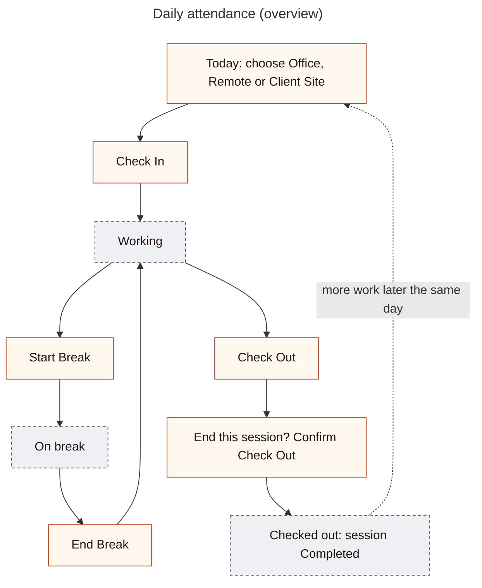
```mermaid
---
title: Daily attendance (overview)
---
flowchart TD
  A["Today: choose Office, Remote or Client Site"]:::user --> B["Check In"]:::user
  B --> C["Working"]:::auto
  C --> D["Start Break"]:::user
  D --> E["On break"]:::auto
  E --> F["End Break"]:::user
  F --> C
  C --> G["Check Out"]:::user
  G --> H["End this session? Confirm Check Out"]:::user
  H --> I["Checked out: session Completed"]:::auto
  I -.->|"more work later the same day"| A
  classDef user fill:#fff8ef,stroke:#c9431d,color:#24140f
  classDef auto fill:#eef0f3,stroke:#5b6472,color:#24140f,stroke-dasharray:4 3
```

Cream boxes are steps you take; grey dashed boxes happen automatically.

---

## B. Accessing DijiAtWork

### B1. Open DijiOne and sign in

1. Open **https://dijione.dijitalteam.com** in your browser. To go straight to DijiAtWork, open **https://dijione.dijitalteam.com/atwork**.
2. On the sign-in page select **Sign in with Microsoft** and sign in with your Dijital Team Microsoft account. Complete any multi-factor prompt your organisation requires.
3. You arrive on **DijiOne Home**.

> Always use the Production address above. Other DijiOne environments are used only for testing.

### B2. Find DijiAtWork on Home

DijiOne Home lists the applications you can use under **MY APPS**. The **DijiAtWork** card shows your role and the application's status. Select **Open**.

The status under the role can read **Healthy**, **Idle** or **Starting…**. Idle and Starting… are normal: DijiAtWork wakes up when you open it, which can take a few seconds the first time.

### B3. Automatic application access

**You do not need to request DijiAtWork.** Every active DijiOne user receives the **DijiAtWork User** role automatically, including people who sign in for the first time. Nobody has to assign it, and it stays while your DijiOne account is active.

### B4. Attendance eligibility

Opening DijiAtWork and **recording attendance** are two different things:

| | Who | What you can do |
|---|---|---|
| **Application access** | Every active DijiOne user | Open DijiAtWork |
| **Attendance eligibility** | Employees whose Dijital Team Microsoft account is linked to their HR employee record | Check in and out, take breaks, view your history, request corrections |

Most employees are linked automatically when they sign in. Accounts that are not employees (for example a shared or service account) can open DijiAtWork, but cannot record attendance. This keeps every attendance record tied to a real employee.

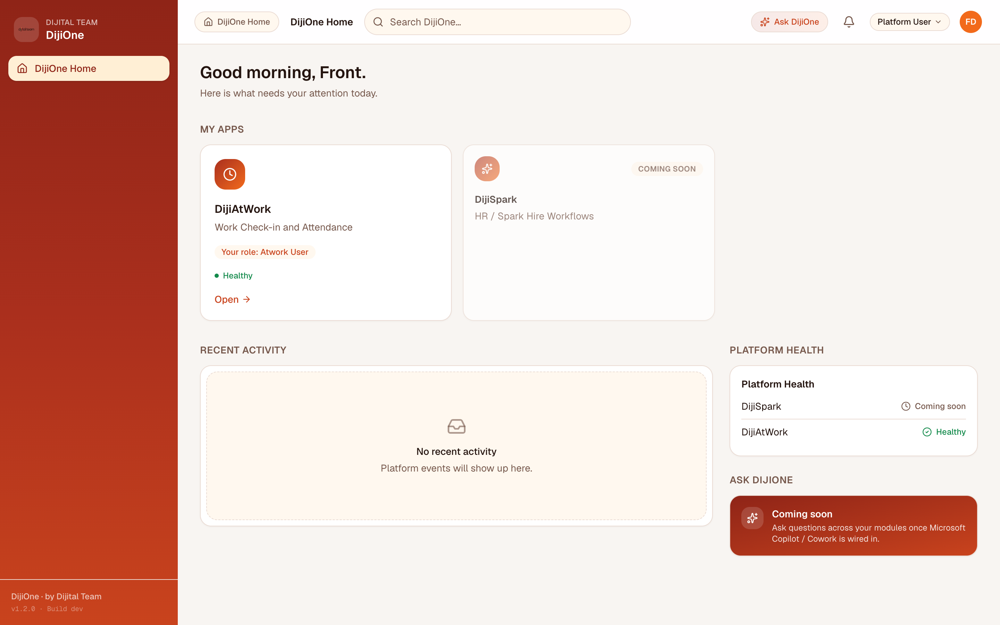

### B5. If attendance is not available to you

If your account is not linked to an employee record, **Today** shows **Attendance is not set up for your account** and the menu has no attendance pages:

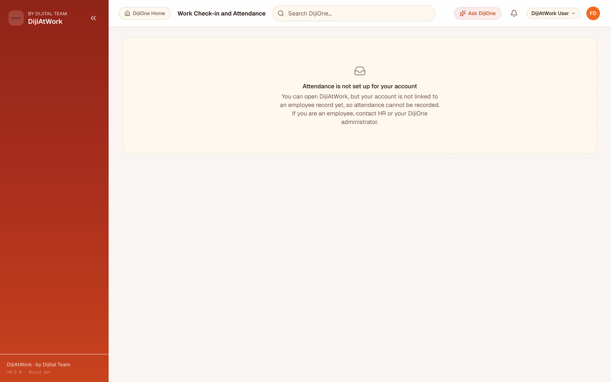

What to do: if you are a Dijital Team employee, contact HR or your DijiOne administrator so your employee record can be linked. Then sign out and sign in again. You do not need a new account.

### B6. The DijiAtWork screen and the collapsible sidebar

DijiAtWork opens on **Today**. The left sidebar lists your pages (**Today**, **My Attendance**, **My Requests**) and, for managers, the **Management** pages. The top bar has **DijiOne Home**, the notification bell and your user menu. All times are in the business time zone shown on each page ("Times are shown in Asia/Colombo.").

To get more space, select the **«** button at the top of the sidebar. The sidebar collapses to icons; point at an icon to see its name, and the current page stays highlighted. Select **»** to expand it again. DijiAtWork remembers your choice on that browser. The keyboard works too: tab to the button and press Enter.

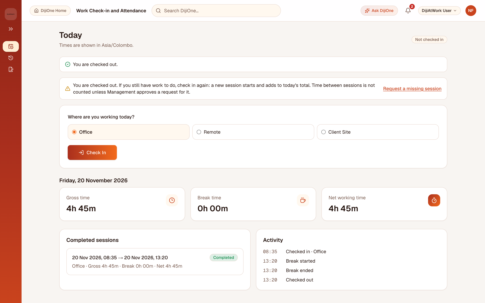

On a phone, the sidebar becomes a menu button in the top bar:

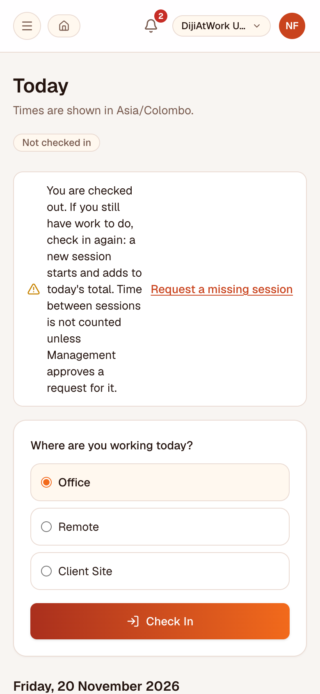

### B7. Sign out

Open the user menu (your initials, top right) and select the item below your name. It is currently labelled **Switch persona**, and it signs you out of DijiOne. Close the browser if you use a shared computer.

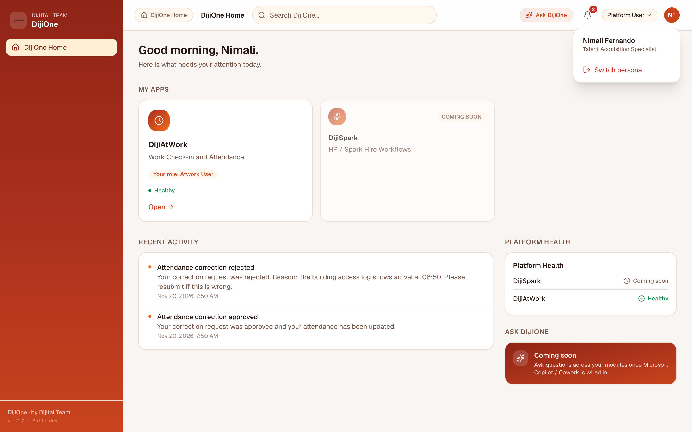

---

## C. Employee: Today

**Today** is where you record your working day. The badge at the top right shows your status: **Not checked in**, **Working** or **On break**.

### C1. Check in

1. Open **Today**.
2. Under **Where are you working today?** choose **Office**, **Remote** or **Client Site**.
3. Select **Check In**.

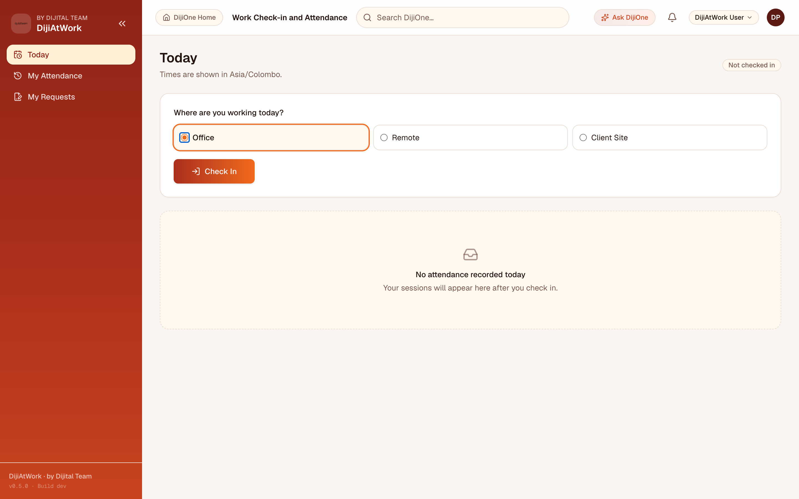

**Result:** the status changes to **Working** and "You are checked in." appears. The large timer shows your **Net working time**, with **Session elapsed** and **Break time** beside it, and the line below shows the work mode and start time. The **Activity** list records "Checked in · Office".

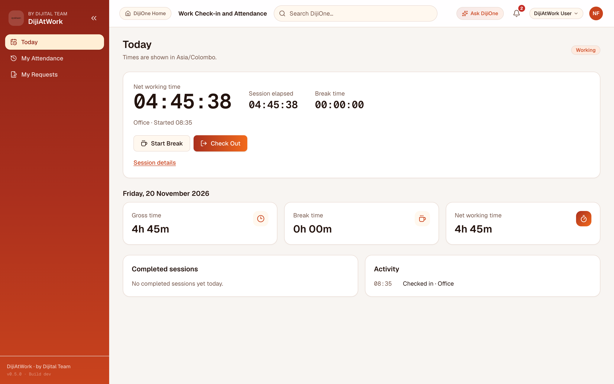

### C2. Take a break

1. Select **Start Break**. The status changes to **On break** and the break timer runs.
2. When you return, select **End Break**.

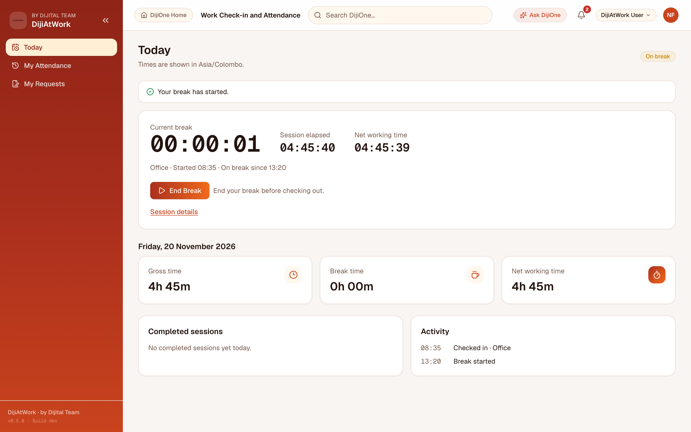

Break time is subtracted from gross time to give your net working time. You cannot check out while a break is running: end the break first.

### C3. Check out

1. Select **Check Out**.
2. Read the confirmation **End this session?**. It shows your net working time and reminds you that this cannot be undone.
3. Select **Confirm Check Out**, or **Keep Working** to cancel.

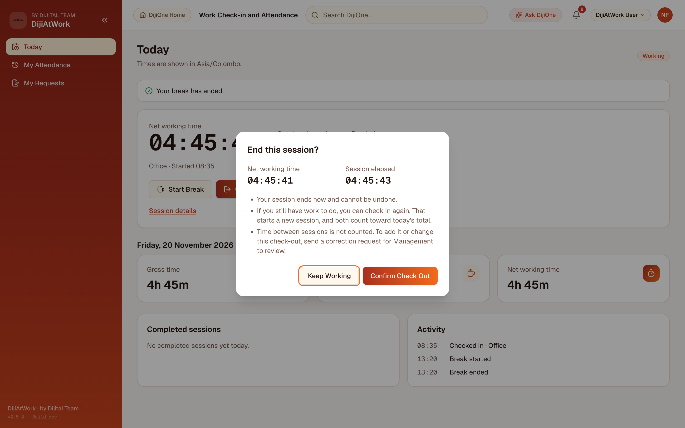

**Result:** "You are checked out." The session appears under **Completed sessions** with its gross, break and net time, and the day's totals update.

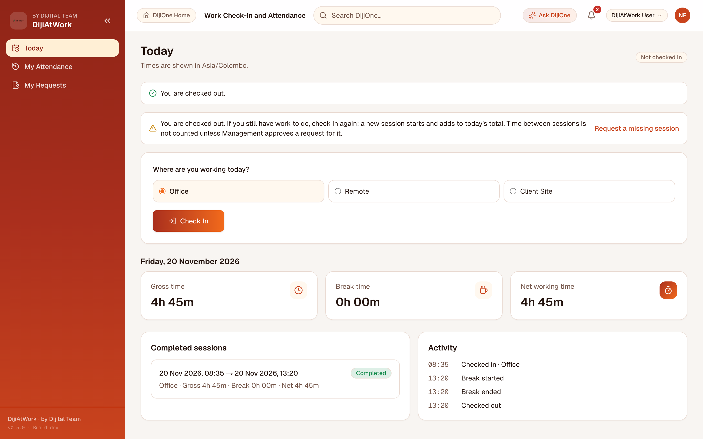

### C4. Check in again after an accidental or early check-out

If you checked out by mistake, or start working again later the same day:

1. Choose the work mode and select **Check In** again. A **new session** starts and is added to today's total.
2. The gap between the two sessions is **not counted**. If it should count, select **Request a missing session** in the notice on Today (see section E).

### C5. Today's totals

Below your status, **Today** shows the date and three totals for the whole day:

| Total | Meaning |
|---|---|
| **Gross time** | All completed sessions today, from check-in to check-out |
| **Break time** | All breaks inside those sessions |
| **Net working time** | Gross time minus break time |

The **Completed sessions** list shows each finished session, and **Activity** lists every check-in, break and check-out in time order.

### C6. If you forgot to check out

When a session is open longer than the missed check-out threshold (12 hours by default):

- **Today** shows: "This session has been open for over 12 hours and its time is unverified, so it is not counted in your totals."
- The timer is labelled **Session elapsed (unverified)** with "Not counted as working time until confirmed."
- You receive a notification (section F).

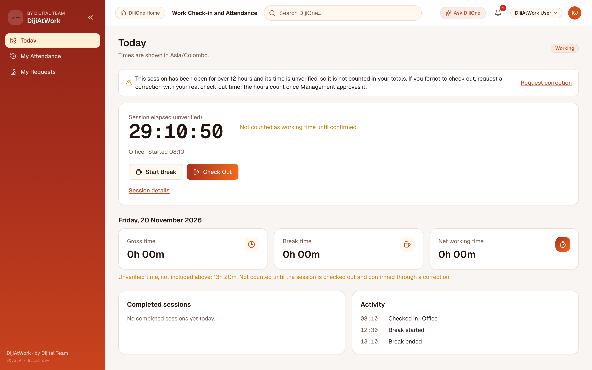

What to do:

1. Select **Check Out** to close the session.
2. Select **Request correction** and enter your real check-out time and a reason (section E).
3. When Management approves it, the hours are counted.

---

## D. Employee: Attendance history

### D1. View your history

1. Open **My Attendance**.
2. Choose **From** and **To** dates and select **Apply**. The default range covers recent weeks.
3. Each day shows its sessions, newest first. Days without records are not shown.

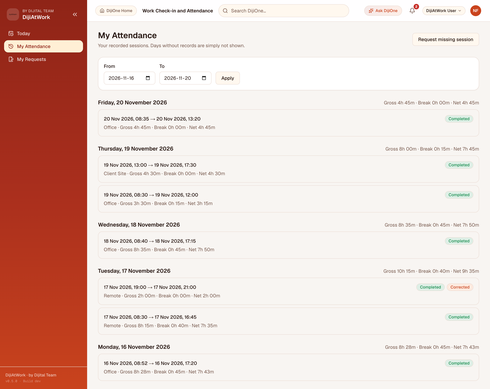

### D2. Several sessions on one day

A day can contain several sessions, for example an office morning and a client-site afternoon. Each session is listed separately with its work mode and times, and the day heading shows the **sum** of all sessions.

**Example (Thursday 19 November in the figure):**

| Session | Gross | Break | Net |
|---|---|---|---|
| Office 08:30 - 12:00 | 3h 30m | 0h 15m | 3h 15m |
| Client Site 13:00 - 17:30 | 4h 30m | 0h 00m | 4h 30m |
| **Day total** | **8h 00m** | **0h 15m** | **7h 45m** |

The hour between 12:00 and 13:00 is not counted because no session was open.

### D3. How hours are calculated

- **Gross** = check-out time minus check-in time.
- **Break** = the sum of all breaks in the session.
- **Net** = gross minus break.

For example, Wednesday 18 November: check-in 08:40, check-out 17:15 gives gross 8h 35m. A lunch break 12:30 - 13:15 is 0h 45m, so net is **7h 50m**.

### D4. Session details

Select a session to see its details: work mode, check-in, check-out, each break, the totals and the session status. From here you can select **Request correction**.

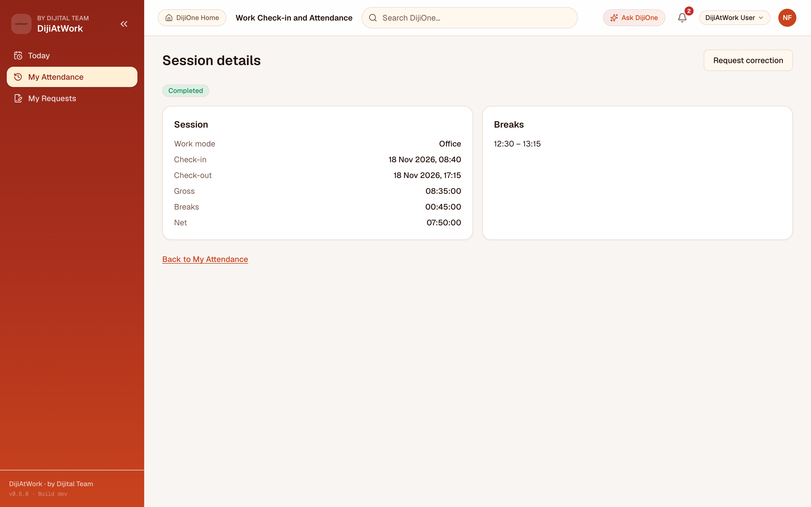

### D5. Statuses, and verified versus unverified hours

| Status | Meaning |
|---|---|
| **Active** | The session is still open. |
| **Completed** | Checked out normally. Its time counts. |
| **Corrected** | Changed or added by an approved request. Its time counts. |
| **Unverified** | Open longer than the threshold. Its time is shown as **elapsed time only** and is **not counted** in your totals, reports or exports. |

Elapsed time is simply how long a session has been open. **Counted working time** is only the time from completed, corrected or confirmed sessions. An unverified session becomes counted only when Management **approves a correction that confirms its real times**. A correction that only changes the work mode does not confirm it.

---

## E. Employee: Attendance corrections

### E1. When to request a correction

| Situation | Request |
|---|---|
| A recorded check-in or check-out time is wrong | **Correction** of that session |
| The work mode is wrong | **Correction** of that session |
| A break is missing or wrong | **Correction** of that session (add, change or remove breaks) |
| You forgot to check out | **Correction** with your real check-out time |
| You worked but no session was recorded (forgot to check in, or the gap after an accidental check-out) | **Missing session** request |

Your official record **does not change** while a request is pending.

### E2. Correct a session

1. Open the session (from **My Attendance**, from **Today**, or via **My Requests** → **Correct a session**) and select **Request correction**.
2. Change what is wrong: **Work mode**, **Check-in**, **Check-out**, and breaks (**Add break**, or the bin icon to remove one). Times are in the business time zone.
3. Enter a **Reason** (required). Explain what happened so Management can check it.
4. Select **Submit request**.

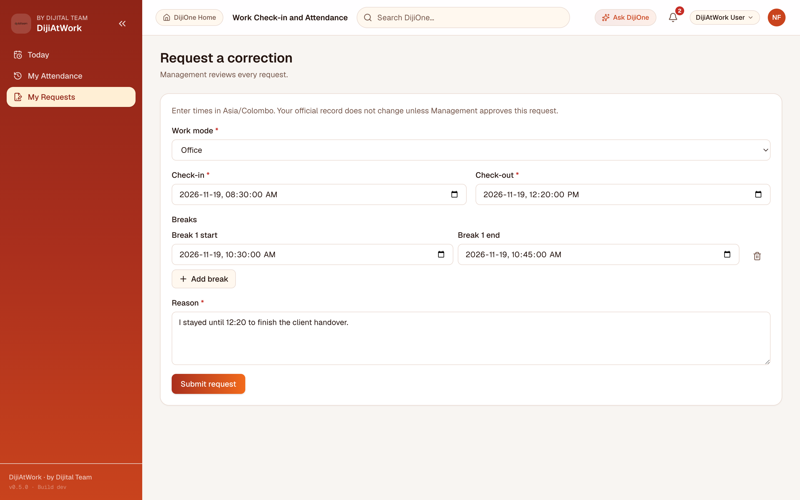

### E3. Report a missing session

1. On **My Attendance** or **My Requests** select **Request missing session** (or **Request a missing session** on Today).
2. Enter the **Work mode**, **Check-in**, **Check-out**, any breaks and a **Reason**.
3. Select **Submit request**.

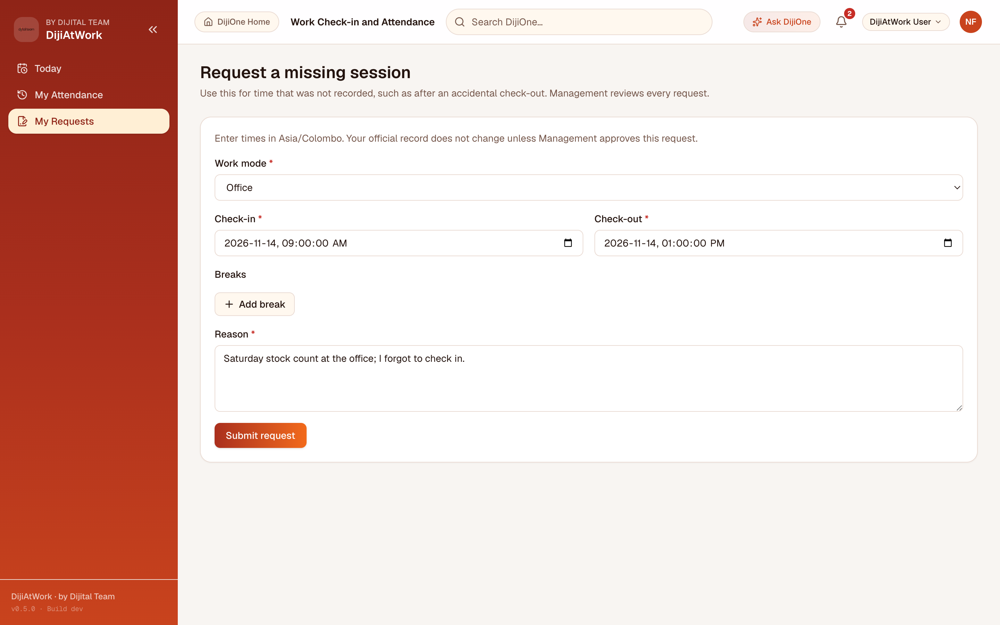

Use a missing-session request only for time with **no** session at all. To fix a session that exists, request a correction.

### E4. Follow your requests

Open **My Requests**. Each request shows its type, when you submitted it, your reason, and a table of **Original** and **Proposed** values with the changes highlighted. Use **Status** to show **All**, **Pending**, **Approved**, **Rejected** or **Withdrawn**.

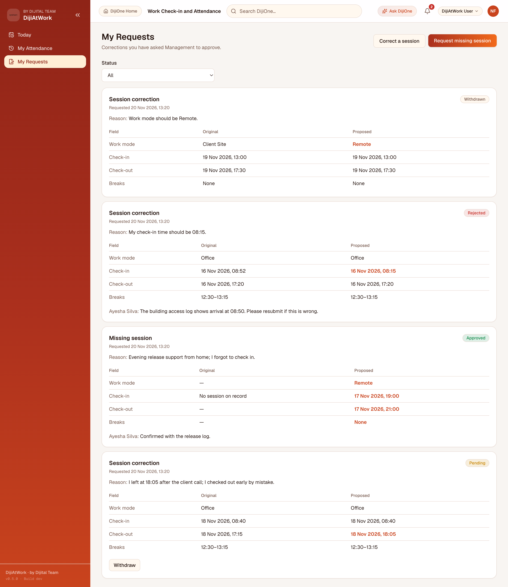

| Status | Meaning |
|---|---|
| **Pending** | Waiting for a manager. You can still withdraw it. |
| **Approved** | Your official record has been changed. The manager's note, if any, is shown. |
| **Rejected** | Nothing changed. The manager's reason is shown; you can submit a new request with better information. |
| **Withdrawn** | You cancelled it. Nothing changed. |

### E5. Withdraw a request

Select **Withdraw** on a pending request. It is withdrawn immediately, without a confirmation step. To ask again, submit a new request.

### E6. After a decision

- **Approved:** the session shows **Corrected** in My Attendance (or the missing session is added), totals are recalculated, and the original values stay in the audit history.
- **Rejected:** nothing changes; read the reason in My Requests.

You are notified of either decision (section F). **You cannot approve your own request**; this applies to managers too.

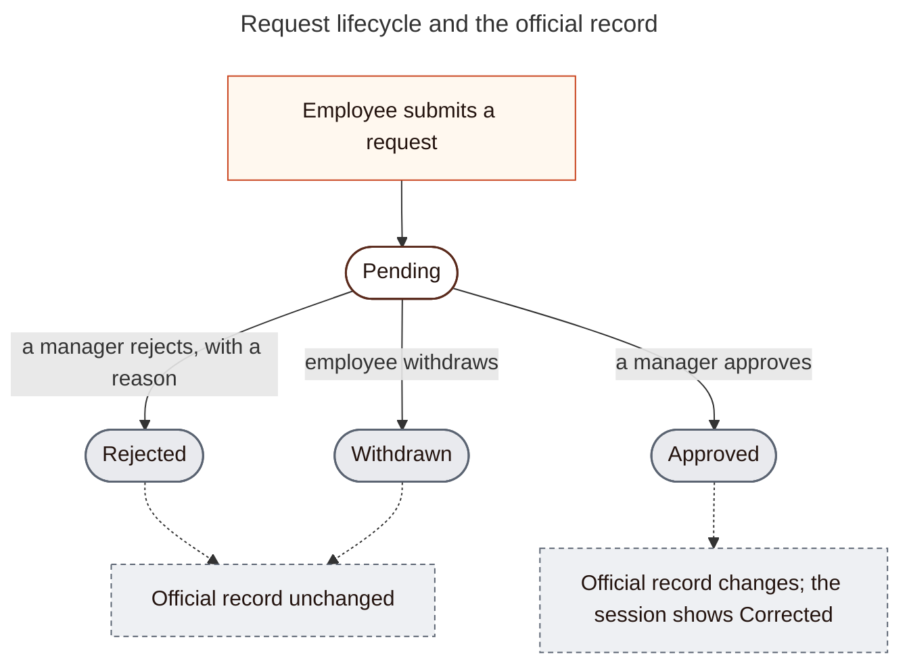
```mermaid
---
title: Request lifecycle and the official record
---
flowchart TD
  S["Employee submits a request"]:::user --> P(["Pending"]):::status
  P -->|"employee withdraws"| W(["Withdrawn"]):::final
  P -->|"a manager approves"| A(["Approved"]):::final
  P -->|"a manager rejects, with a reason"| R(["Rejected"]):::final
  A -.-> C["Official record changes; the session shows Corrected"]:::auto
  R -.-> N["Official record unchanged"]:::auto
  W -.-> N
  classDef user fill:#fff8ef,stroke:#c9431d,color:#24140f
  classDef auto fill:#eef0f3,stroke:#5b6472,color:#24140f,stroke-dasharray:4 3
  classDef status fill:#ffffff,stroke:#5a2a1c,color:#24140f,stroke-width:1.5px
  classDef final fill:#e9eaee,stroke:#5b6472,color:#24140f,stroke-width:1.5px
```

---

## F. Notifications

DijiAtWork notifications appear **inside DijiOne**: on the **bell** in the top bar (with a count of unread items) and under **RECENT ACTIVITY** on DijiOne Home. DijiAtWork does not send email.

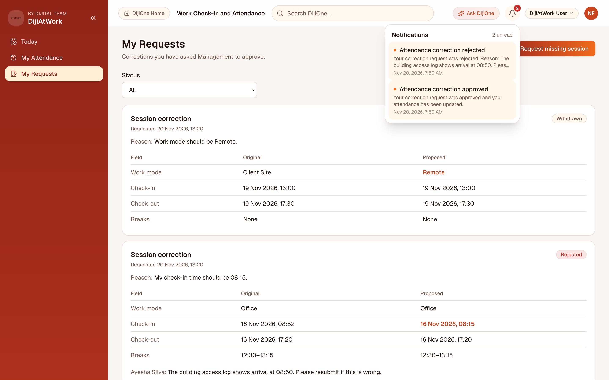

| Notification | Who receives it | When |
|---|---|---|
| **Check-out may have been missed** | You | Your session has been open longer than the threshold |
| **Attendance correction approved** | You | A manager approved your request |
| **Attendance correction rejected** (with the reason) | You | A manager rejected your request |
| **Attendance correction awaiting review** | Managers | An employee submitted a request |
| **Attendance correction withdrawn** | Managers | An employee withdrew a pending request |
| **Attendance corrections awaiting review** (daily reminder) | Managers | From 09:00 each day, when requests have waited more than 24 hours |

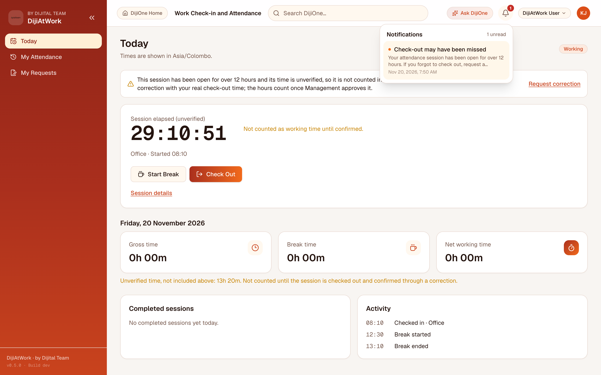

Select a notification to open the related DijiAtWork page. For example, the missed check-out notice opens a correction form for that session, and the manager notices open **Corrections**. Notifications are checked and delivered automatically every few minutes, so a new one can take a short time to appear.

---

## G. Management: Overview

### G1. Who can use Management

The **Management** area is only for people with the **DijiAtWork Manager** role. A **DijiOne administrator** assigns it in the DijiOne Admin Center, to a person or through an access group. It is never given automatically. Managers keep their own employee pages as well.

An employee who opens a Management page sees **Management access required**:

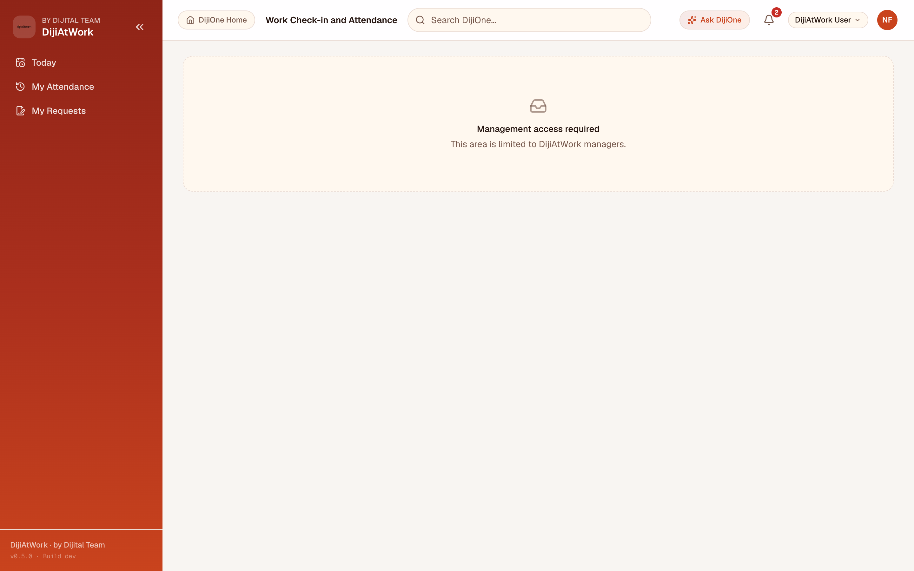

**Scope:** managers see **all employees' attendance**. There are no team-based restrictions in this release.

### G2. The Management Overview

Open **Management → Overview**. It shows today's picture for the whole organisation:

- **Working now**, **On break**, **Completed today** and **Pending corrections** counts;
- **Today so far**: gross, break and net time, with any unverified time shown separately;
- **Currently working**: each person, work mode and start time. An **Overdue** marker means the session is past the missed check-out threshold;
- **On break**, **Attendance exceptions** (sessions open too long) and **Completed sessions today**.

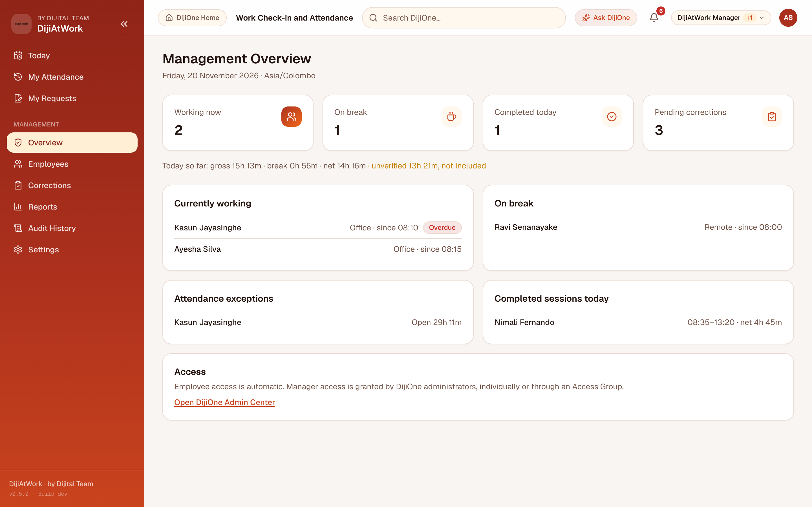

### G3. Attendance that needs attention

- **Overdue / Attendance exceptions:** ask the person to check out and request a correction with the real time (section C6).
- **Pending corrections:** open **Corrections** and decide them (section I). Managers are notified of new requests:

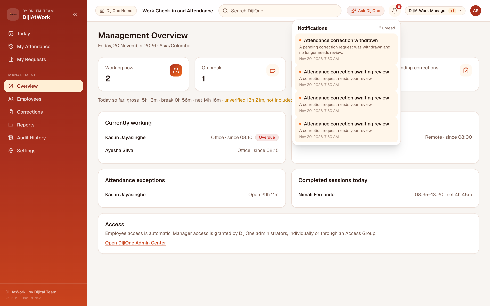

The collapsible sidebar works in Management too:

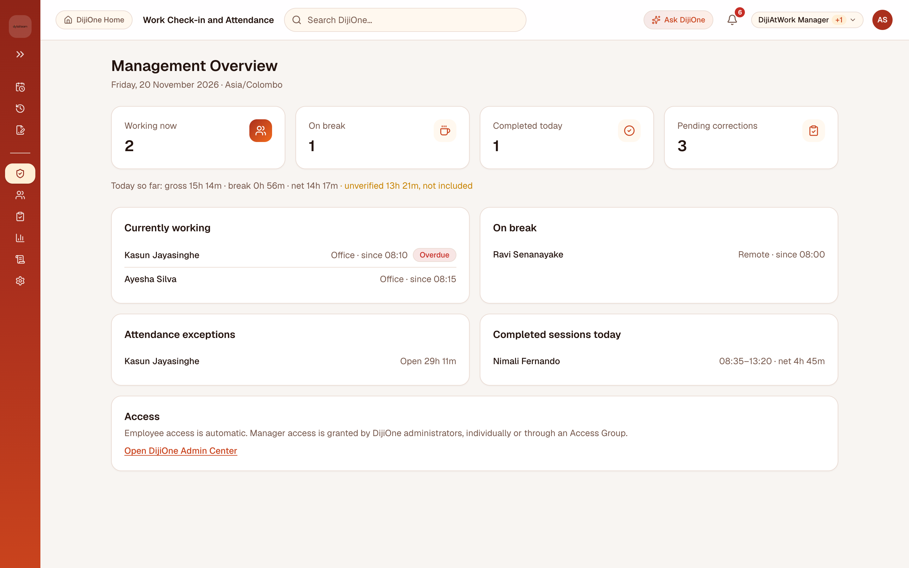

---

## H. Management: Employees and sessions

### H1. Find an employee

Open **Employees**. The list shows people who have recorded attendance or made a request, with their current status. Search by name or email. A colleague who has never checked in does not appear yet.

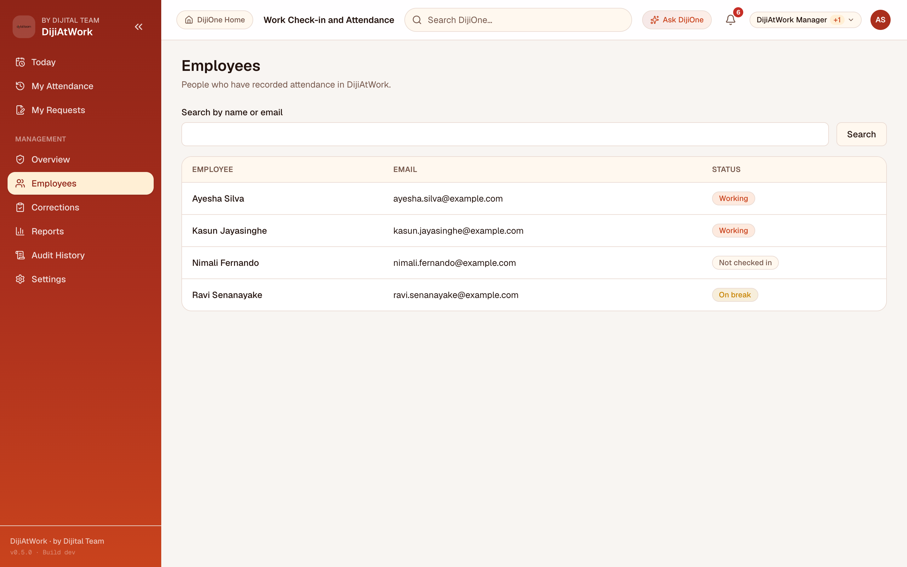

### H2. An employee's attendance

Select an employee to see their attendance by day, with each session's work mode, times, totals and status, for the date range you choose.

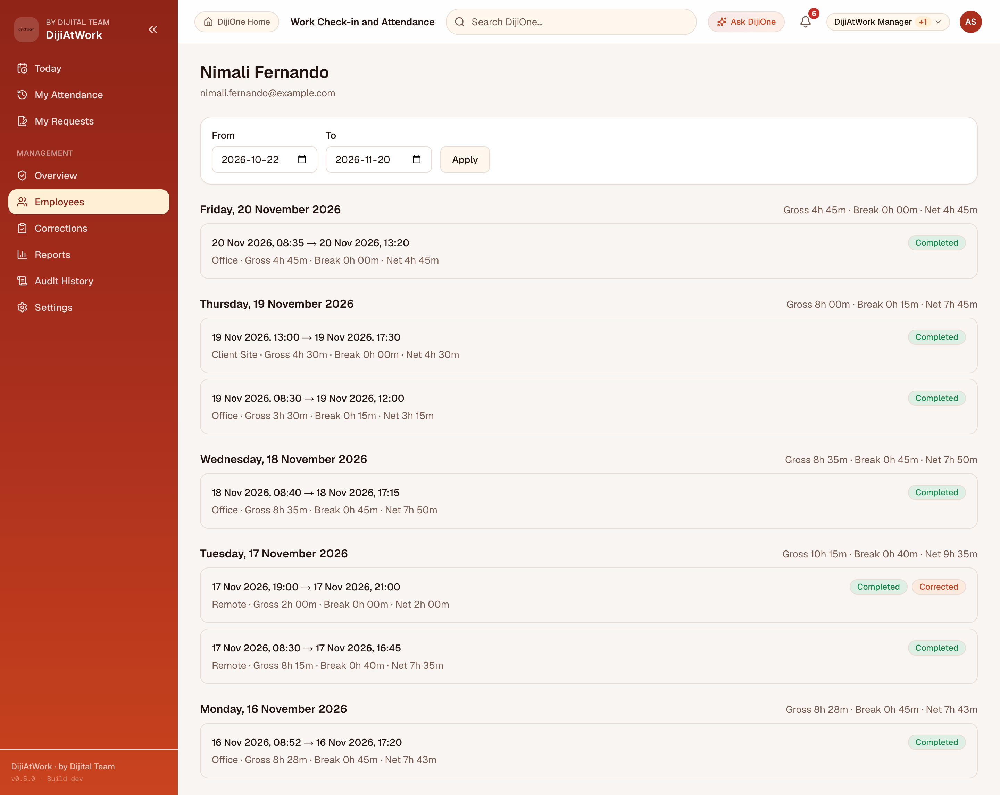

### H3. Session details, and incomplete or unverified sessions

Select a session to see its full details. An **open** session past the threshold is marked **unverified**: its elapsed time is shown but not counted until a correction confirming its real times is approved.

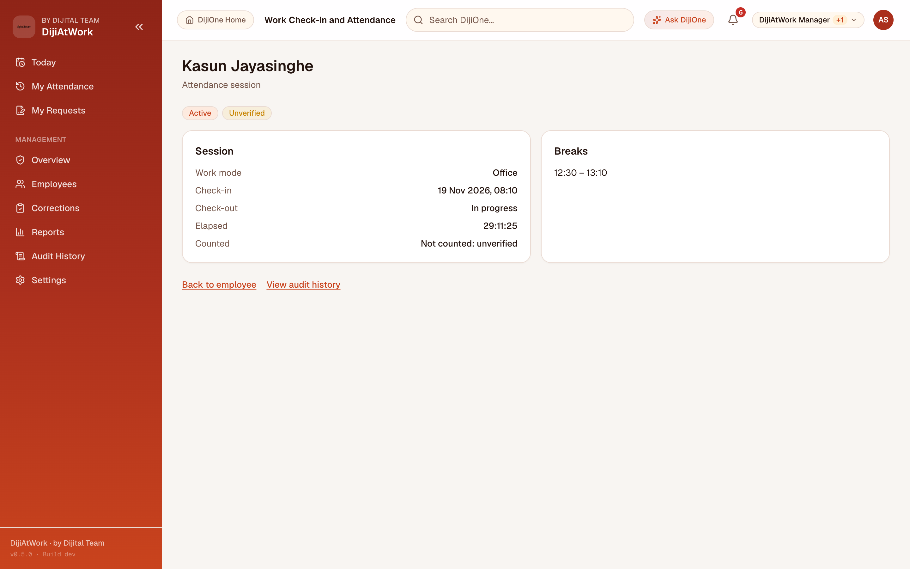

---

## I. Management: Corrections

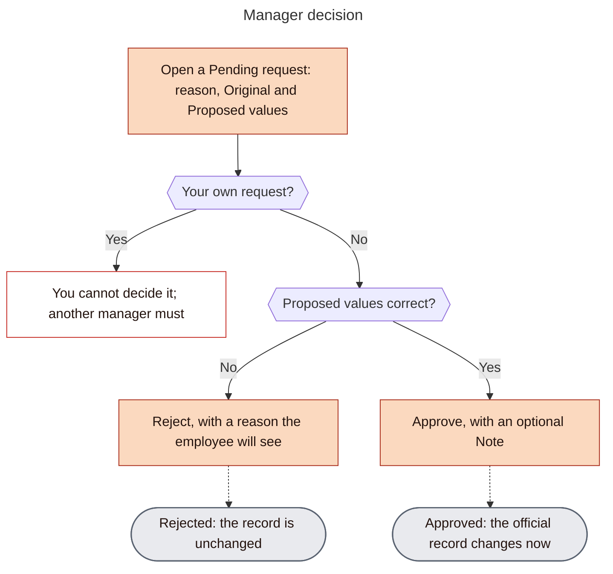
```mermaid
---
title: Manager decision
---
flowchart TD
  A["Open a Pending request: reason, Original and Proposed values"]:::admin --> B{{"Your own request?"}}
  B -->|"Yes"| X["You cannot decide it; another manager must"]:::stop
  B -->|"No"| C{{"Proposed values correct?"}}
  C -->|"No"| R["Reject, with a reason the employee will see"]:::admin
  C -->|"Yes"| F["Approve, with an optional Note"]:::admin
  F -.-> G(["Approved: the official record changes now"]):::final
  R -.-> H(["Rejected: the record is unchanged"]):::final
  classDef admin fill:#fbd9bf,stroke:#aa2f1d,color:#24140f
  classDef stop fill:#ffffff,stroke:#c62d26,color:#24140f
  classDef final fill:#e9eaee,stroke:#5b6472,color:#24140f,stroke-width:1.5px
```

### I1. View pending requests

Open **Management → Corrections**. The queue shows **Pending** requests first; use the filter to see **Approved**, **Rejected**, **Withdrawn** or **All history**.

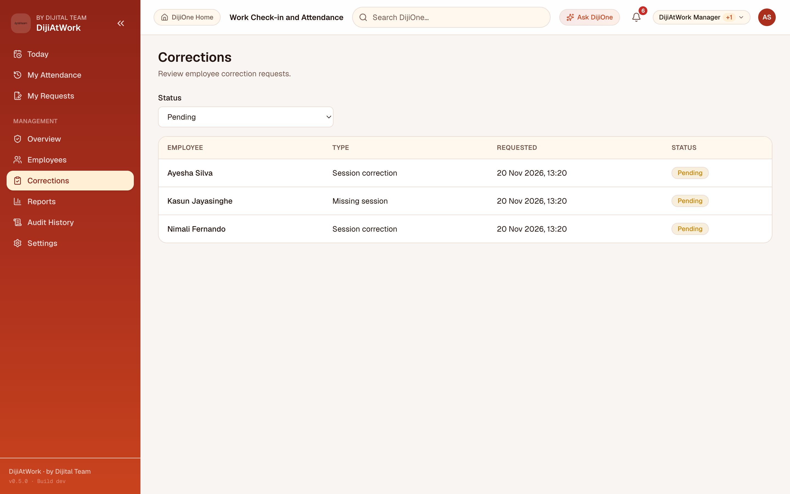

### I2. Review a request

Open a request. It shows the employee, when it was requested, the employee's **Reason**, and a table of **Original** and **Proposed** values. Changed values are highlighted. For a missing session, Original shows "No session on record".

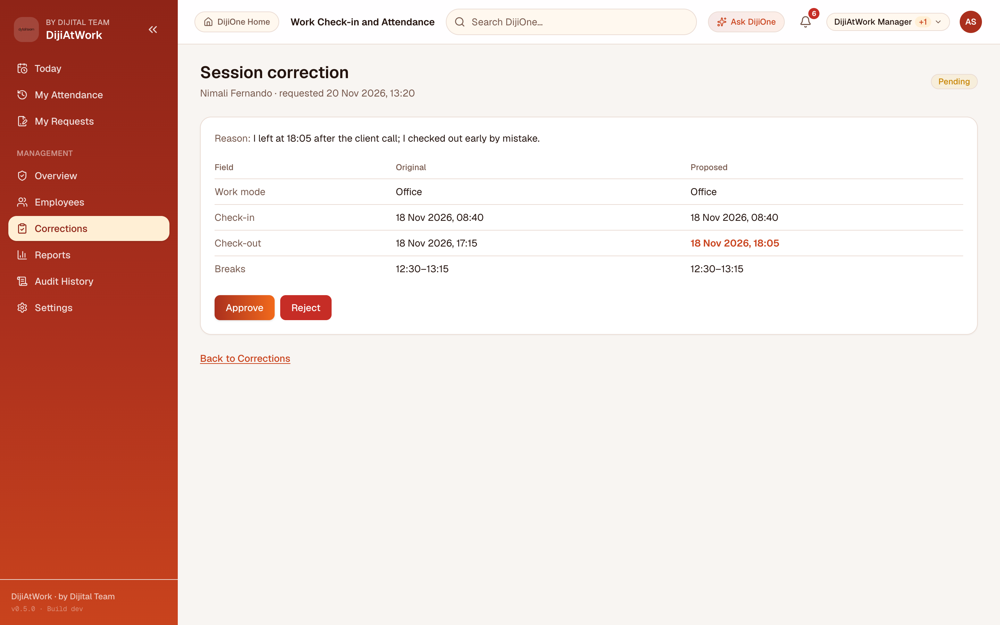

Check the proposed times against what you know (for example meeting records or the employee's explanation) before deciding.

### I3. Approve

1. Select **Approve**.
2. Optionally add a **Note** for the employee.
3. Select **Approve** in the dialog. The official record changes now; the original values stay in the audit history.

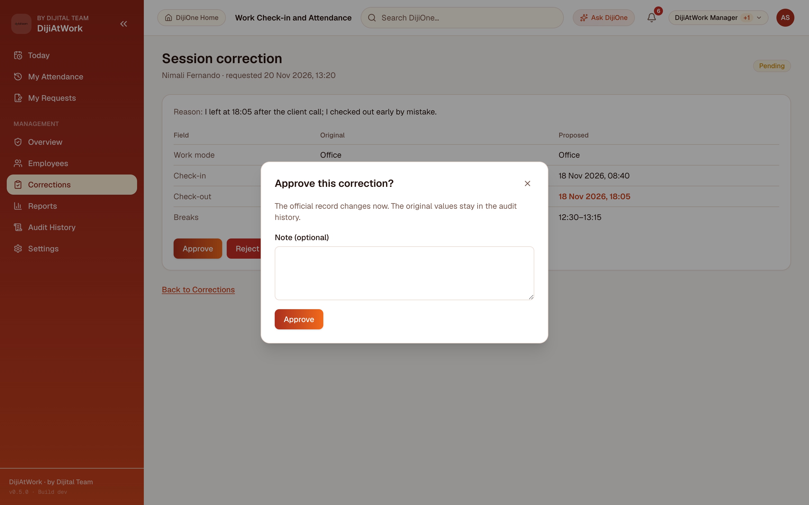

After approval the request shows **Approved** with your note, and the employee is notified.

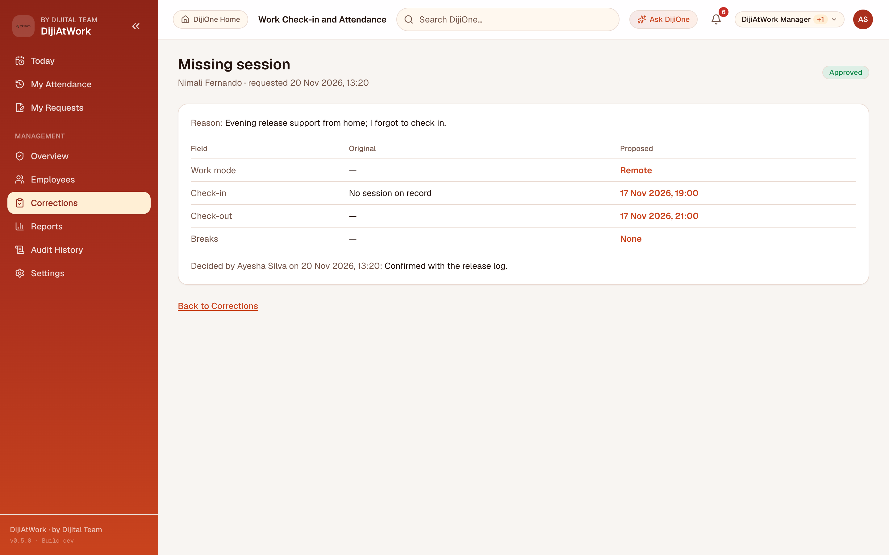

### I4. Reject

1. Select **Reject**.
2. Enter the **reason** (required). The employee sees it.
3. Confirm. The record is unchanged and the employee is notified.

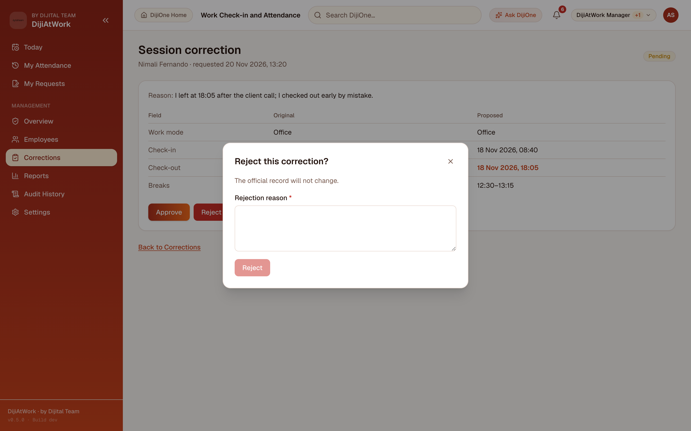

### I5. Restrictions and auditability

- **You cannot decide your own request.** DijiAtWork shows "This is your own request, so another manager must decide it." and offers no decision buttons.

  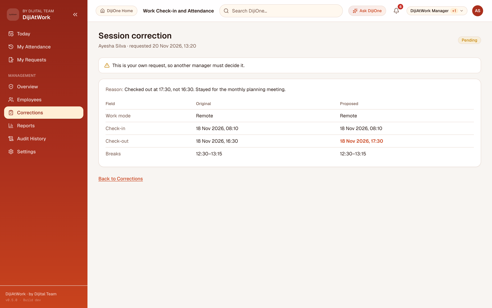

- If the session changed after the request was made, the request is **stale**: reject it and ask the employee to submit a new one.
- Every decision, with who made it and when, is kept in **Audit History** (section K).

---

## J. Management: Reports and exports

### J1. Open and filter a report

1. Open **Management → Reports** ("Operational working hours. These are not payroll figures.").
2. Choose **From** and **To** dates (up to 366 days) and a **Work mode** (or **All**), then select **Apply**.

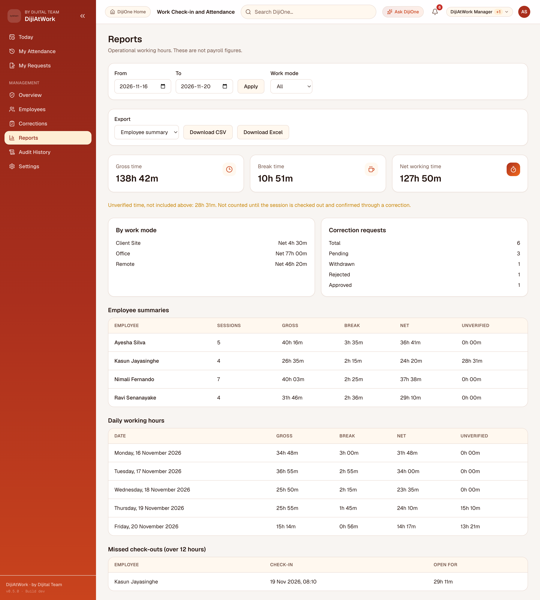

### J2. Understand the totals

| Area | Shows |
|---|---|
| **Gross / Break / Net working time** | Totals for the period, counted time only |
| Unverified line | Time from unverified sessions, **not included** in the totals |
| **By work mode** | Net time per work mode |
| **Correction requests** | Counts by status |
| **Employee summaries** | Sessions, gross, break, net and unverified time per employee |
| **Daily working hours** | Totals per day |
| **Missed check-outs (over 12 hours)** | Sessions past the threshold, with how long they were open |

To see one employee's detail, use **Employees** (section H).

### J3. Export CSV or Excel

1. Under **Export**, choose **Employee summary**, **Sessions**, **Missed check-outs** or **Correction requests**.
2. Select **Download CSV** or **Download Excel**. The file downloads straight away and covers the period and work mode you selected.

**File names** contain the report name and the date and time it was generated, in the business time zone, for example `DijiAtWork_Employee_Summary_Report_2026-11-20_132240.xlsx`.

**Columns.** Every export ends with the report name, **Reporting period from** and **to**, **Export generated at** and **Time zone**. The Sessions export (named *Attendance Report*) also has **Work date**, **Check-in date/time**, **Check-out date/time**, hours in the period, **Unverified** (Yes/No) and **Unverified hours in period (not included)**. Dates and times include the time-zone offset, for example `2026-11-20T08:35:00+05:30`. Hours are decimal hours (4.76 = 4 hours 46 minutes). Excel files have a second sheet, **Export Information**, describing the export.

**Sample (Employee summary, CSV, demonstration data):**

| Employee | Sessions | Gross hours | Break hours | Net hours | Unverified hours (not included) |
|---|---|---|---|---|---|
| Ayesha Silva | 5 | 40.29 | 3.58 | 36.71 | 0.0 |
| Kasun Jayasinghe | 4 | 26.58 | 2.25 | 24.33 | 28.54 |
| Nimali Fernando | 7 | 40.06 | 2.42 | 37.65 | 0.0 |
| Ravi Senanayake | 4 | 31.79 | 2.62 | 29.17 | 0.0 |

The complete sample files (CSV and Excel) are in this manual's `assets/sample-exports` folder.

---

## K. Management: Settings and audit

### K1. Settings

Open **Management → Settings** ("DijiAtWork operational policy"):

| Setting | Effect |
|---|---|
| **Enabled work modes** | Which of Office, Remote and Client Site employees can choose |
| **Business time zone** | The time zone for all times, daily totals and reports (an IANA name such as Asia/Colombo) |
| **Missed check-out threshold (hours)** | After how many hours an open session is flagged and becomes unverified (1 - 72; default 12). Nobody is checked out automatically. |
| **Time format** | 24-hour or 12-hour display |
| **Default history range (days)** | How many days My Attendance shows by default (7 - 90) |

Select **Save settings**.

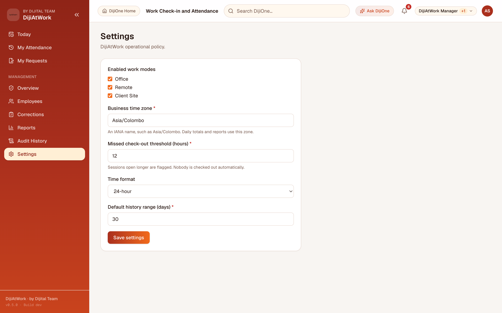

> **Caution:** settings apply to everyone. Changing the time zone or the threshold changes how totals and flags are calculated.

### K2. Audit history

**Audit History** lists every attendance action and change: check-ins, breaks, check-outs, requests, decisions, corrections, exports and settings changes. It shows **When**, **Action**, **By** and **Employee**; select **View** for the details, including the values before and after a change. Filter by **Action**.

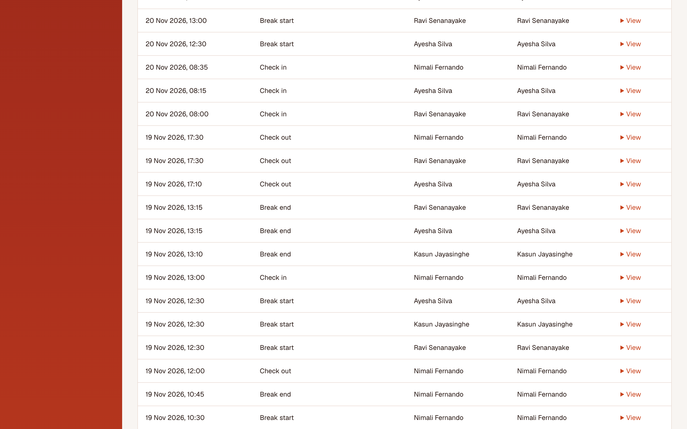

### K3. Which actions need elevated access

| Action | Needs |
|---|---|
| Record and correct your own attendance | Attendance eligibility (section B4) |
| Overview, Employees, Corrections, Reports, exports, Audit History, Settings | **DijiAtWork Manager** role |
| Assign or remove the DijiAtWork Manager role | **DijiOne administrator** (Admin Center) |

---

## L. Common problems and troubleshooting

| Problem | Likely cause | What to do |
|---|---|---|
| DijiAtWork is not on DijiOne Home | Your DijiOne account is inactive, or you are not signed in with your Dijital Team account | Sign out and sign in again with your Dijital Team Microsoft account. If it is still missing, contact your DijiOne administrator. |
| DijiAtWork does not open, or shows "DijiAtWork is unavailable right now" | The application is starting or briefly unavailable | Wait a few seconds and select **Try again**, or reload the page. |
| The card shows **Idle** or **Starting…** | DijiAtWork is waking up | Normal. Open it; it is ready within a few seconds. |
| **Attendance is not set up for your account** | Your account is not linked to an employee record | Contact HR or your DijiOne administrator to link your employee record, then sign out and in again. |
| **Check In** is not shown | You already have an open session | Today shows the open session: check out first (end any break). |
| You are already checked in from yesterday | You forgot to check out | Check out, then request a correction with your real check-out time (C6). |
| You checked out by mistake | Check-out cannot be undone | Check in again for a new session; request a missing session for the gap if it should count (C4). |
| **Start Break** or **End Break** is not available | You are not checked in, or a break is already running | Check in first; end the running break before starting another or checking out. |
| Your hours are missing from the totals | The session is still open or unverified | Check out and request a correction with the real times. |
| Your correction was rejected | The manager could not confirm it | Read the reason in **My Requests** and submit a new request with better information. |
| **Management access required** | You do not have the DijiAtWork Manager role | Ask a DijiOne administrator if you should have it. |
| You cannot approve a request | It is your own request, or it is stale | Another manager must decide your own request; reject a stale one and ask for a new request. |
| An export does not download | The period is longer than 366 days, or the browser blocked the download | Shorten the period, then allow downloads from DijiOne in your browser's download bar. |
| You are asked to sign in again | Your DijiOne session expired | Select **Sign in with Microsoft**; your records are not affected. |
| Times look wrong | DijiAtWork uses the business time zone | Read and enter times in the time zone shown on the page. |

Do not try to work around a permission message, and do not change browser security settings. Contact your DijiOne administrator instead.

---

## M. Frequently asked questions

**Do I need to ask for DijiAtWork access?** No. Every active DijiOne user has it automatically.

**Why can I open DijiAtWork but not check in?** Your account is not linked to an employee record yet. See B5.

**Can I undo a check-out?** No. Check in again, and request a missing session for the gap if needed.

**Will DijiAtWork check me out automatically?** No. A session left open past the threshold becomes unverified until it is corrected.

**Why are my hours not counted?** The session is open, or it is unverified. Check out and request a correction with the real times.

**Can I edit a session myself?** No. You request a correction and a manager decides it.

**Can a manager approve their own correction?** No. Another manager must decide it.

**Do managers see only their team?** No. In this release, managers see all employees.

**Does DijiAtWork send email?** No. Notifications appear in DijiOne (bell and Home).

**Is this used for payroll?** No. It records operational working hours.

**Is DijiAtWork connected to the fingerprint terminals?** No. Those belong to Diji On-site.

**What time zone is used?** The business time zone shown on each page (Asia/Colombo).

**How do I become a DijiAtWork Manager?** A DijiOne administrator assigns the role in the Admin Center.

---

## N. Support and document control

### Support

For help with DijiAtWork, contact your **DijiOne administrator** or the Dijital Team internal IT support channel. For questions about your employee record, contact **HR**. When you ask for help, say which page you were on, what you selected and the exact message shown. Do not send passwords or screenshots of other people's attendance.

### Document information

| | |
|---|---|
| Application | DijiAtWork (DijiAtWork 0.5.0) |
| Platform | DijiOne by Dijital Team |
| Document title | DijiAtWork V1 User Manual |
| Version and date | 2.0, 20 November 2026 |
| Document owner | Dijital Team |
| Intended audience | Employees, managers and authorised administrators |
| Production address | https://dijione.dijitalteam.com/atwork |
| Change history | See [Revision history](#revision-history) |
| Verification | Every workflow and screen in this manual was exercised in the released V1 code (`d877a31`), run locally with fictional demonstration data, on 20 November 2026. Microsoft sign-in itself, and the delivery timing of notifications in Production, were checked against the code and the Production deployment, not with a real user. See `docs/end-user/README.md`. |
