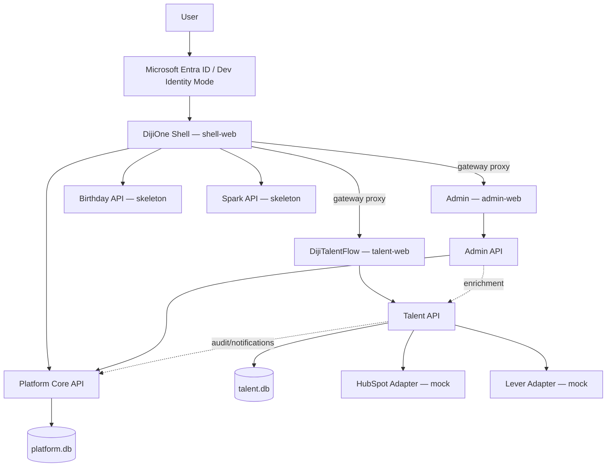

# DijiOne Platform Architecture

## Overview

DijiOne is an application-level service-oriented platform (Phase 2.5):
eight independently runnable, independently testable services — three
Next.js frontend apps behind a gateway, five FastAPI backend services each
owning their own data. Phase 1/2 built this as a modular monolith (one
Next.js app, one FastAPI app) by design, with module boundaries already
enforced by convention so the eventual split wouldn't require a rewrite —
see `docs/decisions/0001-monorepo-layout.md`. Phase 2.5 executed that
split. Business behavior, Phase 2's authorization semantics, and every
existing UI screen are unchanged; only the physical/process boundaries
moved.

**Full detail lives in three companion documents** — this page is the
overview:

- `docs/platform/service-architecture.md` — the eight services, what each
  owns, and why the boundaries are where they are.
- `docs/platform/service-contracts.md` — every service's API surface, the
  gateway routing table, and service-to-service trust boundaries.
- `docs/platform/failure-isolation.md` — what happens when one service is
  down, verified live.



## Repository layout

```text
dijione-platform/
├── apps/
│   ├── shell-web/       # Next.js — DijiOne Home, common nav/auth, gateway rewrites
│   ├── admin-web/       # Next.js — Admin Center pages (basePath /admin)
│   ├── talent-web/      # Next.js — DijiTalentFlow pages (basePath /talent-flow)
│   ├── platform-api/    # FastAPI — identity, authorization, module registry, audit, notifications
│   ├── admin-api/       # FastAPI — administration business rules, no database
│   ├── talent-api/      # FastAPI — DijiTalentFlow's own data + Lever/HubSpot adapters
│   ├── birthday-api/    # FastAPI — skeleton (health/metadata/summary only)
│   └── spark-api/       # FastAPI — skeleton (health/metadata/summary only)
├── packages/
│   ├── design-system/    # Shared UI primitives + shell chrome (TS, all 3 frontend apps)
│   ├── auth-client-ts/   # Shared frontend session/auth logic (TS)
│   ├── auth-client-py/   # Shared JWT claims verification + Platform Core HTTP client (Python)
│   └── contracts/        # Shared TS types mirroring each service's Pydantic schemas
├── docs/        # This documentation set
├── PLAN.md      # Build plan and phase tracking
└── CLAUDE.md    # Authoritative product/engineering contract
```

## Backend structure (per service, `apps/<name>-api/app`)

Every backend service follows the same internal shape — only the
module/route names differ:

```text
app/
├── main.py               # FastAPI app, router registration, CORS
├── core/                 # settings, constants, security (claims-based services only)
├── db/                   # SQLAlchemy Base, session, engine (platform-api, talent-api only — admin-api/birthday-api/spark-api have none)
├── models/                # SQLAlchemy 2 ORM models, this service's owned tables only
├── schemas/               # Pydantic request/response DTOs
├── repositories/          # Tenant-safe data access (one per aggregate)
├── services/               # Business logic — includes audit_service.py/notification_service.py
│                          #   wrapping packages/auth-client-py's PlatformClient in talent-api
└── api/
    ├── deps.py             # Auth dependency: claims-based (talent/birthday/spark) or DB-based (platform/admin)
    └── routes/             # Thin FastAPI route handlers
```

`platform-api` and `admin-api` are the one deliberate exception to
"business services never share code": `admin-api` calls `platform-api`'s
internal API for every read/write, and there is no database of its own —
see `docs/platform/service-architecture.md` "Admin: a real HTTP client".
Route handlers never talk to the database directly — they call a service,
which calls one or more repositories. Repositories are the *only* place
tenant filtering happens, so there is exactly one place to audit for
tenant isolation correctness per service (see
`docs/talent-flow/data-model.md`).

## Frontend structure (per app, `apps/<name>-web/src`)

```text
src/
├── app/
│   ├── layout.tsx            # Root layout: html/body/AppProviders + this app's shell wrapper
│   └── <routes>/page.tsx      # This app's own pages, basePath-relative
├── components/                # App-specific components only (e.g. talent-web's components/talent/*)
└── lib/
    └── api.ts                 # This app's own typed fetch client — its slice of the API surface
```

Shared UI (`Button`, `Card`, `AppShell`, `Sidebar`, `AuthGate`,
`DevPersonaSwitcher`, `NotificationsPanel`, `UserMenu`, …), shared session
logic (`AuthProvider`, `useAuth`, `usePlatformAdmin`, `useTalentScope`,
token storage), and shared types/enums all live in `packages/*` and are
imported as `@dijione/design-system`, `@dijione/auth-client`,
`@dijione/contracts` — real npm workspace packages, not copy-pasted code.
`lib/api.ts` is still the only file in each app that calls `fetch` — every
page/component goes through it, so the REST contract has one seam per app,
same as pre-split.

## Why application-level services (not a monolith, not microservices)

- Each service is independently deployable, testable, and scalable — a
  `talent-api` traffic spike doesn't require scaling `birthday-api`; a
  `talent-web` build failure doesn't block `admin-web`'s deploy.
- Boundaries stay at the major-application level by design (CR §57) — no
  Kubernetes, no message broker, no service mesh. Eight services, not
  eighty.
- Module boundaries that were previously enforced by convention (route
  prefixes, `module_key` on roles) are now enforced physically: separate
  processes, separate databases, no cross-service foreign keys. See
  `docs/platform/service-architecture.md` "Data ownership across
  services".

## Data flow: DijiOne Home → module

1. User authenticates against `platform-api` (Dev Identity Mode locally;
   Entra ID in production) and receives a JWT carrying signed
   authorization claims (module roles, permissions, client scope) — see
   `docs/platform/authorization.md`.
2. `GET /api/modules` (proxied to `platform-api`) returns the
   `ApplicationModule` registry rows the user is authorized to see
   (role-gated).
3. `shell-web` renders a card per module, each independently fetching its
   own service's `/api/*/summary` for a live runtime-status badge (CR
   §39) — see `docs/platform/failure-isolation.md`.
4. Clicking a module card is a full navigation (not a client-side
   transition — see `docs/platform/service-contracts.md` "Cross-zone
   navigation") into that module's own Next.js app, proxied through the
   gateway so the address bar stays on `shell-web`'s origin.
5. Inside a module, the claims already in the user's token supply
   `module_roles` — `talent-api` decodes them locally with no call back to
   `platform-api` on the request path.
