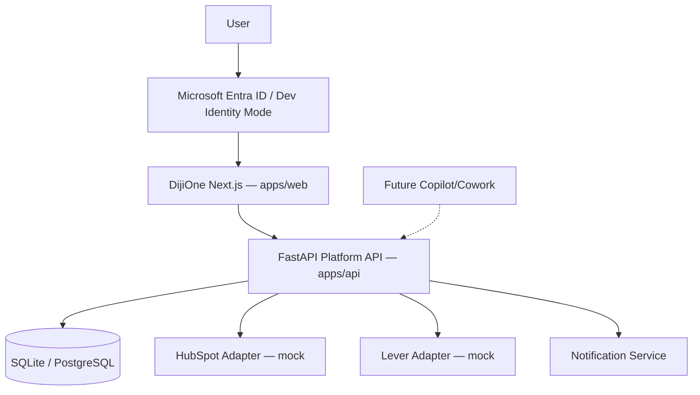

# DijiOne Platform Architecture

## Overview

DijiOne is built as a **modular monolith** for the MVP: one Next.js web
application and one FastAPI backend, with clear internal module boundaries
so DijiTalentFlow (and future modules) can be extracted into independently
deployed services later without a rewrite.



## Repository layout

```text
dijione-platform/
├── apps/
│   ├── web/     # Next.js 16 App Router — DijiOne shell + all module UIs
│   └── api/     # FastAPI platform + module API
├── docs/        # This documentation set
├── PLAN.md      # Build plan and phase tracking
└── CLAUDE.md    # Authoritative product/engineering contract
```

DijiTalentFlow does not live in a separate `modules/talent-flow` package.
FastAPI and Next.js cannot share a JS/Python workspace boundary usefully at
MVP scale, so module-scoped code lives directly inside `apps/web/src/app/talent-flow`
and `apps/api/app/{models,schemas,repositories,services,api/routes}` with
consistent naming (`talent_*`) rather than a physically separate package.
This preserves the architectural *boundary* (module-prefixed routes,
module-scoped services, a `module_key` on every role/permission check)
without the overhead of a real monorepo package split before it's needed.
See `PLAN.md` for the explicit ADR-style rationale.

## Backend structure (`apps/api/app`)

```text
app/
├── main.py               # FastAPI app, router registration, CORS
├── core/                 # settings, constants (roles/stages/enums), permissions.py
│                          # (Role/Permission catalog, Phase 2), dev-JWT auth
├── db/                   # SQLAlchemy Base, session, engine
├── models/                # SQLAlchemy 2 ORM models (incl. role.py, user_module_client_scope.py)
├── schemas/               # Pydantic request/response DTOs (incl. admin.py)
├── repositories/          # Tenant-safe data access (one per aggregate)
├── services/               # Business logic, workflow transitions, audit/notify
│                          #   authorization_service.py — centralized permission/scope engine
│                          #   admin_service.py — Admin Center business logic + audit
├── integrations/
│   ├── lever/             # LeverClient interface, MockLeverClient, stage mapper
│   └── hubspot/           # HubSpotClient interface, MockHubSpotClient
└── api/routes/             # Thin FastAPI route handlers (incl. admin.py, auth_entra.py)
```

Route handlers never talk to the database directly — they call a service,
which calls one or more repositories. Repositories are the *only* place
tenant filtering happens, so there is exactly one place to audit for tenant
isolation correctness (see `docs/talent-flow/data-model.md`).

## Frontend structure (`apps/web/src`)

```text
src/
├── app/
│   ├── page.tsx              # DijiOne Home
│   ├── talent-flow/           # DijiTalentFlow module routes
│   └── admin/                 # DijiOne Admin Center (Phase 2) — see docs/platform/admin-center.md
├── components/
│   ├── shell/                 # AppShell, Sidebar, TopNav, persona switcher
│   ├── ui/                    # Design-system primitives (Card, Button, Table, …)
│   └── talent/                 # DijiTalentFlow-specific views
└── lib/                        # api.ts (typed fetch client), types.ts, auth-context.tsx
```

`lib/api.ts` is the only file that calls `fetch` against the backend. Every
page/component goes through it, so the REST contract has one seam.

## Why a modular monolith (not microservices)

- One deployment, one auth flow, one design system during MVP.
- Module boundaries are enforced by convention (route prefixes, `module_key`
  on roles, service/repository separation) rather than network boundaries.
- Nothing prevents extracting `talent-flow` into its own FastAPI service
  later: its routes, services and models are already namespaced and only
  depend on shared `core`/`db` primitives.

## Data flow: DijiOne Home → module

1. User authenticates (Dev Identity Mode locally; Entra ID in production).
2. `GET /api/modules` returns the `ApplicationModule` registry rows the
   user is authorized to see (role-gated).
3. DijiOne Home renders a card per module; clicking navigates to the
   module's route inside the same Next.js app (no re-authentication).
4. Inside a module, `GET /api/auth/me` supplies `module_roles`, which the
   frontend uses to resolve the user's scope (client vs staff) for that
   module — see `docs/platform/authentication.md`.
