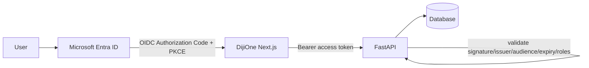

# DijiOne Authentication & Authorization

## Production target



FastAPI validates, on every request:

- token signature (against Entra's JWKS)
- issuer and audience
- expiry
- role/group claims
- module permission scope
- client/tenant scope (for DijiTalentFlow)

Frontend route/UI hiding is never treated as authorization — every
tenant/role check enforced by the frontend is re-enforced server-side.

## Local / demo target: Dev Identity Mode

No Entra ID tenant is available during this build phase (CLAUDE.md §58), so
`DEV_IDENTITY_MODE=true` (the default) switches authentication to a fixed
set of personas seeded into the database (`scripts/seed.py`):

| Persona key       | Name                     | Platform role   | DijiTalentFlow role |
|--------------------|--------------------------|-----------------|----------------------|
| `madushanka-ta`    | Madushanka Weeriyasinghe | PLATFORM_USER   | TA_MEMBER            |
| `customer-success` | Tharindu Fernando        | PLATFORM_USER   | CUSTOMER_SUCCESS     |
| `ta-manager`       | Sanduni Wickrama         | PLATFORM_USER   | TA_MANAGER           |
| `platform-admin`   | Dilani Rathnayake        | PLATFORM_ADMIN  | TA_MANAGER           |
| `abc-client`       | Amal Perera              | PLATFORM_USER   | TALENT_CLIENT (ABC Company) |
| `xyz-client`       | Nadeesha Silva           | PLATFORM_USER   | TALENT_CLIENT (XYZ Company) |
| `nova-client`      | Kasun Jayasuriya         | PLATFORM_USER   | TALENT_CLIENT (Nova Solutions) |

Flow:

1. `GET /api/auth/dev-personas` — public, lists the personas above (used by
   the persona switcher screen at `/`).
2. `POST /api/auth/dev-login {persona_key}` — issues a short-lived HS256
   JWT (`app/core/security.py: DevAuthProvider`) encoding the user id.
3. Frontend stores the token in `localStorage` and sends it as
   `Authorization: Bearer <token>` on every request.
4. `GET /api/auth/me` returns the current user + their `module_roles`.

## The auth seam (`app/core/security.py`)

```python
class AuthProvider(ABC):
    def issue_token(self, user_id: int, **claims) -> str: ...
    def decode_token(self, token: str) -> dict: ...

class DevAuthProvider(AuthProvider): ...   # active when DEV_IDENTITY_MODE=true
class EntraAuthProvider(AuthProvider): ... # production seam, not yet implemented
```

`get_auth_provider()` returns whichever implementation is active based on
`Settings.dev_identity_mode`. Route and service code depend only on
`AuthProvider` — swapping in real Entra ID token validation later touches
exactly this one file, never business logic.

## Role model

```text
Platform roles:        PLATFORM_USER, PLATFORM_ADMIN
DijiTalentFlow roles:   TALENT_CLIENT, TA_MEMBER, CUSTOMER_SUCCESS, TA_MANAGER
```

A `UserModuleRole` row links a user to a `module_key` + `role`, and — for
`TALENT_CLIENT` only — a `client_id`. Staff roles (`TA_MEMBER`,
`CUSTOMER_SUCCESS`, `TA_MANAGER`) leave `client_id` null, meaning
cross-client visibility within DijiTalentFlow.

`app/api/deps.py: TalentScope` resolves this once per request:

```python
scope.client_id   # None for staff, a specific client id for TALENT_CLIENT
scope.is_staff     # True for TA_MEMBER / CUSTOMER_SUCCESS / TA_MANAGER
```

Every tenant-scoped repository method takes `client_id: int | None` and
filters when it is not None — see `docs/talent-flow/data-model.md` for the
tenant isolation guarantee this produces.
