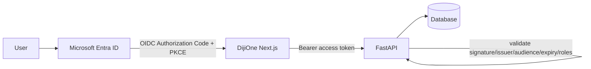

# DijiOne Authentication & Authorization

## Production target



FastAPI validates, on every request:

- token signature (against Entra's JWKS)
- issuer and audience
- expiry
- role/group claims
- module permission scope
- client/tenant scope (for DijiTalentFlow)

Frontend route/UI hiding is never treated as authorization — every
tenant/role check enforced by the frontend is re-enforced server-side.

## Local / demo target: Dev Identity Mode

No Entra ID tenant is available during this build phase (CLAUDE.md §58), so
`DEV_IDENTITY_MODE=true` (the default) switches authentication to a fixed
set of personas seeded into the database (`scripts/seed.py`). Dev Identity
Mode is only the *identity acquisition* step — everything downstream
(platform role → module assignment → module role → permissions → client
scope) runs through the same `AuthorizationService` Entra ID will use in
production (Phase 2 CR §43). Deactivated personas (`is_active=false`) are
rejected at login with 403, matching production behavior.

| Persona key       | Name                     | Platform role   | DijiTalentFlow role |
|--------------------|--------------------------|-----------------|----------------------|
| `madushanka-ta`    | Madushanka Weeriyasinghe | PLATFORM_USER   | TA_MEMBER (all clients) |
| `customer-success` | Tharindu Fernando        | PLATFORM_USER   | CUSTOMER_SUCCESS (all clients) |
| `ta-manager`       | Sanduni Wickrama         | PLATFORM_USER   | TA_MANAGER (all clients) |
| `platform-admin`   | Dilani Rathnayake        | PLATFORM_ADMIN  | TA_MANAGER (all clients) |
| `super-admin`      | Priyantha Bandara        | SUPER_ADMIN     | — (platform admin only) |
| `abc-client`       | Amal Perera              | PLATFORM_USER   | TALENT_CLIENT (ABC Company) |
| `xyz-client`       | Nadeesha Silva           | PLATFORM_USER   | TALENT_CLIENT (XYZ Company) |
| `nova-client`      | Kasun Jayasuriya         | PLATFORM_USER   | TALENT_CLIENT (Nova Solutions) |
| `ta-portfolio`     | Ruwan Gunasekara          | PLATFORM_USER   | TA_MEMBER (ABC + XYZ only — demonstrates client/portfolio scope) |

Flow:

1. `GET /api/auth/dev-personas` — public, lists the personas above (used by
   the persona switcher screen at `/`).
2. `POST /api/auth/dev-login {persona_key}` — rejects deactivated accounts
   (403), stamps `User.last_login_at`, and issues a short-lived HS256 JWT
   (`app/core/security.py: DevAuthProvider`) encoding the user id.
3. Frontend stores the token in `localStorage`
   (`packages/auth-client-ts/src/http.ts`, shared by all three frontend
   apps) and sends it as `Authorization: Bearer <token>` on every request.
   Phase 2.5 note: `localStorage` is scoped per browser-perceived origin,
   and since `shell-web`'s gateway proxies both pages and APIs for
   `admin-web`/`talent-web`, the browser only ever sees
   `http://localhost:3000` — so the token set at login is visible to every
   zone without any cross-origin cookie machinery. See
   `docs/platform/service-contracts.md` "Gateway / routing".
4. `GET /api/auth/me` returns the current user, their `module_roles`, and
   their resolved `platform_permissions` — the frontend never infers
   authorization from the `platform_role` string itself (see
   `docs/platform/authorization.md`). Since Phase 2.5, the *access token
   itself* also carries this same information as signed claims, for
   `talent-api`/`birthday-api`/`spark-api` to read locally — see
   "Claims-based authorization for business services" in
   `docs/platform/authorization.md`.

All authentication (token issuance, dev personas, the Entra seam) lives
exclusively in `platform-api` — the only service that owns `User` records.
Every other backend service trusts a token `platform-api` issued rather
than authenticating anyone itself.

## Microsoft Entra ID SSO (`AUTH_MODE=entra`)

`AUTH_MODE` selects the sign-in path:

| `AUTH_MODE` | Sign-in | `/api/auth/dev-*` | `/api/auth/entra/*` |
|---|---|---|---|
| `dev` (default) | Dev Identity Mode persona switcher | active | 501 |
| `entra` | Microsoft Entra ID (OIDC Authorization Code + PKCE) | **404** | active (needs the four `ENTRA_*` values, else 501) |

**Entra authenticates; DijiOne still issues the session token.** The Entra
`id_token` is verified once, at `/api/auth/entra/token`, then discarded — a
DijiOne HS256 claims token (`issue_session_token`, issuer
`dijione-dev-identity`) is minted from it, exactly as `dev-login` does. So
`talent-api` / `birthday-api` / `spark-api` and `packages/auth-client-py`
are **unchanged** — they never see an Entra token.

Flow (`apps/platform-api/app/api/routes/auth_entra.py`,
`apps/shell-web/src/app/{login,api/auth/callback}/route.ts`):

1. `GET /login` (shell-web) → `GET /api/auth/entra/login-url` builds the v2.0
   `/authorize` URL with `state` / `nonce` / PKCE `S256` and returns a
   short-lived signed **flow token** carrying `{state, nonce, code_verifier}`;
   shell-web stores it in an httpOnly cookie and 302s to Entra.
2. Entra redirects to `/api/auth/callback` (a shell-web filesystem route,
   matched before the `/api/auth/*` proxy). It POSTs `{code, state,
   flow_token}` to `POST /api/auth/entra/token`.
3. `platform-api` validates `state`, exchanges the code (confidential client
   + `code_verifier`), validates the `id_token` (`EntraTokenVerifier`: RS256
   against Entra's cached JWKS, `iss` / `aud` / `exp` / `nonce` / `tid`),
   resolves the DijiOne `User` (§first-login below), and issues the DijiOne
   session token.
4. shell-web's callback stores that token in `localStorage` (same key the app
   already uses) and navigates to `/`. `GET /api/auth/logout` returns the
   Entra front-channel logout URL.

**First-login policy (option C).** No existing `User` for the Entra `oid` →
match on email → else **auto-create `is_active=False`**; login is then
refused (403 "ask an admin to activate") until a platform admin activates the
account and assigns access in the Admin Center. Pre-provision the demo users'
email so they are active immediately.

**Entra app registration** (one, single-tenant): Web platform, redirect URI
`= ENTRA_REDIRECT_URI` (`https://<host>/api/auth/callback`), delegated
`openid profile email`, one client secret. No separate API registration —
DijiOne's services consume the DijiOne session token, not an Entra token.
Record `ENTRA_TENANT_ID` / `ENTRA_CLIENT_ID` / `ENTRA_CLIENT_SECRET` /
`ENTRA_REDIRECT_URI` / `PUBLIC_BASE_URL` into `.env` or the host secret store
(never commit). `EntraAuthProvider` in `security.py` remains an unused stub —
the id_token verifier + session issuer are the working path.

## The auth seam (`apps/platform-api/app/core/security.py`)

```python
class AuthProvider(ABC):
    def issue_token(self, user_id: int, **claims) -> str: ...
    def decode_token(self, token: str) -> dict: ...

class DevAuthProvider(AuthProvider): ...   # active when DEV_IDENTITY_MODE=true
class EntraAuthProvider(AuthProvider): ... # production seam, not yet implemented
```

`get_auth_provider()` returns `DevAuthProvider` when `Settings.dev_auth_enabled`
(`AUTH_MODE=dev` **and** `DEV_IDENTITY_MODE=true`). In `entra` mode the Entra
`id_token` is verified by `EntraTokenVerifier` and the DijiOne session token
is minted by `issue_session_token` — see "Microsoft Entra ID SSO" above.

## Role model

```text
Platform roles:        PLATFORM_USER, PLATFORM_ADMIN, SUPER_ADMIN
DijiTalentFlow roles:   TALENT_CLIENT, TA_MEMBER, CUSTOMER_SUCCESS, TA_MANAGER
```

Roles are now permission bundles resolved by a centralized authorization
engine rather than a fixed set of `if role == ...` checks — see
**`docs/platform/authorization.md`** for the full Phase 2 model (Role /
Permission / RolePermission / UserModuleClientScope, portfolio scope, and
the DijiOne Admin Center that manages all of it).

A `UserModuleRole` row still links a user to a `module_key` + `role`, and —
for `TALENT_CLIENT` — a `client_id` for fast single-tenant lookups. Staff
roles additionally resolve a *portfolio* (`TalentScope.client_ids`): either
a specific list of authorized clients or `None` for unrestricted
(ALL_CLIENTS) access, backed by `user_module_client_scopes`.

`apps/talent-api/app/api/deps.py: TalentScope` resolves this once per
request — from JWT claims, not a database query, since Phase 2.5 (see
`docs/platform/authorization.md`):

```python
scope.client_id    # None for staff, a specific client id for TALENT_CLIENT
scope.client_ids    # staff portfolio restriction; None = ALL_CLIENTS
scope.permissions   # resolved module-role permission set
scope.is_staff       # "talent.workspace.staff" in scope.permissions
scope.has(key)        # generic permission check
```

Every tenant-scoped repository method takes an additional
`allowed_client_ids: list[int] | None` parameter, applied as an `.in_()`
filter only when the caller's portfolio is restricted — see
`docs/talent-flow/data-model.md` for the tenant isolation guarantee this
produces.
