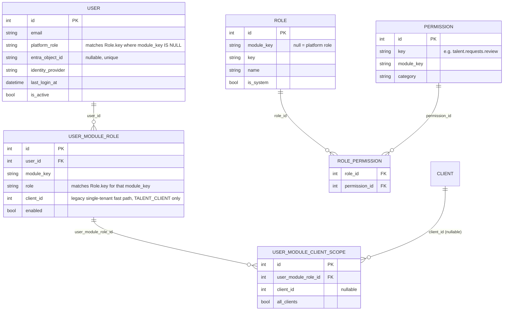

# DijiOne Authorization Model (Phase 2, extended Phase 2.5)

This document describes DijiOne's centralized authorization engine,
introduced to separate **authentication** (Microsoft Entra ID / Dev
Identity Mode — "who are you?") from **authorization** (DijiOne — "what can
you access?"), per the Phase 2 change request.

**Phase 2.5 update**: the engine below (`AuthorizationService`, the
Role/Permission catalog, `AdminService`'s SUPER_ADMIN safety rules) still
lives entirely in `platform-api` — nothing about *how* authorization is
computed changed. What changed is *how business services consume it*: pre-
split, every module's route handlers queried the same shared database
directly; post-split, `talent-api` (and, once they have real endpoints to
gate, `birthday-api`/`spark-api`) have no database access to
`platform-api`'s tables at all, and instead read the already-resolved
result from signed JWT claims. See "Claims-based authorization for
business services" below — everything above that section describes
`platform-api`'s own engine and is unchanged from Phase 2.

```text
Microsoft Entra ID  =  Who are you?
DijiOne              =  What applications can you access?
Module Role          =  What responsibility do you have?
Permissions          =  What actions may you perform?
Client Scope         =  Which organization's data may you access?
```

## Entity model



`UserModuleRole` is DijiOne's `UserModuleAssignment` concept — the original
MVP table extended in place (not replaced) with an `enabled` flag and a
`client_scopes` relationship, per the CR's "extend, don't rebuild" mandate.
`Role` is a resolvable permission bundle layered *underneath* the existing
string-keyed `User.platform_role` / `UserModuleRole.role` columns — no
existing consumer of those columns needed to change.

## Single source of truth for the catalog

`apps/platform-api/app/core/permissions.py` defines every Role/Permission/
RolePermission row the platform ships with. Both the Alembic migration
(`2e7f7d7dc3fa_phase2_authorization.py`, one-time backfill) and
`scripts/seed.py` (repeatable local reseed) import it, so a migrated
database and a fresh `--reset` reseed always end up identical.

Platform roles and their permissions:

| Role | Key permissions |
|---|---|
| SUPER_ADMIN | All `platform.admin.*` permissions, including `manage_admins` |
| PLATFORM_ADMIN | `platform.admin.access`, `manage_users`, `manage_modules`, `manage_client_scopes`, `view_audit` — **not** `manage_admins` |
| PLATFORM_USER | None (standard authenticated user; access comes entirely from module assignments) |

DijiTalentFlow roles and their permissions (see `app/core/permissions.py`
for the full 22-permission catalog): `TALENT_CLIENT` gets `_read_own` /
`_create` style permissions scoped to their own organization;
`TA_MEMBER` gets the full staff bundle (`talent.workspace.staff` plus
read/manage permissions across clients, candidates, applications,
interviews, messages, documents); `CUSTOMER_SUCCESS` and `TA_MANAGER` get
everything `TA_MEMBER` has, plus `talent.requests.review`.

## Client / portfolio scope

`TalentScope.client_ids` (resolved by `AuthorizationService.client_scope_for`)
is `None` for unrestricted (ALL_CLIENTS) access, or a list of specific
client ids for a restricted portfolio. Every tenant-scoped repository
method accepts an additive `allowed_client_ids` parameter — restricted
staff and `TALENT_CLIENT` behave identically to the pre-Phase-2
implementation when unrestricted, so no existing behavior changed for
personas that were never given a portfolio.

A module assignment with **no** scope rows at all defaults to unrestricted
— this keeps hand-created or not-yet-migrated rows working without a
mandatory backfill for every one, while the Alembic migration explicitly
backfills a scope row (or an `all_clients` row) for every pre-existing
`UserModuleRole`.

Demonstrated in seed data: the `ta-portfolio` persona (Ruwan Gunasekara) is
a `TA_MEMBER` restricted to ABC Company + XYZ Company only — Nova Solutions
is invisible to them across every DijiTalentFlow list/detail/dashboard
endpoint, verified in `tests/test_authorization_phase2.py`.

## The authorization engine (`apps/platform-api/app/services/authorization_service.py`)

```python
class AuthorizationService:
    def platform_permissions(self, user: User) -> frozenset[str]: ...
    def module_role_permissions(self, module_role: UserModuleRole) -> frozenset[str]: ...
    def client_scope_for(self, module_role: UserModuleRole) -> list[int] | None: ...
```

Reusable FastAPI dependencies built on it
(`apps/platform-api/app/api/deps.py`) — used by `platform-api` itself and,
via pass-through, by every `/api/admin/*` request `admin-api` forwards:

```python
require_platform_admin                      # any admin (SUPER_ADMIN or PLATFORM_ADMIN)
require_platform_permission("platform.admin.manage_admins")
```

`talent-api`'s equivalent dependencies (`apps/talent-api/app/api/deps.py`)
have the identical names and shapes but resolve from JWT claims instead —
see "Claims-based authorization for business services" below:

```python
require_staff_scope                          # DijiTalentFlow cross-client staff
require_customer_success_scope               # talent.requests.review
require_talent_permission("talent.candidates.manage")
```

Route handlers never hardcode `if role == "TA_MEMBER"` — they depend on one
of the above. Client-supplied `role`, `client_id`, or permission values are
never trusted (CLAUDE.md §7, §33).

## Claims-based authorization for business services (Phase 2.5)

`talent-api`, `birthday-api`, `spark-api` own no `User`/`UserModuleRole`
table — that data is `platform-api`'s. Rather than call `platform-api`
synchronously on every request (real coupling: `platform-api` down would
mean every business-service request fails, CR §21), `platform-api`
computes the caller's full authorization context **once, at login**, and
embeds it as signed claims in the JWT
(`apps/platform-api/app/services/claims_service.py`):

```json
{
  "sub": "42",
  "is_active": true,
  "full_name": "Ruwan Gunasekara",
  "platform_role": "PLATFORM_USER",
  "platform_permissions": [],
  "module_roles": {
    "talent-flow": {
      "role": "TA_MEMBER",
      "client_id": null,
      "client_ids": [1, 2],
      "permissions": ["talent.requests.read", "talent.requests.update", "..."]
    }
  }
}
```

`packages/auth-client-py`'s `decode_claims()` verifies the signature (same
HS256 secret in dev; Entra-derived claims later) and shapes the payload
into `AuthClaims`/`ModuleRoleClaims`. `talent-api`'s `get_talent_scope`
(`apps/talent-api/app/api/deps.py`) builds the exact same `TalentScope`
object the pre-split monolith did, just from `claims.module("talent-flow")`
instead of a database join — every talent-api route handler is byte-for-
byte unchanged.

**The trade-off, made explicitly**: a permission change in the Admin
Center (revoking a module role, changing client scope) takes effect the
next time the affected user's token is reissued (next login, or a future
refresh flow), not instantly. `jwt_expires_minutes` is the staleness
window. This is the documented, deliberate choice CR §21 asks for — see
`docs/platform/failure-isolation.md` "Auth: signed claims, not a live
dependency" for the full reasoning and what emergency account disabling
still does immediately versus what it doesn't.

## Frontend consumption

`GET /api/auth/me` and `POST /api/auth/dev-login` return a resolved
`platform_permissions: string[]` array alongside `module_roles`. The
frontend's `usePlatformAdmin()` / `usePlatformPermission()` hooks
(`packages/auth-client-ts/src/auth-context.tsx`, shared by all three
frontend apps) check membership in that array — never the raw
`platform_role` string — so a frontend nav decision and a backend
authorization decision can never silently drift apart. Frontend hiding
remains a UX convenience only; every route above is independently enforced
server-side.

## SUPER_ADMIN safety (CR §50)

`AdminService` enforces, independent of the frontend:

- the last active SUPER_ADMIN cannot be deactivated;
- the last active SUPER_ADMIN cannot be demoted to a non-SUPER_ADMIN role;
- only a caller holding `platform.admin.manage_admins` (i.e. a SUPER_ADMIN)
  may grant, change, or revoke SUPER_ADMIN / PLATFORM_ADMIN on any user.

## Audit (CR §35)

Every `AdminService` mutation calls `AuditService.log(...)`, capturing
actor, action, entity, timestamp, and before/after state in the existing
`AuditLog` table (no new schema needed — it already supported this shape).
Actions logged: `user.activated`, `user.deactivated`,
`user.platform_role_changed`, `module_assignment.created/updated/removed`.
This still runs entirely inside `platform-api` (`admin-api` has no direct
database access to write to). `talent-api`'s own audit events
(`talent_request.created`, `application.stage_changed`, etc.) reach the
same `AuditLog` table via an HTTP call instead of a local write — see
`docs/platform/service-contracts.md` "Platform Core" internal endpoints
and `docs/platform/failure-isolation.md` for what happens to a talent
action when that call fails.
