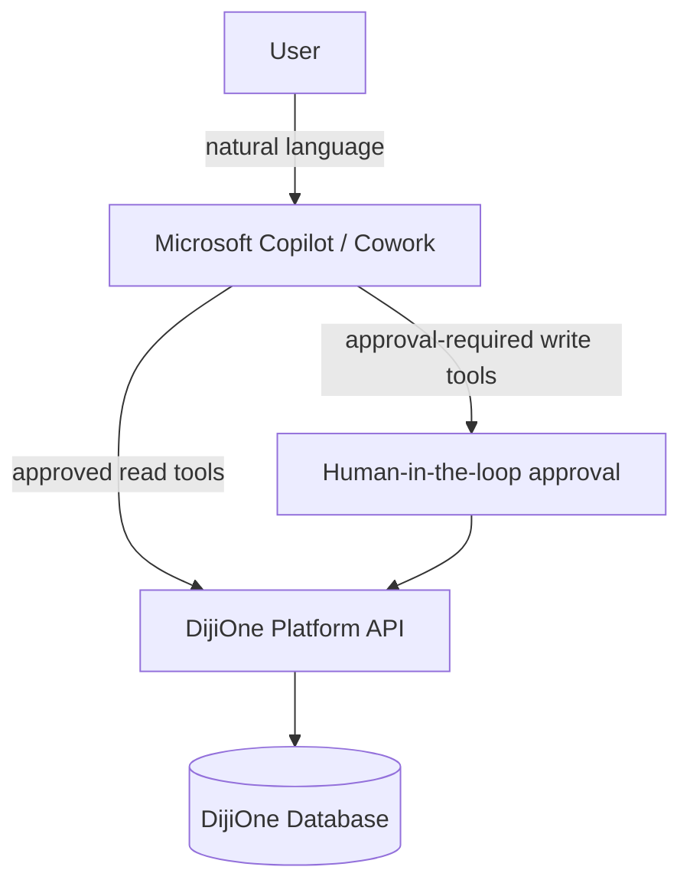

# Microsoft Copilot / Cowork — Future Architecture

Not implemented in this MVP phase (CLAUDE.md §15, §957). This document
records the intended architecture so the seam is clear when it is built.

## Principle

Microsoft 365 Copilot / Copilot Cowork sits **above** DijiOne as an
orchestration and interaction layer. The deterministic business
application (DijiOne + DijiTalentFlow) never depends on an LLM to execute
a critical transaction — Copilot only invokes approved, already-existing
DijiOne APIs and workflows.



## Example interactions

```text
"Show me all talent requests that have been in sourcing for more than 10 days."
  → Copilot calls a read-only DijiTalentFlow tool (GET /api/talent/requests?stage=SOURCING)
    and filters/summarizes the result. No write occurs.

"What are our most urgent recruitment requests?"
  → Copilot calls GET /api/talent/ta/dashboard and reasons over `attention_requests`.

"Order next week's birthday cakes."
  → Copilot invokes an approved DijiBirthday workflow tool — a write action,
    so it requires explicit user/approver confirmation before executing.
```

## Read tools (safe, no confirmation required)

Any existing `GET` endpoint is a candidate: `/api/talent/requests`,
`/api/talent/candidates`, `/api/talent/applications`,
`/api/talent/interviews`, `/api/talent/ta/dashboard`,
`/api/talent/dashboard/client`. These already enforce the same
role/tenant scoping as the UI (`TalentScope`), so a Copilot tool built on
top of them inherits tenant isolation for free — it cannot see more than
the calling user's UI would show.

## Write tools (require approval)

Any mutating endpoint (`POST`/`PATCH` on talent requests, applications,
interviews, messages) would be wrapped in a Copilot "action" that:

1. Presents the proposed change to the user for confirmation.
2. Executes via the same service layer the UI uses (never a shortcut
   around `TalentRequestService`/`ApplicationService`), so audit logging
   and notification fan-out happen identically regardless of whether a
   human or Copilot triggered the change.
3. Records `actor_id` as the human approver, not "Copilot", in the
   `AuditLog` — Copilot is an interface, not an accountable actor.

## Role propagation

A Copilot tool call must carry the same bearer token / role context as a
normal API call. Copilot never gets elevated privileges — a client persona
asking Copilot a question can only ever see what that persona's
`TalentScope` already allows.

## Auditing

Every Copilot-triggered write goes through the existing `AuditService`,
identical to a UI-triggered write. No separate Copilot audit path is
introduced, so there is exactly one place to review "who changed what."

## Agent boundaries

- Copilot may **read** anything the calling user's role can already see.
- Copilot may **propose** writes but must not execute irreversible or
  high-impact actions without explicit confirmation.
- Copilot must not be given direct database access — only the same REST
  API surface (and role scoping) that the Next.js frontend uses.
