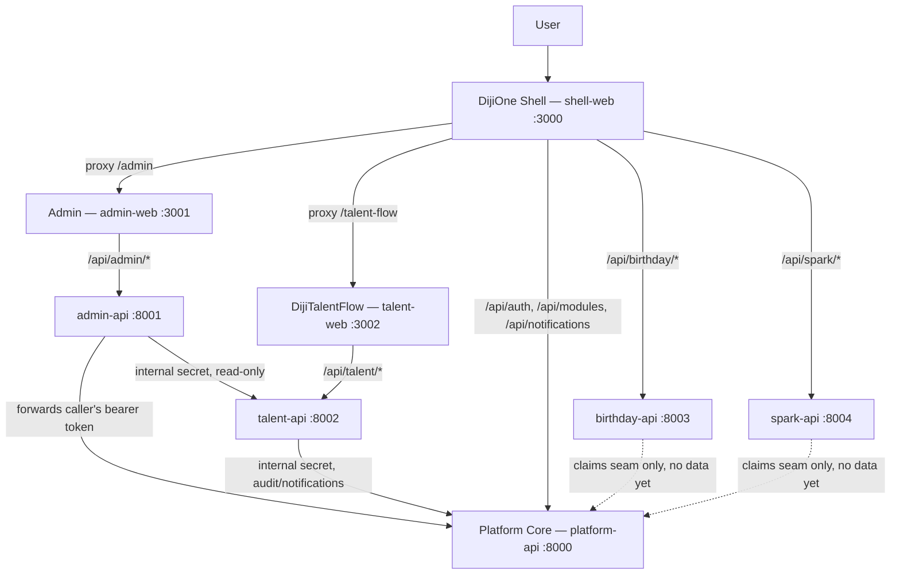

# DijiOne Service Architecture (Phase 2.5)

Phase 2.5 turned DijiOne from a modular monolith (one Next.js app, one
FastAPI app) into an application-level service-oriented architecture: eight
independently runnable, independently testable services, each owning its
own data. This document is the map of that architecture — see
`docs/platform/service-contracts.md` for the API surface each service
exposes, `docs/platform/failure-isolation.md` for what happens when one is
down, and `docs/platform/local-development.md` for running all eight
locally.

## Why this split, and what didn't change

DijiTalentFlow's business logic, Phase 2's authorization model, and every
existing UI screen are unchanged — this was a structural refactor, not a
rewrite. The ADR at `docs/decisions/0001-monorepo-layout.md` had already
anticipated this exact seam (module code depended only on `app/core`/
`app/db`); Phase 2.5 executes it.

## The eight services

| Service | Kind | Port | Owns |
|---|---|---|---|
| `shell-web` | Next.js | 3000 | DijiOne Home, common nav/auth chrome, module cards, gateway rewrites |
| `admin-web` | Next.js | 3001 | Admin Center pages |
| `talent-web` | Next.js | 3002 | DijiTalentFlow pages |
| `platform-api` | FastAPI | 8000 | Users, roles, permissions, module registry, client/portfolio scope, audit log, notifications |
| `admin-api` | FastAPI | 8001 | Administration business rules (SUPER_ADMIN lockout, admin-role restriction) — **no database** |
| `talent-api` | FastAPI | 8002 | Clients, talent requests, candidates, applications, interviews, messages, documents, Lever/HubSpot adapters |
| `birthday-api` | FastAPI | 8003 | Skeleton only — health/metadata/summary, no business data yet |
| `spark-api` | FastAPI | 8004 | Skeleton only — health/metadata/summary, no business data yet |

Frontend zones use Next.js's ["Multi Zones"](https://nextjs.org/docs/app/guides/multi-zones)
pattern: `admin-web` and `talent-web` set `basePath` (`/admin`,
`/talent-flow`) so their own asset/page URLs never collide with each
other's or shell-web's when proxied; `shell-web`'s `next.config.ts`
rewrites both **pages** (so the browser only ever sees `localhost:3000`)
and **APIs** for every backend service. See
`docs/platform/service-contracts.md` "Gateway / routing" for the full
rewrite table.

## Data ownership across services

Each service's database is a physically separate SQLite file locally
(`platform.db`, `talent.db`; `admin-api`/`birthday-api`/`spark-api` have
none yet) — not just a naming convention. This makes "a service cannot
query another service's tables" true by construction, not by discipline,
and maps 1:1 onto separate Postgres databases/schemas later with no further
rewrite (CR §23–24).

The practical consequence: **no foreign keys cross a service boundary.**
Where the pre-split schema had e.g. `documents.uploaded_by -> users.id` or
`user_module_roles.client_id -> clients.id`, those columns are now plain
integers — opaque ids referencing a record another service owns. Two
patterns replace what a cross-database FK/JOIN used to do:

1. **Denormalize at write time.** `talent-api`'s `Message.sender_name` and
   `Document.uploaded_by_name` are captured from the caller's JWT claims
   when the row is created, instead of being resolved by joining to a
   `users` table on every read. Message/document history reads the name as
   it was at send time — the same trade-off audit logs and message
   threads already make everywhere.
2. **Ask the owning service, over HTTP, for anything that must stay live.**
   Admin's client-scope picker and dashboard need talent-api's `Client`
   names/counts; the internal `packages/auth-client-py`'s `PlatformClient`
   (and the equivalent calls from `admin-api`) fetch them via talent-api's
   `/api/talent/internal/clients-lite` and `/api/talent/summary` — see
   `docs/platform/service-contracts.md`.

| Service | Owns |
|---|---|
| `platform-api` | `users`, `user_module_roles`, `user_module_client_scopes`, `roles`, `permissions`, `role_permissions`, `application_modules`, `audit_logs`, `notifications` |
| `talent-api` | `clients`, `talent_requests`, `candidates`, `applications`, `interviews`, `messages`, `documents`, `external_mappings`, `integration_events` |
| `admin-api` | Nothing — see below |

## Admin: a real HTTP client, not a shared database

The Phase 2.5 change request's explicit priority was long-term isolation
over short-term convenience, so `admin-api` was built as a genuine
zero-database service rather than sharing `platform-api`'s database:

- Every `/api/admin/*` request `admin-api` receives is forwarded to
  `platform-api`'s internal `/api/platform/admin/*` surface, **re-attaching
  the original caller's bearer token** — Platform Core re-derives the
  actor's permissions from that token itself. `admin-api` never asserts
  "trust me, this user is an admin" on its own authority (CR §48).
- The SUPER_ADMIN lockout and admin-role-change restriction business rules
  live in `platform-api`'s `AdminService`, next to the data they protect —
  not duplicated in `admin-api`.
- Client display names and the live pending-request count are enriched in
  from `talent-api`, best-effort: if `talent-api` is down, `admin-api`
  still returns full user/role/permission data with client names falling
  back to their raw ids and the pending count showing `0` (CR §38).

See `packages/auth-client-py/auth_client_py/platform_client.py` for the
shared HTTP client both `admin-api` and `talent-api` use, and
`docs/platform/authorization.md` for the claims-based auth model business
services (`talent-api`, `birthday-api`, `spark-api`) use instead.

## What's deliberately not here yet

Per CR §57 ("do not overengineer"), this phase does not introduce:
Kubernetes, a message broker, a service mesh, distributed tracing, multiple
production databases, or a real API gateway product. Local dev routing is
plain Next.js rewrites; production's equivalent (Azure Front Door / API
Management) is documented, not built — see
`docs/platform/service-contracts.md` "Production direction".
