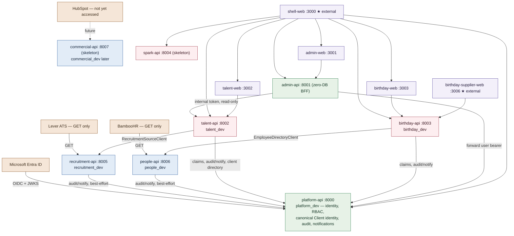

# DijiOne Service Architecture

**Domain-Driven Distributed Modular Platform.** Coarse, domain-sized
services — not fine-grained microservices — each independently runnable,
independently testable, and owning its own database. This document is the
map of that architecture. See `docs/platform/service-contracts.md` for the
API surface each service exposes and the per-dependency contract table,
`docs/platform/data-ownership.md` for who owns which data and each
degraded-mode contract, `docs/platform/failure-isolation.md` for what
happens when one service is down, and `docs/platform/local-development.md`
for running everything locally.

> **History.** Phase 2.5 first split a modular monolith into
> application-level services. The Architecture Completion Plan
> (`DijiOne-Data-Ownership-Architecture-v2.md`, executed as Waves A–F on
> `dev-prep`) then completed the domain boundaries this document describes:
> a platform-owned canonical Client/Organisation identity, a Recruitment
> Source domain (Lever) physically separate from DijiTalentFlow, a
> People/Workforce domain (BambooHR) physically separate from DijiBirthday,
> and a Commercial/CRM skeleton reserved for HubSpot. Any earlier text
> describing Lever or BambooHR as owned by an application service, or
> client identity as talent-api's own table, is superseded.

## Layers

```text
EXTERNAL PROVIDERS  →  SOURCE DOMAINS  →  PLATFORM CORE  →  APPLICATION DOMAINS  →  FRONTENDS
   (Lever, BambooHR,      (recruitment-api,   (platform-api:      (talent-api,          (shell-web + 4
    HubSpot, Entra)        people-api,         identity, RBAC,     birthday-api,          module web apps)
                           commercial-api)      canonical Client)   spark-api)
```

- **External providers** are read-only or GET-only where the safety
  contract requires it (Lever — CLAUDE.md §60).
- **Source domains** are the *only* DijiOne owner of a given provider
  integration — "integrate once, consume many." Each has internal ingress
  only; nothing outside DijiOne calls them, and nothing inside DijiOne
  calls a provider except through its one owning source domain.
- **Platform Core** owns identity, authorization, and platform-wide
  reference data — including the canonical Client/Organisation identity
  every other service references (`docs/platform/data-ownership.md` §1).
- **Application domains** own operational/workflow/trust state — the thing
  a DijiOne product actually does — and consume source domains over HTTP,
  never a shared database.
- **Frontends** are Next.js "zones"; `shell-web` is the single gateway a
  browser talks to.

## The services



| Service | Kind | Port | Owns |
|---|---|---|---|
| `shell-web` | Next.js | 3000 | DijiOne Home, common nav/auth chrome, module cards, gateway rewrites (**external ingress**) |
| `admin-web` | Next.js | 3001 | Admin Center pages |
| `talent-web` | Next.js | 3002 | DijiTalentFlow pages |
| `birthday-web` | Next.js | 3003 | DijiBirthday internal (TA/HR) pages |
| `birthday-supplier-web` | Next.js | 3006 | DijiBirthday supplier portal (**external ingress**, separate hostname) |
| `platform-api` | FastAPI | 8000 | Users, roles, permissions, module registry, access groups, **canonical Client/Organisation identity**, client authorization scopes, audit log, notifications, platform s2s auth |
| `admin-api` | FastAPI | 8001 | Administration business-rule pass-through (SUPER_ADMIN lockout, admin-role restriction) — **no database** |
| `talent-api` | FastAPI | 8002 | TalentRequest, TalentFlow Candidate/Application, interviews, messages, documents, `PostingClientMapping` client-visibility trust decision, TalentFlow's client extension |
| `birthday-api` | FastAPI | 8003 | BirthdayOrder workflow, suppliers, delivery/approval state, order-time employee snapshots, outbound supplier email |
| `spark-api` | FastAPI | 8004 | Skeleton only — health/metadata/summary, no business data yet |
| `recruitment-api` | FastAPI | 8005 | **Sole owner of the Lever integration**: Lever client/adapter, posting + candidacy read models, DTC-tag parsing, sync lifecycle |
| `people-api` | FastAPI | 8006 | **Sole owner of the BambooHR integration**: BambooHR client/adapter, employee/workforce read model, sync lifecycle |
| `commercial-api` | FastAPI | 8007 | Skeleton — health/metadata + the relocated HubSpot stub/webhook. Future sole owner of HubSpot; never owns Client identity |

Frontend zones use Next.js
["Multi Zones"](https://nextjs.org/docs/app/guides/multi-zones): each
non-shell web app sets its own `basePath` so its asset/page URLs never
collide when proxied; `shell-web`'s `next.config.ts` rewrites both **pages**
and **APIs** for every backend service. See
`docs/platform/service-contracts.md` "Gateway / routing" for the full
rewrite table.

## Source domains vs application domains — the rule that governs every new service

- **A source domain** exists only to own one external provider integration
  and publish a canonical, minimum-data read model over HTTP. It has no
  user-facing UI, is not in the module registry, and is consumed by
  application services via a typed client
  (`RecruitmentSourceClient`, `EmployeeDirectoryClient`) — never a shared
  database, never a second direct credential to the same provider anywhere
  else in the platform.
- **An application domain** owns operational, workflow, and trust state —
  the actual product behaviour a user experiences — and is registered in
  the module framework (`docs/platform/module-framework.md`). It may keep a
  **thin local projection** of a source domain's data when, and only when,
  an authorization decision must stay available and fail-closed even if the
  source domain is down (see `talent-api`'s `RecruitmentPostingRef` in
  `docs/platform/data-ownership.md` §4) — that is not a second canonical
  copy, it is a cache with an explicit staleness contract.
- **Promotion ladder** (when to extract a new source domain): a bounded
  module inside an application service → an owned schema/data boundary →
  an internal HTTP contract → an independently deployable service. Promote
  on multiple consumers, an independent release cadence, a scaling need, a
  security boundary, an ownership boundary, or a provider-integration
  ownership boundary — exactly what justified pulling Lever and BambooHR
  out of `talent-api`/`birthday-api`.

**Explicitly rejected** (anti-scope, unless independently proven
necessary): per-entity microservices (`posting-service`,
`candidate-service`, `stage-service`, `interview-service`,
`notification-service`, …), a message broker/event bus, CQRS
infrastructure, a service mesh, Kubernetes, a generic integration
framework. Service-to-service communication stays request/response HTTP.

## Data ownership across services

Each service's database is a physically separate SQLite file locally
(`platform.db`, `talent.db`, `birthday.db`, `recruitment.db`, `people.db`,
`commercial.db`; `admin-api`/`spark-api` have none) — not just a naming
convention. This makes "a service cannot query another service's tables"
true by construction. See `docs/platform/data-ownership.md` for the full
table-by-table map and the two degraded-mode patterns (fail-closed local
projection vs defer-and-self-heal). Locally this is SQLite; production maps
1:1 onto one PostgreSQL database per domain with no further rewrite.

**No foreign keys cross a service boundary.** Two patterns replace what a
cross-database FK/JOIN used to do:

1. **Denormalize at write time.** `talent-api`'s `Message.sender_name` and
   `Document.uploaded_by_name` are captured from the caller's JWT claims
   when the row is created. `birthday-api`'s `BirthdayOrder` employee
   columns are captured from `people-api` at detection time — an
   operational snapshot, not a live join (see `data-ownership.md` §5).
2. **Ask the owning service, over HTTP, for anything that must stay live.**
   `talent-api` asks `recruitment-api` for postings via
   `RecruitmentSourceClient`; `birthday-api` asks `people-api` for
   employees via `EmployeeDirectoryClient`; `admin-api`/`talent-api` ask
   `platform-api` for canonical client names via `GET
   /api/platform/internal/clients`.

## Admin: a real HTTP client, not a shared database

`admin-api` is a genuine zero-database service:

- Every `/api/admin/*` request is forwarded to `platform-api`'s internal
  `/api/platform/admin/*` surface, **re-attaching the original caller's
  bearer token** — Platform Core re-derives the actor's permissions itself;
  `admin-api` never asserts "trust me, this user is an admin" on its own
  authority.
- The SUPER_ADMIN lockout and admin-role-change restriction business rules
  live in `platform-api`'s `AdminService`, next to the data they protect.
- Client display names and the pending-request count are enriched from
  `talent-api`, best-effort — see `docs/platform/failure-isolation.md`.

## What's deliberately not here yet

Kubernetes, a message broker, a service mesh, distributed tracing, a real
API gateway product. Local dev routing is plain Next.js rewrites;
production's equivalent (Azure Front Door / API Management) is documented
in `docs/platform/deployment-topology.md`, not built.
