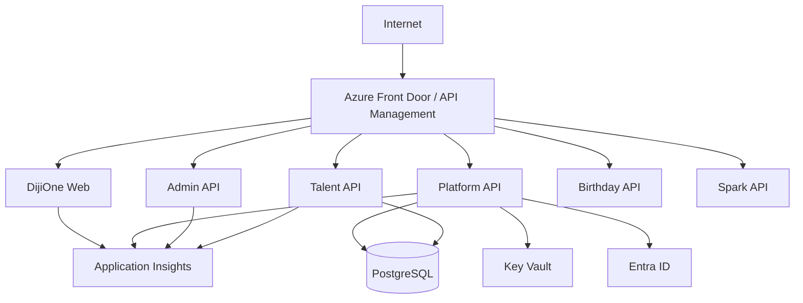

# DijiOne Service Contracts (Phase 2.5)

The API surface each service exposes, who's allowed to call it, and the
gateway routes that make eight processes look like one site to a browser.
See `docs/platform/service-architecture.md` for the bigger picture and
`docs/platform/failure-isolation.md` for what each contract's resilience
strategy is.

## Gateway / routing

`shell-web` (port 3000) is the only address a browser or a developer needs
in dev — it proxies both **pages** and **APIs**, so the URL bar never
leaves `localhost:3000`:

| Path | Proxied to |
|---|---|
| `/admin`, `/admin/:path*` | `admin-web` :3001 (page zone, `basePath: "/admin"`) |
| `/talent-flow`, `/talent-flow/:path*` | `talent-web` :3002 (page zone, `basePath: "/talent-flow"`) |
| `/api/auth/:path*` | `platform-api` :8000 |
| `/api/modules` | `platform-api` :8000 |
| `/api/notifications/:path*` | `platform-api` :8000 |
| `/api/admin/:path*` | `admin-api` :8001 |
| `/api/talent/:path*` | `talent-api` :8002 |
| `/api/birthday/:path*` | `birthday-api` :8003 |
| `/api/spark/:path*` | `spark-api` :8004 |

`admin-web` and `talent-web` carry the identical `/api/auth/*` and
`/api/notifications/*` rewrites (plus their own service's prefix) in their
own `next.config.ts`, so each is independently runnable/testable standalone
on its own port, not just when reached through `shell-web` — a `talent-web`
build failure cannot block `admin-web`'s build or deploy (CR §29).

**Cross-zone navigation uses a plain `<a>`, not `next/link`.** Next.js's
client-side router can't render another zone's app in place — clicking a
`next/link` to a route outside the current app's own manifest updates the
URL bar via `history.pushState` but leaves the old page rendered, with no
error. Every link that leaves the current zone (DijiOne Home's module
cards, the "Administration" nav item, every "Back to DijiOne Home" link)
is a plain anchor tag for this reason — grep `NavItem.external` and the
inline `eslint-disable-next-line @next/next/no-html-link-for-pages`
comments for the exact spots.

Production later swaps this rewrite layer for Azure Front Door/API
Management doing the same path-based fan-out — see "Production direction"
below.

## Platform Core (`platform-api`, :8000)

**Public** (called by browsers, via the gateway):

```
GET  /health
GET  /api/auth/dev-personas
POST /api/auth/dev-login
GET  /api/auth/me
GET  /api/auth/entra/login-url        (501 until Entra is configured)
POST /api/auth/entra/token            (501 until Entra is configured)
GET  /api/modules
GET  /api/notifications
POST /api/notifications/{id}/read
```

**Internal — admin surface** (`/api/platform/admin/*`): only called by
`admin-api`, which forwards the original caller's bearer token on every
request. Re-authorized here exactly as `/api/admin/*` was pre-split
(`require_platform_admin` / `require_platform_permission`) — see
`app/api/routes/platform_admin.py`.

**Internal — service-to-service writes** (`/api/platform/internal/*`):
protected by the `X-Internal-Token` header (must equal
`INTERNAL_SERVICE_SECRET`, identical across every backend service), never
by a per-user token — there is no human actor behind these calls.

```
POST /api/platform/internal/audit-events
POST /api/platform/internal/notifications
POST /api/platform/internal/notifications/broadcast   ({module_key, role, client_id?})
GET  /api/platform/internal/module-roles/{module_key}/{role}/user-ids
```

`talent-api` calls these through `packages/auth-client-py`'s
`PlatformClient` for every audit-log write and notification — see
`app/services/audit_service.py` / `notification_service.py` in
`apps/talent-api`.

## Admin (`admin-api`, :8001)

Public contract is byte-for-byte what `/api/admin/*` was before the split
(admin-web's `lib/api.ts` didn't change any endpoint shapes):

```
GET    /health
GET    /api/admin/dashboard
GET    /api/admin/users
GET    /api/admin/users/{id}
GET    /api/admin/users/{id}/effective-access
PATCH  /api/admin/users/{id}/status
PATCH  /api/admin/users/{id}/platform-role
PUT    /api/admin/users/{id}/modules/{module_key}
DELETE /api/admin/users/{id}/modules/{module_key}
GET    /api/admin/clients
GET    /api/admin/modules
GET    /api/admin/roles
GET    /api/admin/permissions
GET    /api/admin/audit
```

Internally, every one of these forwards to `platform-api`'s
`/api/platform/admin/*` (pass-through auth, see
`docs/platform/service-architecture.md` "Admin: a real HTTP client");
`/dashboard` and the user list additionally call `talent-api`'s
`/api/talent/summary` and `/api/talent/internal/clients-lite` for
enrichment. A `platform-api` outage is not survivable for `admin-api` (it
has no data of its own) and surfaces as `503`; a `talent-api` outage
degrades gracefully (empty client names, `0` pending count) — see
`docs/platform/failure-isolation.md`.

## DijiTalentFlow (`talent-api`, :8002)

```
GET  /health
GET  /api/talent/summary                              (unauthenticated — DijiOne Home card + admin-api's dashboard)
GET  /api/talent/internal/clients-lite                 (internal secret — admin-api's client-name enrichment)
GET/POST   /api/talent/clients, /api/talent/clients/{id}
GET/POST   /api/talent/requests, /api/talent/requests/{id}
POST /api/talent/requests/{id}/review | /stage | /ta-status
GET/POST   /api/talent/candidates, /api/talent/candidates/{id}
GET  /api/talent/requests/{id}/candidates              (client-safe view)
GET/POST   /api/talent/applications, /api/talent/applications/{id}/stage|status|score|visibility
GET/POST   /api/talent/interviews, /api/talent/interviews/{id}/status
GET/POST   /api/talent/requests/{id}/messages
GET/POST   /api/talent/requests/{id}/documents
GET  /api/talent/dashboard/client, /api/talent/ta/dashboard
GET  /api/talent/integrations/lever/status | /hubspot/status | /events
POST /api/talent/webhooks/lever | /hubspot
```

Authorization is entirely claims-based (see
`docs/platform/authorization.md`) — no database join to `platform-api`'s
tables, no synchronous call to it on the request path. The only outbound
calls `talent-api` makes are the best-effort audit/notification writes
described above.

## DijiBirthday / DijiSpark (`birthday-api` :8003, `spark-api` :8004)

Identical skeleton contract, proving the pattern before any real business
logic exists (CR §9, §10, §51):

```
GET /health
GET /api/{birthday|spark}/metadata
GET /api/{birthday|spark}/summary
GET /api/{birthday|spark}/whoami     (Depends on claims — proves the auth seam decodes real tokens end to end)
```

## Service-to-service trust boundaries

Two distinct mechanisms, chosen per CR §48 ("never trust a role/user id
supplied by another service; don't implement insecure shared secrets as
final architecture"):

1. **User-scoped calls** (`admin-api` → `platform-api`'s admin surface):
   the original caller's bearer token is forwarded as-is. The receiving
   service re-derives the actor's identity and permissions from that token
   itself — `admin-api`'s claim about who is calling is never trusted on
   its own.
2. **Service-initiated calls with no human actor** (audit events,
   notifications, `admin-api`'s talent-api enrichment reads): a shared
   secret (`INTERNAL_SERVICE_SECRET`) on the `X-Internal-Token` header,
   identical across every backend service's `.env`.

The shared secret is explicitly a **dev-only** trust mechanism. Production
should replace it with mTLS, a managed identity, or a private network
segment services other than the gateway can't reach at all — noted here so
it isn't mistaken for a finished design.

## Production direction (documentation only — not built)



Azure Front Door/APIM performs the same path-based fan-out the Next.js
rewrites do in dev; Application Insights/OpenTelemetry is the target for
the structured logging every service already emits. No production
infrastructure was provisioned as part of this phase (CR §52, §57).
