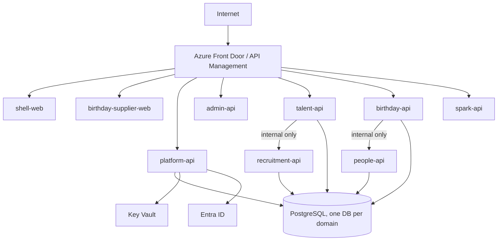

# DijiOne Service Contracts

The API surface each service exposes, who's allowed to call it, and the
gateway routes that make eleven backend/frontend processes look like one
site to a browser. See `docs/platform/service-architecture.md` for the
bigger picture, `docs/platform/data-ownership.md` for the full
per-dependency timeout/failure/auth/versioning table, and
`docs/platform/failure-isolation.md` for verified failure-injection
results.

## Gateway / routing

`shell-web` (port 3000) is the only address a browser or a developer needs
in dev — it proxies both **pages** and **APIs**, so the URL bar never
leaves `localhost:3000`:

| Path | Proxied to |
|---|---|
| `/admin`, `/admin/:path*` | `admin-web` :3001 (page zone, `basePath: "/admin"`) |
| `/talent-flow`, `/talent-flow/:path*` | `talent-web` :3002 (page zone, `basePath: "/talent-flow"`) |
| `/birthday`, `/birthday/:path*` | `birthday-web` :3003 (page zone, `basePath: "/birthday"`) |
| `/api/auth/:path*` | `platform-api` :8000 |
| `/api/modules` | `platform-api` :8000 |
| `/api/notifications/:path*` | `platform-api` :8000 |
| `/api/admin/:path*` | `admin-api` :8001 |
| `/api/talent/:path*` | `talent-api` :8002 |
| `/api/birthday/:path*` | `birthday-api` :8003 |
| `/api/spark/:path*` | `spark-api` :8004 |

`recruitment-api`, `people-api`, and `commercial-api` have **no gateway
route** — they are source domains with internal ingress only, called
exclusively by other backend services (`RecruitmentSourceClient`,
`EmployeeDirectoryClient`), never by a browser or `shell-web` directly.
`birthday-supplier-web` (port 3006) is its own external hostname, not
proxied through `shell-web` — see `docs/platform/deployment-topology.md`.

Each non-shell web app carries the identical `/api/auth/*` and
`/api/notifications/*` rewrites (plus its own service's prefix) in its own
`next.config.ts`, so each is independently runnable/testable standalone on
its own port, not just when reached through `shell-web`.

**Cross-zone navigation uses a plain `<a>`, not `next/link`.** Next.js's
client-side router can't render another zone's app in place. Every link
that leaves the current zone is a plain anchor tag for this reason.

Production later swaps this rewrite layer for Azure Front Door/API
Management doing the same path-based fan-out — see
`docs/platform/deployment-topology.md`.

## Platform Core (`platform-api`, :8000)

**Public** (called by browsers, via the gateway):

```
GET  /health, /health/deep
GET  /api/auth/dev-personas
POST /api/auth/dev-login
GET  /api/auth/me
GET  /api/auth/config, /api/auth/logout
GET  /api/auth/entra/login-url        (501 until Entra is configured)
POST /api/auth/entra/token            (501 until Entra is configured)
GET  /api/modules
GET  /api/notifications
POST /api/notifications/{id}/read
```

**Internal — admin surface** (`/api/platform/admin/*`): only called by
`admin-api`, which forwards the original caller's bearer token on every
request. Includes user/role/permission/module/audit management, Access
Groups, and `GET/POST /api/platform/admin/clients` — the platform-admin
surface that mints canonical Client identity (Architecture Completion Plan
§6.1).

**Internal — service-to-service** (`/api/platform/internal/*`): protected
by `X-Internal-Token` (must equal `INTERNAL_SERVICE_SECRET`, identical
across every backend), never by a per-user token:

```
GET  /api/platform/internal/clients                                 (canonical client directory: public_id, name, status)
POST /api/platform/internal/audit-events
POST /api/platform/internal/notifications
POST /api/platform/internal/notifications/broadcast   ({module_key, role, client_id?})
GET  /api/platform/internal/module-roles/{module_key}/{role}/user-ids
```

Every backend service calls these through `packages/auth-client-py`'s
`PlatformClient` for audit-log writes, notifications, and canonical client
lookups.

## Admin (`admin-api`, :8001)

```
GET    /health, /health/deep
GET    /api/admin/dashboard
GET    /api/admin/users, /api/admin/users/{id}, /api/admin/users/{id}/effective-access
PATCH  /api/admin/users/{id}/status, /api/admin/users/{id}/platform-role
PUT    /api/admin/users/{id}/modules/{module_key}
GET    /api/admin/clients, /api/admin/modules, /api/admin/roles, /api/admin/permissions, /api/admin/audit
GET    /api/admin/groups, /api/admin/groups/{id}
```

Every one of these forwards to `platform-api`'s `/api/platform/admin/*`
(pass-through auth); `/dashboard` and the user list additionally call
`talent-api`'s `/api/talent/summary` for enrichment. See
`docs/platform/data-ownership.md` §6 for the failure posture of each.

## DijiTalentFlow (`talent-api`, :8002)

```
GET  /health, /health/deep
GET  /api/talent/summary                              (unauthenticated — DijiOne Home card + admin-api's dashboard)
GET/POST   /api/talent/clients, /api/talent/clients/{id}
GET/POST   /api/talent/requests, /api/talent/requests/{id}
POST /api/talent/requests/{id}/review | /stage | /ta-status
GET/POST   /api/talent/candidates, /api/talent/candidates/{id}
GET  /api/talent/requests/{id}/candidates              (client-safe view)
GET/POST   /api/talent/applications, /api/talent/applications/{id}/stage|status|score|visibility
GET/POST   /api/talent/interviews, /api/talent/interviews/{id}/status
GET/POST   /api/talent/requests/{id}/messages
GET/POST   /api/talent/requests/{id}/documents
GET  /api/talent/dashboard/client, /api/talent/ta/dashboard
GET  /api/talent/postings, /api/talent/postings/{ref_id}, /api/talent/postings/client-visible
POST /api/talent/postings/{ref_id}/verify-mapping        (staff — MANUAL trust override)
GET  /api/talent/integrations/recruitment/freshness, /sync/latest, /sync/history, /sync/{run_id}
POST /api/talent/integrations/recruitment/sync            (202 — proxies to recruitment-api, single-flight)
```

`talent-api` holds **no** Lever or HubSpot credential and makes **no**
direct call to either provider — every posting/candidacy fact comes from
`recruitment-api` via `RecruitmentSourceClient`, projected locally into
`RecruitmentPostingRef` for the fail-closed client-visibility join (see
`docs/platform/data-ownership.md` §4a). Authorization is otherwise entirely
claims-based (`docs/platform/authorization.md`) — no database join to
`platform-api`, no synchronous call to it on the request path except the
best-effort audit/notification writes.

## DijiBirthday (`birthday-api`, :8003)

```
GET  /health, /health/deep
GET  /api/birthday/metadata, /summary, /whoami
GET  /api/birthday/orders, /orders/{id}
POST /api/birthday/orders
POST /api/birthday/orders/{id}/verify | /confirm-release | /hold | /release | /cancel | /send-to-supplier | /resend
GET  /api/birthday/orders/{id}/readiness, /orders/{id}/issues
GET  /api/birthday/suppliers, /suppliers/{id}, /suppliers/{id}/locations, /suppliers/{id}/catalogue, /suppliers/{id}/users
GET  /api/birthday/dashboard, /upcoming
GET  /api/birthday/employees/upcoming-birthdays          (degrades to "unavailable" if people-api is down — §4b)
GET  /api/birthday/config
GET  /api/birthday/portal/*                              (supplier-portal surface, own auth — see below)
POST /api/birthday/internal/run-daily-scan                (202 — external-triggered, never in-process)
GET  /api/birthday/internal/scan-runs, /scan-runs/{id}
POST /api/birthday/admin/run-detection
GET  /api/birthday/admin/scan-runs
```

`birthday-api` holds **no** BambooHR credential and **no** employee
directory table — every employee fact comes from `people-api` via
`EmployeeDirectoryClient`, either live (for the current scan) or as an
immutable snapshot already written onto a `BirthdayOrder` (see
`docs/platform/data-ownership.md` §4b, §5). It owns an independent
Microsoft Graph app registration for outbound supplier email, deliberately
separate from `platform-api`'s identity Graph usage (§6 of
`docs/platform/data-ownership.md`) — mock by default
(`EMAIL_SENDING_MODE=mock`), behind a factory seam.

## DijiSpark (`spark-api`, :8004) — skeleton

```
GET /health, /health/deep
GET /api/spark/metadata, /summary, /whoami
```

Proves the module pattern before any real business logic exists; a future
consumer of `recruitment-api`/`people-api`, not a third owner of either
provider.

## Recruitment Source (`recruitment-api`, :8005) — internal ingress only

```
GET  /health, /health/deep
GET  /api/recruitment/postings                            (canonical DTO incl. parsed DTC fact + synced_at)
GET  /api/recruitment/postings/{external_id}
GET  /api/recruitment/candidacies
GET  /api/recruitment/freshness
GET  /api/recruitment/sync/latest, /sync/history, /sync/{run_id}
POST /api/recruitment/internal/sync                        (202, single-flight)
POST /api/recruitment/internal/scheduled-sync               (202 — Container Apps Job target)
POST /api/recruitment/webhooks/lever                        (HMAC-verified when secret configured)
```

The **sole** DijiOne owner of the Lever integration. `LiveLeverClient`
exposes no write verb — GET-only by construction, guarded by
`test_lever_client_safety.py`. See `docs/platform/recruitment-source.md`
for the DTC client-tag resolution contract and the full sync lifecycle.

## People / Workforce (`people-api`, :8006) — internal ingress only

```
GET  /health, /health/deep
GET  /api/people/employees                                 (?active_only=)
GET  /api/people/employees/{bamboohr_id}                    (?include_inactive_live_lookup= — single live GET, never persisted)
GET  /api/people/freshness
GET  /api/people/sync/history
POST /api/people/internal/sync                              (202, single-flight)
POST /api/people/internal/scheduled-sync                     (202 — Container Apps Job target)
```

The **sole** DijiOne owner of the BambooHR integration. See
`docs/platform/data-ownership.md` §4b for `birthday-api`'s degraded-mode
contract against this service.

## Commercial / CRM (`commercial-api`, :8007) — skeleton, internal ingress only

```
GET  /health, /health/deep
GET  /api/commercial/hubspot/status                          (internal token — no live HubSpot client yet)
GET  /api/commercial/events
POST /api/commercial/webhooks/hubspot                         (public, unauthenticated — matches prior talent-api behaviour; signature verification added when HubSpot access lands)
```

Health/metadata + the relocated HubSpot stub only. **No live HubSpot
client, no credential, no database beyond the `integration_events` shell,
no canonical Client ownership** — see `docs/platform/data-ownership.md` §1.

## Service-to-service trust boundaries

Two distinct mechanisms:

1. **User-scoped calls** (`admin-api` → `platform-api`'s admin surface):
   the original caller's bearer token is forwarded as-is. The receiving
   service re-derives the actor's identity and permissions from that token
   itself.
2. **Service-initiated calls with no human actor** (audit events,
   notifications, source-domain reads, sync triggers): `X-Internal-Token`
   (must equal the shared `INTERNAL_SERVICE_SECRET`) plus an advisory
   `X-Internal-Caller: <service>` header for logging. One factory —
   `make_verify_internal_request()` in `packages/auth-client-py` — is
   imported by every backend's `api/deps.py` as `require_internal_service`;
   no service redeclares its own copy.

The shared secret is explicitly a **dev-only** trust mechanism. Production
should replace it with mTLS, a managed identity, or a private network
segment services other than the gateway can't reach at all — noted here so
it isn't mistaken for a finished design.

## Production direction (documentation only — not built)



See `docs/platform/deployment-topology.md` for the full Container Apps
topology, ingress matrix, and scheduled Jobs. No production infrastructure
has been provisioned.
