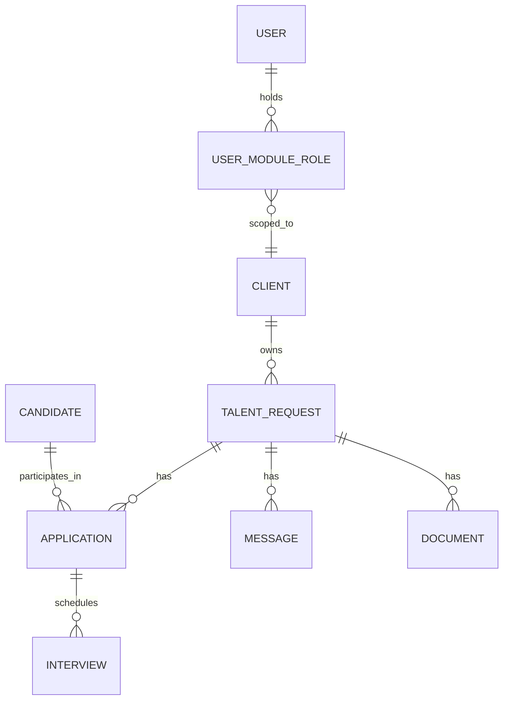

# DijiTalentFlow Data Model



## Entities (`apps/talent-api/app/models/`)

| Model | Purpose | Tenant key |
|---|---|---|
| `Client` | A Dijital Team client organization | — (the tenant itself) |
| `TalentRequest` | A role a client needs filled | `client_id` |
| `Candidate` | Master candidate profile — **never** tenant-scoped | — (global pool, §19) |
| `Application` | Candidate ↔ TalentRequest join; the tenant-safe unit for candidate visibility | via `talent_request_id → client_id` |
| `Interview` | Scheduled interview for one `Application` | via `application → talent_request → client_id` |
| `Message` | Request-scoped chat message | via `talent_request_id → client_id` |
| `Document` | Request-scoped file metadata | via `talent_request_id → client_id` |
| `User` / `UserModuleRole` | Identity + module-scoped role, `client_id` set only for `TALENT_CLIENT` | — |
| `Notification` | Per-user notification | — |
| `AuditLog` | Immutable event log | — |
| `ExternalMapping` | `(provider, external_object_type, external_id) → (internal_object_type, internal_id)`, idempotency key for sync | — |
| `IntegrationEvent` | Webhook delivery log, unique on `(provider, external_event_id)` | — |

## Tenant isolation — how it is actually enforced

Every repository that touches tenant-scoped data takes a `client_id: int | None`:

```python
# app/repositories/talent_request_repo.py
def list_for_scope(self, *, client_id: int | None, ...): ...
def get_by_id(self, request_id: int, *, client_id: int | None): ...
```

`client_id=None` means "staff scope" (no filter). A `TALENT_CLIENT` caller's
`client_id` comes from **`TalentScope`** (`app/api/deps.py`), which is
resolved from the authenticated user's `UserModuleRole` row — **never**
from a client-supplied query parameter or path segment. A malicious or
buggy client request cannot widen its own scope by passing a different
`client_id` in the query string — see `list_talent_requests` in
`app/api/routes/talent_requests.py`: the `client_id` query param is only
honored as an additional *staff-side* filter (`filter_client_id`), applied
only when the caller's own `scope.client_id is None`.

This is proven by `apps/talent-api/tests/test_tenant_isolation.py`, which
attempts all four vectors called out in CLAUDE.md §14:

1. **List endpoint** — `GET /api/talent/requests` as Client A never
   contains Client B's requests.
2. **Detail endpoint** — `GET /api/talent/requests/{id}` for a Client B
   request as Client A returns 404 (not 403 — existence is not leaked).
3. **Manipulated route ID** — sequentially enumerating IDs as Client B
   only ever succeeds for Client B's own request.
4. **Search/filter endpoint** — search text and a forced `client_id` query
   param cannot surface another tenant's rows.

## Candidate ownership rule in practice

`Application` has a unique constraint on `(candidate_id, talent_request_id)`
(`uq_candidate_request`), enforced at the service layer too
(`ApplicationService.create_application` raises `DuplicateApplicationError`
before insert). This is what allows Ron Axel (seed data) to have
simultaneous applications with ABC Company and XYZ Company from a single
`Candidate` row — see `tests/test_candidate_ownership.py`.

## Client-safe candidate visibility

Clients never query `Candidate` directly. `GET
/api/talent/requests/{id}/candidates` returns `ClientSafeCandidateOut` —
built only from `Application` rows where `is_client_visible=True` for that
specific request, and explicitly excludes `score`, `recruiter_notes`, and
any other-client `Application` (CLAUDE.md §35). The exclusion is structural
(the DTO has no such fields), not a filtering step that could be forgotten.

## Tech debt: `Application.score`

`Application.score` (`Float`, nullable) has **no authoritative source** —
Lever exposes no candidate score, and the field was originally local dev
scaffolding for a manual-rating idea that was never built out. As of the
DijiTalentFlow monitoring-first iteration, `PATCH
/api/talent/applications/{id}/score` and `ApplicationService.update_score`
are retired entirely (route returns 403; the service method no longer
exists) — nothing in the product reads or writes this column any more. The
column itself is **kept** rather than dropped, purely as zero-risk
back-compat (no migration required, no risk to existing rows); it should be
removed in a future migration once there is confidence nothing external
still expects the field to exist. `Application.current_stage` and
`Application.status` are the opposite case — they **are** Lever facts, so
they stay read-only in the product but are actively refreshed from the
Recruitment Source on every reconcile (see
`VerifiedPostingPromotionReconciler`).
