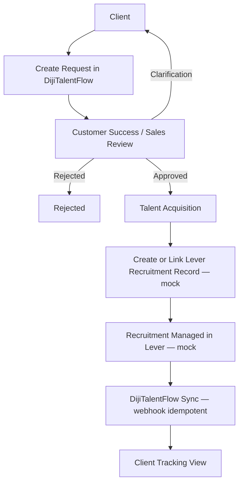

# DijiTalentFlow Requirements

Source of truth: `CLAUDE.md` §16-45. This tracks implementation status
against that contract.

## Business model

- Three parties: Client, Dijital Team, Candidate/Contractor (§17).
- Candidate Ownership Rule (§19): one master `Candidate` record, reused
  across clients via the `Application` join entity. Enforced by a unique
  constraint on `(candidate_id, talent_request_id)` and demonstrated by
  the seed data (Ron Axel has two applications, ABC Company and XYZ
  Company) and by `tests/test_candidate_ownership.py`.

## Workflow (§29)

Implemented end-to-end: `TalentRequestService.create_request` →
`review_request` → `update_stage`, each writing an `AuditLog` entry and
firing role-scoped `Notification`s. Covered by
`tests/test_talent_request_workflow.py`.

## Client-facing canonical stages (§30)

`REQUEST_SUBMITTED → REQUIREMENT_CONFIRMED → SOURCING → SCREENING →
CLIENT_REVIEW → INTERVIEWS → OFFER → ONBOARDING → DEPLOYED`

Never overridden by a raw Lever stage name — `app/integrations/lever/mapper.py`
maps provider vocabulary into this fixed set before anything reaches the
client UI.

## Client Workspace (§31-38)

| Requirement | Status |
|---|---|
| Dashboard (active requests, candidates in process, interviews this week, offers) | Done |
| My Requests (search, stage/status filter, create) | Done |
| New Talent Request → Pending Customer Success review | Done |
| Candidates (client-safe fields only) | Done — aggregated across requests |
| Interviews | Done |
| Messages | Done — per-request thread + aggregated overview |
| Documents | Done — metadata only, local demo storage reference |

## Talent Acquisition Workspace (§39-45)

| Requirement | Status |
|---|---|
| Operations Dashboard | Done |
| Client Portfolios | Done |
| All Requests (cross-client queue, filters) | Done |
| Candidate Pool (master profiles, create) | Done |
| Applications (create, stage/status/score/notes/visibility) | Done |
| Interview Manager | Done — list + schedule + status update |

## Explicitly deferred

- Customer Success as a distinct third workspace UI: the `CUSTOMER_SUCCESS`
  role exists and drives the review action, but reuses the TA Workspace
  shell rather than a bespoke UI — consistent with CLAUDE.md's "future
  Customer Success review experience must be supported in the domain model
  and workflow" (§16), not necessarily a fully separate UI at MVP.
- Real file upload for Documents (metadata model is ready for it).
