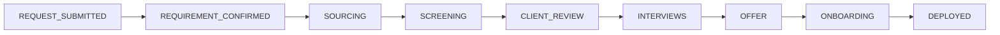

# DijiTalentFlow Workflows

## Talent request lifecycle

Three parallel status tracks live on `TalentRequest`:

- `customer_success_status`: `PENDING_REVIEW → APPROVED | REJECTED | CLARIFICATION_REQUIRED`
- `lifecycle_status`: `PENDING_REVIEW → APPROVED → IN_PROGRESS → FULFILLED | CANCELLED | REJECTED`
- `ta_status`: `NOT_STARTED → VALIDATING → ATS_LINKED → IN_PROGRESS → COMPLETED`
- `current_stage`: the canonical stage above, drives `client_safe_status_text`
  and the progress bar (`progress_percent = current_index / (stage_count - 1) * 100`)

## Who can do what (`app/api/deps.py`)

| Action | Endpoint | Required scope |
|---|---|---|
| Create request | `POST /api/talent/requests` | `TALENT_CLIENT` (own client only) |
| Review request | `POST /api/talent/requests/{id}/review` | `CUSTOMER_SUCCESS` or `TA_MANAGER` |
| Update stage | `POST /api/talent/requests/{id}/stage` | any staff role |
| Update TA status | `POST /api/talent/requests/{id}/ta-status` | any staff role |
| Create/manage candidates & applications | `/api/talent/candidates`, `/api/talent/applications/*` | any staff role |
| Schedule/update interviews | `/api/talent/interviews/*` (write) | any staff role |
| View client portfolios | `GET /api/talent/clients` | any staff role |
| Send/read messages, upload/read documents | `/api/talent/requests/{id}/messages`, `/documents` | staff (any client) or the owning client |

## Notification fan-out

`NotificationService` is called from every workflow transition:

- Request created → all `CUSTOMER_SUCCESS` users.
- Request approved → all `TA_MEMBER` users.
- Request rejected / clarification requested → the submitting client's
  `TALENT_CLIENT` users only.
- Stage changed → the request's client users (`APPLICATION_STAGE_CHANGED`).
- Application made client-visible → the request's client users
  (`CLIENT_FEEDBACK_REQUIRED`).
- Interview scheduled (client-visible) → the request's client users
  (`INTERVIEW_UPCOMING`).
- New message → the other party (client → TA_MEMBER; staff → that
  request's client users).
- Integration sync failure → `TA_MANAGER` users
  (`INTEGRATION_SYNC_FAILED`).

## Audit trail

Every transition above also calls `AuditService.log(...)`, recording
`actor_id`, `action`, `entity_type`/`entity_id`, and a JSON snapshot of
`previous_state`/`new_state`. Nothing mutates `TalentRequest`,
`Application`, or `Interview` state without a corresponding audit row —
this is enforced by convention (every service method that mutates state
calls `self.audit.log(...)` before returning), not by a database trigger,
so any new mutation added later must follow the same pattern.
